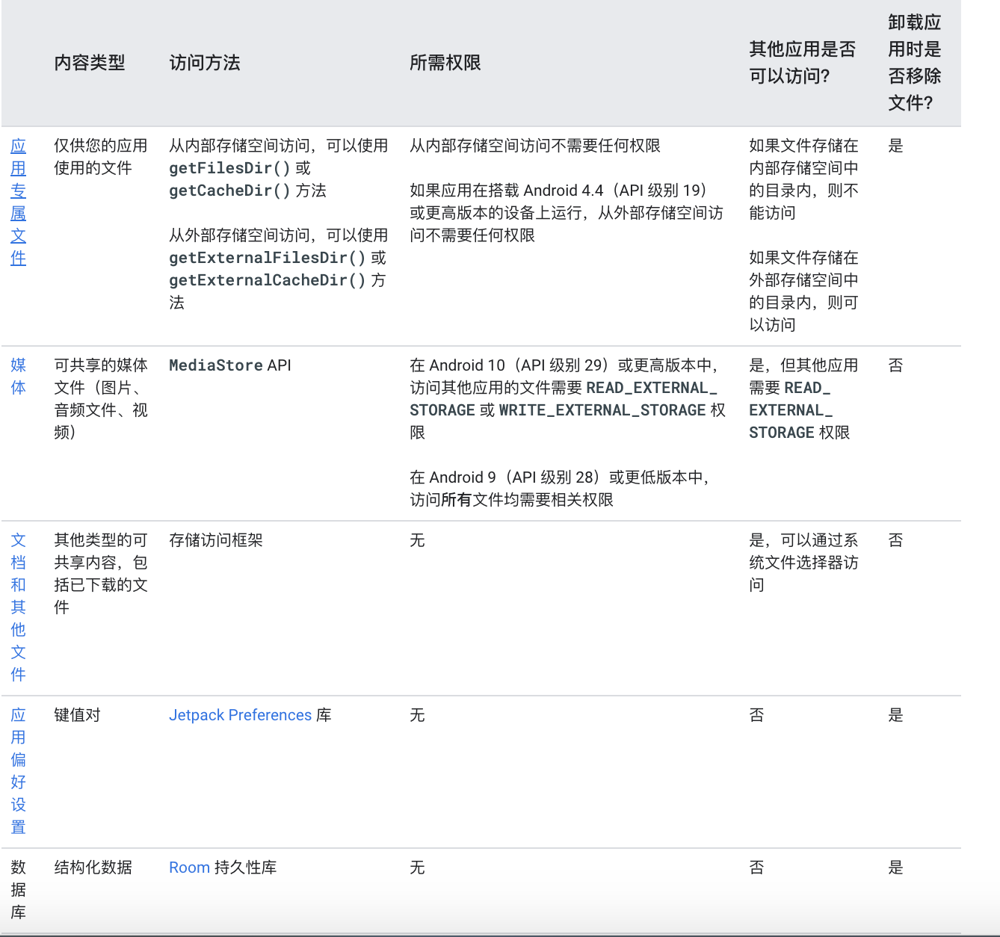
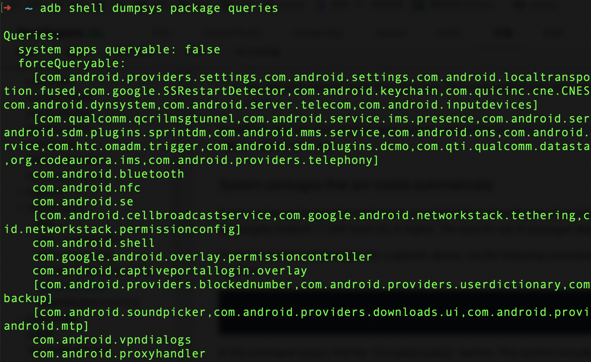

## Android 11 下的 ContentProvider 使用了解了吗?

### 引子

最近在做跨 `App` 数据共享的一个调研，其中调研的一个方案是通过 `ContentProvider` 进行跨进程数据通信实现，测试 `demo` 在 `Android 10` 的手机上运行能够正常运行，当我使用 `Android11` 的手机时直接提示找不到对应的 `ContentProvider`。

赶紧捋一捋思路，进行排查。

第一步，查查 ContentProvider 的配置是否发生变更。

```java
// provider 声明
<provider
    android:authorities="com.dsw.ant.provider"
    android:exported="true"
    android:enabled="true"
    android:writePermission="com.dsw.ant.writer"
    android:name=".MyProvider">
</provider>

// 使用方式
ContentValues contentValues = new ContentValues();
contentValues.put("time", System.currentTimeMillis());
getContentResolver().insert(Uri.parse("content://com.dsw.ant.provider/data"), contentValues);
```

`ContentProvider` 的 `android:exported` 属性也配置了，配置没有问题，按道理说应该可以呀！现在唯一的区别就是 Android11 的系统变化，赶紧去官网查看 [Android11 中的更新日志](https://developer.android.google.cn/about/versions/11)。

因为和存储相关，所以直接就开始看[Android 11 中的存储机制更新](https://developer.android.google.cn/about/versions/11/privacy/storage)，分区存储的访问级别：



搜罗一圈后，还是可以正常通过 ContentProvider 进行数据共享，那就说明不是这个问题，继续寻找发生的变更项？[Android 11 中的软件包可见性](https://developer.android.google.cn/about/versions/11/privacy/package-visibility) 成了我下一步排查的方向。

#### Android 11 中的软件包可见性

官方关于软件包可见性的介绍：

>Android 11 更改了应用查询用户已在设备上安装的其他应用以及与之交互的方式。使用 `<queries>` 元素，应用可以定义一组自身可访问的其他软件包。通过告知系统应向您的应用显示哪些其他软件包，此元素有助于鼓励最小权限原则。此外，此元素还可帮助 Google Play 等应用商店评估应用为用户提供的隐私权和安全性。
>
>如果您的应用以 Android 11 或更高版本为目标平台，您可能需要在应用的清单文件中添加 `<queries>` 元素。在 `<queries>` 元素中，您可以按软件包名称、intent 签名或提供程序授权指定软件包。

一句话概括：Android11 中更改了应用之间的交互方式，需要在 `Manifest` 中使用 `<queries>` 标签声明要访问的 `App`。

赶紧尝试，在 A demo 中通过  `<queries>` 声明了 B demo 的 applicationId 名称。

```xml
<queries>
    <package android:name="com.dsw.ant.demo" />
</queries>
```

运行可以正常使用了。

```xml
注意：
 <queries> 元素需要在 Android Gradle plugin 4.0.0 及以上的版本使用。
```

问题解决就结束了？too young to simple，作为一个打工人，我怎能就此止步，赶紧看看软件包可见性还有哪些特性

### Android 11 中的软件包可见性详细解读

当我们创建一个 App 时，需要考虑与其他 App 的交互访问，比如我们访问系统级相册、电话等，在 Android 10 及以下的版本中，只要 App 开启了可被其他 App 访问，则直接就可以被访问，比如在 Android 10 及之前的版本中，App 可以通过 queryIntentActivities() 方法获取该设备中所有已安装的应用列表。这很不安全，也超出了一个 App 实际所需要的权限范围，所以在 Android 11 中引入了软件包可加性来限制这一情况。在 Android11 中使用 `<queries>` 元素，应用可以定义一组自身可访问的其他软件包。

#### 1. 哪些应用可直接被别的应用访问

Android11 中对于符合一些条件的 App 不用添加 `<queries>` 元素就可以被其他 App 访问，主要用于提供基本功能和常见的用法。

- 自己访问自己的 App
- 某些系统包，比如媒体提供商，实现了 Android 的核心功能。了解有关如何确定运行应用程序的设备上自动显示哪些程序包的更多信息。
- The app that installed your app.
- 使用 `startActivityForResult() `拉起你 App 的 App
- 任何绑定你 App 中的 Service 的 App
- 任何获取你 App 中的 ContentProvider 的 App
- 当你 App 中的 ContentProvider 设置 [android:grantUriPermission](https://developer.android.google.cn/guide/topics/manifest/provider-element#gprmsn) 时可被被的 App 访问

#### 2. 查看设备中哪些 App 可以被访问

通常系统应用是可以直接被其它 App 访问的，我们可以通过以下指令查看某台设备中被直接访问的 App。

```xml
adb shell dumpsys package queries
```



#### 3. queries 的使用

通过 `<queries>` 标签来指定需要交互的  App 名称，在 `<queries>` 元素中，您可以按软件包名称、intent 签名或提供程序授权指定软件包。

**指定包名**

```xml
<manifest package="com.example.game">
    <queries>
        <package android:name="com.example.store" />
        <package android:name="com.example.services" />
    </queries>
    ...
</manifest>
```

**指定 Intent**

```xml
<manifest package="com.example.game">
    <queries>
        <intent>
            <action android:name="android.intent.action.SEND" />
            <data android:mimeType="image/jpeg" />
        </intent>
    </queries>
    ...
</manifest>
```

**指定 Provider**

```xml
<manifest package="com.example.suite.enterprise">
    <queries>
        <provider android:authorities="com.example.settings.files" />
    </queries>
    ...
</manifest>
```

**与所有的 App 交互**

在极少数情况下，你的 App 需要与所有安装在这台设备上的  App 进行交互，这个时候可以通过声明 [`QUERY_ALL_PACKAGES`](https://developer.android.google.cn/reference/kotlin/android/Manifest.permission#query_all_packages) 权限来完成。

```xml
<uses-permission android:name="android.permission.QUERY_ALL_PACKAGES"/>
```


参考：

- [Android 11 中的存储机制更新](https://developer.android.google.cn/about/versions/11/privacy/storage)
- 