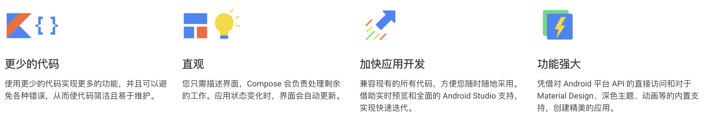
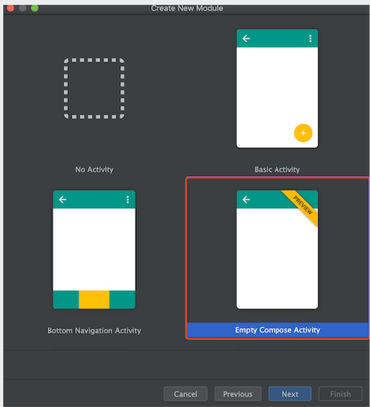
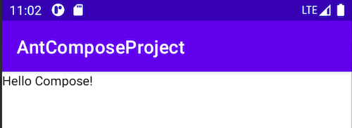
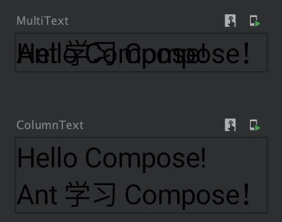
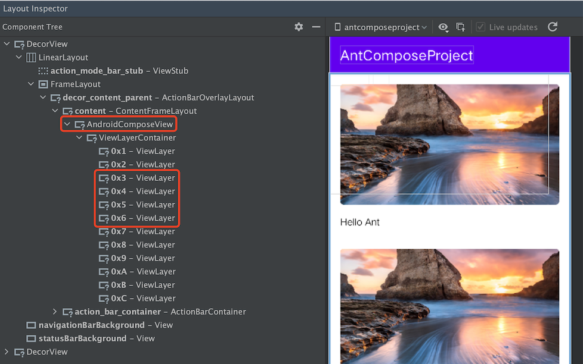
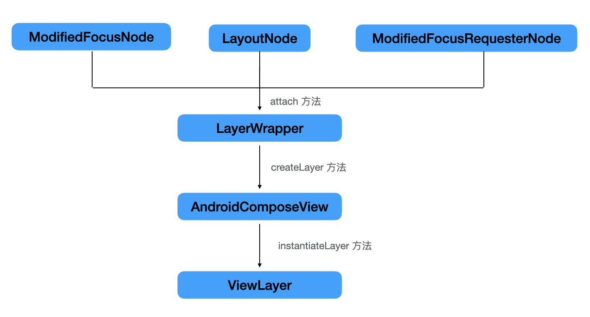

### 一文带你了解 Jetpack Compose UI 框架

`Jetpack` `Compose` 是用于构建原生界面的新款 `Android` 工具包。它可简化并加快 `Android` 的 `UI` 开发工作。使用更少的代码、强大的工具和直观的 `Kotlin API`，快速构建 `App` 的 `UI`。



由于目前`Jetpack Compose` 为 `Alpha` 版。所以需要在 `Android Studio`  的 `Canary` 版本才能体验。[下载 ANDROID STUDIO CANARY 版](https://developer.android.google.cn/studio/preview)

#### 1. 创建 Jetpack Compose 项目

在 `Android  Studio Canary` 版本中已经提供了 `Compose` 的模板，在创建项目时选择 `Empty Compose Activity` 模板即可。



至此，就完成一个 `Compose` 项目的创建。除此之外，我们也可以选择导入 `Jetpack Compose` 示例应用，操作步骤参照导入[Jetpack Compose Sample 操作步骤](https://developer.android.google.cn/jetpack/compose/setup#sample)。

#### 2. Compose 函数使用

##### 2.1  HelloWorld

在 `MainActivity.kt` 中显示一个文本。

```kotlin
class MainActivity : AppCompatActivity() {
    override fun onCreate(savedInstanceState: Bundle?) {
        super.onCreate(savedInstanceState)
        setContent {
            Text("Hello Compose!")
        }
    }
}
```



这个与使用 XML 布局的方式差别很大，`setContent` 块定义了 `Activity` 的布局。我们不使用 `XML` 文件来定义布局内容，而是调用可组合函数，比如上面的 `Text` 函数。`Jetpack Compose` 使用自定义 `Kotlin` 编译器插件将这些可组合函数转换为应用的界面元素。

##### 2.2 Compose 函数

`Jetpack Compose` 是围绕 `Compose` 函数构建的。即通过以编程方式实现 `UI` 界面，在开发中只需描述应用界面的样式布局和数据依赖关系，而不必关注界面的构建过程。**给一个函数添加 `@Composable` 注解即创建了一个 Compose 函数。**注意，`Compose` 函数只能在其他 `Compose` 函数的范围内调用。

下面我们将上面示例中的 `Text` 移动到自定义的 `Compose` 函数中。

```ko
class MainActivity : AppCompatActivity() {
    override fun onCreate(savedInstanceState: Bundle?) {
        super.onCreate(savedInstanceState)
        setContent {
            HelloCompose()
        }
    }
    
    @Composable
    fun HelloCompose() {
        Text("Hello Compose!")
    }
}
```

通过定义 `Compose` 函数的方式 `UI` 布局。

##### 2.3 设置点击监听

除了使用 `Text` 函数，还有一些其它的基础函数供我们使用，比如 `Button`、`Image` 等。那么如何给显示的 UI 控件设置点击监听呢？在 Compose 框架中提供了两种方式：

- 对于类似 `Button` 函数的这种，提供了 `onClick` 函数式接口供外部设置点击监听；
- 对于类似 `Text` 函数这种，没有提供显式接口设置的，通过 `Modifier` 类设置点击监听；

**Button 函数设置点击事件**

```kotlin
@Composable
fun TextButton() {
    Button(
        onClick = {
            Log.d("Andoter", this.javaClass.name)
            Toast.makeText(this@MainActivity, "Button 点击", Toast.LENGTH_SHORT).show()
        }
    ) {
        Text(text = "Hello Compose!", color = Color.Red)
    }
}
```

通过设置 `onClick` 函数即可实现点击实现，注意 `Button` 函数本身没有设置文本内容，需要通过 `Text` 函数设置显示文本内容。

**Text 函数设置点击事件**

```kotlin
@Composable
fun ClickedText() {
    val modifier = Modifier.clickable(onClick = {
        Log.d("Andoter", this.javaClass.name)
        Toast.makeText(this@MainActivity, "Button 点击", Toast.LENGTH_SHORT).show()
    })

    Text(text = "Hello Compose!",modifier = modifier.padding(10.dp))
}
```

通过 `Modifier.clickable` 的方式实现设置点击事件。`Modifier` 类不仅能够设置点击事件，还能够设置控件的布局属性。

- `clickable()` ：设置点击监听
- `padding()` ：在元素周围留出空间
- `fillMaxWidth()` ：使可组合项填充其父项给它的最大宽度
- `preferredSize()` ：指定元素的首选宽度和高度

##### 2.4 预览

在 `Compose` 框架中为 `Compose` 函数提供预览能力，通过给 `Compose` 函数添加 `@Preview` 注解即可进行预览。在实际的开发中，预览函数不要发布到线上，所以最佳做法是单独创建不会被应用调用的预览函数用于查看实际效果，专门的预览函数可以提高性能，并且有利于以后更轻松地设置多个预览。


#### 3. 布局

在 `Jetpack Compose` 中一切的元素都是围绕 Compose 函数展开，所以布局也是通过对应的内置 Compose 函数实现。

##### 3.1 `Column` 和 `Row`

二者的特点：

- `Column`：使元素按照竖直方向排列；
- `Row`：使元素按照水平方向排列；
- `Stack`：将一个元素放在另一个元素上。

这里我们以 `Column` 函数作为示例。

```kotlin
@Preview
@Composable
fun MultiText() {
    Text(text = "Hello Compose!")
    Text("Ant 学习 Compose！")
}


@Preview
@Composable
fun ColumnText() {
    Column {
        Text(text = "Hello Compose!")
        Text("Ant 学习 Compose！")
    }
}
```

通过 `Column` 可将组件按照竖直方向排列，预览效果对比：



##### 3.2  `ScrollableRow` 和 `ScrollableColumn`

使用 `ScrollableRow` 或 `ScrollableColumn` 可使 `Row` 或 `Column` 内的元素滚动。

```kotlin
@Composable
fun ProductList() {
    ScrollableColumn(Modifier.fillMaxSize()) {
        listOf("Ant", "Andoter", "小伟").forEach { value ->
            ProductDetailView(value)
        }
    }
}

@Composable
fun ProductDetailView(text: String) {
    val image = imageResource(id = R.drawable.header)
    Column(modifier = Modifier.padding(16.dp)) {
        val imageModifier = Modifier
            .preferredHeight(180.dp)
            .clip(shape = RoundedCornerShape(5.dp))
            .fillMaxWidth()
            .clickable(onClick = {
                Log.d("Ant", "click");
            })
        Image(image, modifier = imageModifier, contentScale = ContentScale.Crop)
        Spacer(modifier = Modifier.preferredHeight(16.dp))
        Text("Hello Compose!")
    }
}
```


#### 4. Compose 展示结构

通过上面的介绍，对 `Compose` 有了一个初步的认识，那么 `Compose` 函数如何绘制在屏幕上的呢？以什么样的形式展示的呢？我们使用 `Layout Inspector` 工具查看一个 `Compose` 页面。



通过左侧的布局结构可以发现，`Compose` 框架中已经废弃原有的` View` 体系中的控件（`TextView`、`Button`、`ImageView` 等），而是使用 `AndroidComposeView`（继承 `ViewGroup`）、`ViewLayerContainer`（继承 `ViewGroup`）和 `ViewLayer`（继承 `View`） 控件实现，其中 `ViewLayer` 代表每个 `View` 控件视图。

查看 `ViewLayer` 的调用关系,可以得到视图的生成关系：`LayerWrapper` → `AndroidComposeView` -> `ViewLayer`。



#### 5. 业务影响

`Jetpack Compose` 是一个适用于 `Android` 的新式声明性界面工具包，同时点击监听的设置方式也发生较大变化，那么对于我来说，最直观的业务影响是无法继续使用原有的插码技术进行点击事件的采集。这块需要进行调研适配。

上面提到设置点击的两种方式，本质上都是通过 `Modifier` 进行实现，来看下面的一个例子。

```kotlin
@Composable
fun ClickedText() {
    val modifier = Modifier.clickable(onClick = {
        Log.d("Andoter", this.javaClass.name)
        Toast.makeText(this@MainActivity, "Button 点击", Toast.LENGTH_SHORT).show()
    })

    Text(text = "Hello Compose!", modifier = modifier.padding(10.dp))
}
```

通过 `Modifier` 给一个 `Text` 设置点击监听，在点击的时候弹出一个 `Toast`。反编译看看最后的实现。

```kotlin
/* access modifiers changed from: package-private */
@Metadata(mo23161bv = {1, 0, 3}, mo23164k = 3, mo23165mv = {1, 4, 0})
/* compiled from: MainActivity.kt */
public final class MainActivity$TextButton$1$1 extends Lambda implements Function0<Unit> {
    private final /* synthetic */ MainActivity $this;

    /* JADX INFO: super call moved to the top of the method (can break code semantics) */
    MainActivity$TextButton$1$1(MainActivity mainActivity) {
        super(0);
        this.$this = mainActivity;
    }

    @Override // kotlin.jvm.functions.Function0
    public final void invoke() {
        Log.d(LiveLiterals$MainActivityKt.INSTANCE.mo17059x27db7fde(), this.$this.getClass().getName());
        Toast.makeText(this.$this, LiveLiterals$MainActivityKt.INSTANCE.mo17064x88044b3e(), 0).show();
    }
}
```

`Kotlin` 经过处理最终是转换成一个继承 `Lambda` 并实现 `Fuction0` 接口的类来托管实现点击监听。这样我们就可以总结出 `Hook` 条件：

- `kotlin.jvm.internal.Lambda` 的子类
- 实现 `kotlin.jvm.functions.Function` 接口
- 被 `public` 和 `final` 修饰符的 `invoke` 方法

尽管 `Hook` 点找到了，但是目前还无法突破获取对应的  `View`，依托 `View` 读取的属性就无法获取。谁来救救我(￣︶￣)

#### 6. 总结

长期以来，`Android` 视图层次结构一直可以表示为界面微件树。界面更新方式是使用 `findViewById()` 等函数遍历树，这种手动操纵视图的方式会提高出错的可能性。在过去的几年中，移动端已开始转向声明性界面模型，比如 `Flutter`、`Swift UI`，所以 `Jetpack Compose` 框架应该也是后续发展的一个方向。


**更多资料**

- [Android Jetpack Compose](https://developer.android.google.cn/jetpack/compose)