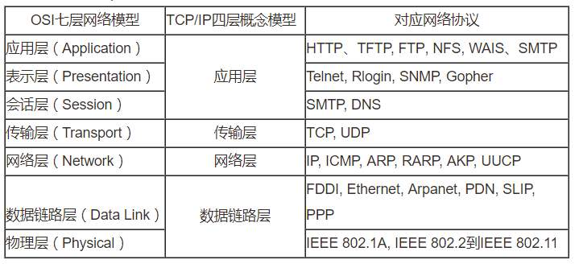
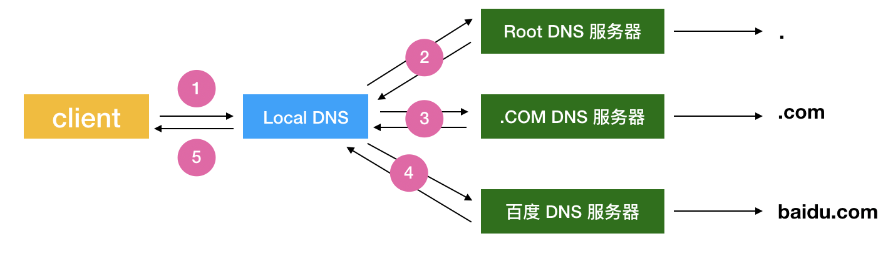

## 你应该知道的 HTTP 基础知识

### 1. HTTP 是什么

#### 1.1 概述

**超文本传输协议**（英语：HyperText Transfer Protocol，缩写：HTTP）是一种用于分布式、协作式和超媒体信息系统的应用层协议。HTTP 是 WWW 万维网通信的基础，被广泛使用，最常见的当你浏览一个网页时，浏览器和服务器之间就会通过 HTTP 进行数据的发送和接收。所以 HTTP 是一种基于请求/响应的协议。

#### 1.2 HTTP 发展历程

根据 HTTP 的协议版本，发展历程大致分为：`HTTP/0.9`、`HTTP/1.0`、`HTTP/1.1`、 `HTTP/2.0` 和 `HTTP/3.0` 。其中 `HTTP/1.1` 版本是使用最广泛的协议。

**HTTP/0.9 **

最早版本是 1991 年发布的 0.9 版。该版本极其简单，只有一个命令`GET`。没有 `Header` 等描述信息，服务器发送完毕，即关闭 `TCP` 连接。

**HTTP/1.0**

1996 年 5 月，HTTP/1.0 版本发布，内容大大增加。增加了很多指令，比如增加了 `POST` 指令，其他的新增功能还包括状态码（status code）、多字符集支持、多部分发送（multi-part type）、权限（authorization）、缓存（cache）、内容编码（content encoding）等。

**HTTP/1.1**

由于 `HTTP1.0` 协议中每个 `TCP` 只能发送一个请求，请求完毕后连接就关闭。造成 `TCP` 新建连接成本比较搞。所以 1997 年 1 月，`HTTP/1.1` 版本发布，只比 1.0 版本晚了半年。它进一步完善了 `HTTP` 协议，一直用到了20年后的今天，直到现在还是最流行的版本。

主要增加了**持久化连接**、**管道机制**。引入了持久连接（persistent connection），即 `TCP` 连接默认不关闭，可以被多个请求复用，不用声明`Connection: keep-alive`。管道机制（pipelining），即在同一个 `TCP` 连接里面，客户端可以同时发送多个请求。这样就进一步改进了 `HTTP` 协议的效率。

**HTTP/2.0**

该版本的特点是：

- 二进制协议：在 `HTTP/1.1` 版本中，支持文本和二进制的数据体，在 `HTTP/2.0` 中则是一个彻底的二进制协议，头信息和数据体都是二进制，并且统称为"帧"（frame）：头信息帧和数据帧。二进制协议的一个好处是，可以定义额外的帧。

**HTTP/3.0**

在 `HTTP/3.0` 中为提高 Web 应用性能，[HTTP/3.0 将 TCP 协议更换为基于 UDP 的谷歌 QUIC](https://www.jianshu.com/p/f17b4a015e27)`。更多的内容可以参照这其它文章了解。

#### 1.3 HTTP 协议的主要特点
1. 支持客户/服务器模式。
2. 简单快速：客户向服务器请求服务时，只需传送请求方法和路径。请求方法常用的有GET、HEAD、POST。每种方法规定了客户与服务器联系的类型不同。由于HTTP协议简单，使得HTTP服务器的程序规模小，因而通信速度很快。
3. 灵活：HTTP允许传输任意类型的数据对象。正在传输的类型由Content-Type加以标记。
4. 无连接：无连接的含义是限制每次连接只处理一个请求。服务器处理完客户的请求，并收到客户的应答后，即断开连接。采用这种方式可以节省传输时间。
5. 无状态：HTTP协议是无状态协议。无状态是指协议对于事务处理没有记忆能力。缺少状态意味着如果后续处理需要前面的信息，则它必须重传，这样可能导致每次连接传送的数据量增大。另一方面，在服务器不需要先前信息时它的应答就较快。

### 2. URL 统一资源定位符

`Uniform Resource Locator` 全称统一资源定位符，简称 `URL`。用于唯一标识网络上的资源，它是 WWW 的统一资源定位标志，就是指网络地址。

**URL 基本格式**

通用的格式：scheme://host[:port#]/path/…/[?query-string] [#anchor]

|     名称     |                 功能                 |
| :----------: | :----------------------------------: |
|    scheme    | 传送协议，常见的有：http、https、ftp |
|      //      |     层级 URL 标记符号，固定不变      |
|     host     |       服务器，通常为域名或 ip        |
|     port     |                端口号                |
|     path     |               资源路径               |
| query-string |         发给服务器的查询参数         |
|    anchor    |     片段、锚点，以“#”字符为起点      |

举个例子，URL = http://www.andoter.com:80/news/index.html?id=20&page=1 


### 3. HTTP 请求

一个 `HTTP` 请求报文的一般格式由请求行、请求头部和请求数据组成。


#### 3.1 请求行

请求行由三部分组成：请求方法、URL、协议版本。

```xml
GET /img/bd_logo1.png?qua=high&where=super HTTP/1.1
Referer: https://www.baidu.com/
User-Agent: Mozilla/5.0 (Macintosh; Intel Mac OS X 10_15_3) AppleWebKit/537.36 (KHTML, like Gecko) Chrome/80.0.3987.122 Safari/537.36
Sec-Fetch-Dest: image
```

在上面的示例中：

- 请求方法：GET
- URL：/img/bd_logo1.png?qua=high&where=super
- 协议版本：HTTP/1.1

在 `HTTP/1.1` 版本中定义了常见的一组请求方法。

| 方法名    | 功能                                                         |
| --------- | ------------------------------------------------------------ |
| `GET`     | `GET` 方法请求一个指定资源的表示形式. 使用 `GET` 的请求应该只被用于获取数据。 |
| `HEAD`    | `HEAD` 方法请求一个与 `GET` 请求的响应相同的响应，但没有响应体。 |
| `POST`    | `POST` 方法用于将实体提交到指定的资源，通常导致在服务器上的状态变化或副作用。 |
| `PUT`     | `PUT` 方法用请求替换目标资源的所有当前表示。                 |
| `DELETE`  | `DELETE` 方法删除指定的资源。                                |
| `CONNECT` | `CONNECT` 方法建立一个到由目标资源标识的服务器的隧道。       |
| `OPTIONS` | `OPTIONS` 方法用于描述目标资源的通信选项。                   |
| `TRACE`   | `TRACE` 方法沿着到目标资源的路径执行一个消息环回测试。       |
| `PATCH`   | `PATCH` 方法用于对资源应用部分修改。                         |

虽然 `HTTP` 的请求方式有多种，但是我们在实际应用中常用的也就是 `GET` 和 `POST`，其他请求方式也都可以通过这两种方式间接的来实现。

#### 3.2 请求头部

请求头部通常用于添加一些附加信息，格式为KV 键值对—`键: 值`，注意**冒号后面有一个空格**。

```xml
Accept: text/html,application/xhtml+xml,application/xml;q=0.9,image/webp,image/apng,*/*;q=0.8,application/signed-exchange;v=b3;q=0.9
Accept-Encoding: gzip, deflate, br
Accept-Language: zh-CN,zh;q=0.9
Connection: keep-alive
Cookie: 
Host: www.baidu.com
Sec-Fetch-Dest: document
Sec-Fetch-Mode: navigate
Sec-Fetch-Site: none
Sec-Fetch-User: ?1
Upgrade-Insecure-Requests: 1
User-Agent: Mozilla/5.0 (Macintosh; Intel Mac OS X 10_15_3) AppleWebKit/537.36 (KHTML, like Gecko) Chrome/80.0.3987.122 Safari/537.36
```

常见的请求头。

| 名称                | 功能                                                         |
| ------------------- | ------------------------------------------------------------ |
| `Accept`            | 浏览器可接受的 `MIME` 类型，可以多个值，用`,`(英文逗号)分开  |
| `Accept-Encoding`   | 浏览器能够进行解码的数据编码方式，比如 `gzip`                |
| `Accept-Charset`    | 浏览器可接受的字符集                                         |
| `Accept-Language`   | 浏览器所希望的语言种类，当服务器能够提供一种以上的语言版本时要用到 |
| `Authorization`     | 授权信息，用于设置身份认证信息                               |
| `Connection`        | 表示是否需要持久连接。如果 `Servlet` 看到这里的值为 `Keep-Alive`，或者看到请求使用的是 `HTTP 1.1`（默认进行持久连接），它就可以利用持久连接的优点。 |
| `Content-Type`      | `MediaType`，即是 `Internet Media Type`，互联网媒体类型；也叫做 `MIME` 类型，在 `http` 协议消息头中，使用 `Content-Type` 来表示具体请求中的媒体类型信息。[常见的类型](https://tool.oschina.net/commons)。 |
| `Content-Length`    | 表示请求消息正文的长度                                       |
| `Cookie`            | `Cookie` 信息                                                |
| `Host`              | 请求的主机和端口号                                           |
| `If-Modified-Since` | 只有当所请求的内容在指定的日期之后又经过修改才返回它，否则返回 304 “Not Modified” 应答。 |
| `Referer`           | 标识请求引用自哪个地址，比如你从页面 A 跳转到页面 B 时，值为页面 A 的地址 |
| `User-Agent`        | 浏览器类型                                                   |
| `Cache-Control`     | 指定请求和响应遵循的缓存机制，请求时的缓存指令包括 `no-cache`、`no-store`、`max-age`、`max-stale`、`min-fresh`、`only-if-cached` |

#### 3.3 请求体

请求体主要是针对 `POST` 请求而言，根据不同的应用场景，常见的 `POST` 请求提交的数据类型有以下 3 种。

**application/json**

最常见的类型，越来越多的应用使用 `application/json`，用来告诉服务端消息主体是序列化的 `json` 字符串。

**multipart/form-data**

将表单的数据处理为一条消息，以标签为单元，用分隔符分开。既可以上传键值对，也可以上传文件。必须让 `form` 表单的 `enctype` 等于 `multipart/form-data`。

**application/x-www-form-urlencoded**

浏览器的原生 `form` 表单，如果不设置 `enctype` 属性，那么最终就会以 `application/x-www-form-urlencoded` 方式提交数。

### 4. HTTP 响应

一个 `HTTP` 影响消息由响应状态行、影响头、空行和响应正文组成。


#### 4.1 状态行

状态行由：协议版本、状态码、状态码描述组成。

```xml
HTTP/1.1 200 OK
Server: nginx/1.10.2
Date: Mon, 02 Mar 2020 15:23:27 GMT
Content-Type: application/json
```

上面的例子中：

- 协议版本：HTTP/1.1
- 状态码：200
- 状态码描述：OK

常见的状态码有：

| 状态码             | 功能描述                                                   |
| ------------------ | ---------------------------------------------------------- |
| 1XX （提示信息）   | 表示请求已接收，继续处理                                   |
| 2XX （成功）       | 表示请求已被成功接收、理解、接收                           |
| 3XX （重定向）     | 表示资源（网页等）被永久转移到其它 URL，也就是所谓的重定向 |
| 4XX （客户端错误） | 表示请求有语法错误或者请求无法实现                         |
| 5XX （服务器错误） | 表示服务器未能实现合法的请求                               |

#### 4.2 响应头部

响应头部同样是键值对的形式。

```xml
Access-Control-Allow-Credentials: true
Access-Control-Allow-Headers: Content-Type,X-Agent,X-Token,X-Legacy-Token,X-Legacy-Uid,X-Legacy-Device-Id,X-Legacy-New-Token,X-Request-Id
Access-Control-Allow-Methods: GET, PUT, POST, DELETE, PATCH
Access-Control-Allow-Origin: *
Access-Control-Max-Age: 86400
Connection: close
Content-Encoding: gzip
Content-Type: application/json
Date: Mon, 02 Mar 2020 15:23:27 GMT
Server: nginx/1.10.2
Set-Cookie: QINGCLOUDELB=6c217b5deeccb67c0d51e4d6f319ad279a8d3a749e334706eff5b9d6e96d83ee|Xl0k8|Xl0k8; path=/; HttpOnly
Transfer-Encoding: chunked
Vary: Accept-Encoding
X-Request-Id: c3d8f9f05c9911eab9dd8f862fae4482
```

响应头部和请求头部通用的 `Header` 有：`Accept`、`Content-length`、`Content-Type`、`Content-Encoding`等。响应头部特殊的 `Header` 有：

| 名称            | 功能描述                                                     |
| --------------- | ------------------------------------------------------------ |
| `Connection`    | 针对该链接的所有预期的选项                                   |
| `Date`          | 此条消息被发送时的日期和时间                                 |
| `Expires`       | 指定一个日期/时间，超过该时间此回应过期                      |
| `Last-Modified` | 请求对象的最后修改时间                                       |
| `Server`        | 服务器名称                                                   |
| `Vary`          | 告知下游的代理服务器如何对之后的请求协议头进行匹配，以决定是否可使用已缓存的响应内容而不是重新从原服务器请求新的内容 |

#### 4.3 响应体

响应体就是响应的消息体，如果是纯数据就是返回纯数据，如果请求的是HTML页面，那么返回的就是 `HTML` 代码，如果是 `JS` 就是 `JS` 代码，如此之类。

### 5. 网络请求流程

#### 5.1 OSI 七层网络模型

在进行网络请求流程分析是，我们可以先了解下 `OSI` 模型。`OSI` 的全程是Open Systems Interconncection，即开放系统互联，它由ISO(International Organization for Standardization)制定。OSI是网络通信的一种通用框架，它分为七层，并且定义了在每一层上数据的处理方法。



OSI 七层网络模型：

- 应用层：应用层是网络体系中最高的一层，也是唯一面向用户的一层，也可视为为用户提供常用的应用程序，每个网络应用都对应着不同的协议。
- 表示层：主要负责数据格式的转换，确保一个系统的应用层发送的消息可以被另一个系统的应用层读取，编码转换，数据解析，管理数据的解密和加密，同时也对应用层的协议进行翻译。
- 会话层：负责网络中两节点的建立，在数据传输中维护计算机网络中两台计算机之间的通信连接，并决定何时终止通信。
- 传输层：是整个网络关键的部分，是实现两个用户进程间端到端的可靠通信，处理数据包的错误等传输问题。是向下通信服务最高层，向上用户功能最底层。
- 网络层：进行逻辑地址寻址，实现不同网络之间的路径选择。
- 数据链路层： 物理地址（MAC 地址），网络设备的唯一身份标识。建立逻辑连接、进行硬件地址寻址，相邻的两个设备间的互相通信。
- 物理层：七层模型中的最底层，主要是物理介质传输媒介（网线或者是无线），在不同设备中传输比特，将0/1信号与电信号或者光信号互相转化。

这里借用博客[深入浅出－网络七层模型](https://www.cnblogs.com/sunsky303/p/10647255.html)中的一张图来更详细了解下。


#### 5.2 HTTP 请求过程

当我们在浏览器中输入 `https://www.baidu.com` 点击 `Enter` 后浏览器给我们展现百度的首页，那这中间发生了哪些过程，最终给我们展现出一个渲染好的网页。大致的过程可以概括为如下：

1. 首先浏览器对 `www.baidu.com` 这个网址进行 `DNS` 域名解析，得到对应的 `IP`地址
2. 根据这个 `IP`，找到对应的服务器，发起 `TCP` 的三次握手
3. 建立 `TCP` 连接后发起 `HTTP` 请求
4. 服务器响应 `HTTP` 请求，浏览器得到 `html` 代码
5. 浏览器解析 `html` 代码，并请求 `html` 代码中的资源（如 `js、css`图片等）
6. 浏览器对页面进行渲染呈现给用户

在这个过程中，有两个常见的概念：`DNS 解析` 和 `TCP 的三次握手`。

`DNS（Domain Name System）`，翻译过来就是域名和 `IP` 地址相互映射的系统。这里又可以细分为：权威 DNS、递归 DNS（又称为 Local DNS） 和 公共 DNS。

**DNS 解析过程**



1. 终端向 `Local DNS`发起 `www.baidu.com`的访问请求
2. `Local DNS` 收到请求后，从 `Root Hints` 获取根域名服务器地址，并向 `Root DNS Server` 发起解析请求，`Root DNS Server` 返回 `com` 顶级域名服务器 `IP` 地址
3. `Local DNS` 向 `COM DNS Server` 发起域名解析请求，`COM DNS Server` 返回 `.com`  二级域名服务器 `IP` 地址
4. `Local DNS` 向 `百度 DNS Server` 发起域名解析请求，`CSDN DNS Server` 返回最终的 `www.baidu.com` 的 `IP` 地址
5. `Local DNS` 将递归查询获取的 `IP` 地址返回给终端

#### 5.3 TCP 三次握手和四次挥手

基于前面的知识，在传输层和网络层中，常见的是采用 `TCP/IP` 的协议进行通信，`TCP` 协议提供可靠的连接服务，采用三次握手建立一个可靠连接。

这里需要了解 `TCP` 报文格式中的 6  中标志位：

- SYN：synchronous 建立联机，发起一个新连接
- ACK：acknowledgement 确认，确认序号有效
- PSH：push 传送，接收方应该尽快将这个报文交给应用层
- FIN：finish 结束，释放一个连接
- RST：reset 重置，重置连接
- URG：紧急指针（urgent pointer）有效

**三次握手**

所谓三次握手（Three-Way Handshake）就是指建立一个 `TCP` 连接时，需要客户端和服务端总共发送 3 个包以确认连接的建立。


第一次握手：`Client` 将标志位 `SYN` 置为 1，随机产生一个值 `seq=J`，并将该数据包发送给 `Server`，`Client` 进入 `SYN_SENT` 状态，等待 `Server` 确认。

第二次握手：`Server` 收到数据包后由标志位 `SYN=1` 知道 `Client` 请求建立连接，`Server` 将标志位 `SYN` 和 `ACK` 都置为 1，`ack=J+1`，随机产生一个值 `seq=K`，并将该数据包发送给 `Client` 以确认连接请求，`Server` 进入 `SYN_RCVD` 状态。

第三次握手：`Client` 收到确认后，检查 `ack` 是否为 `J+1`，`ACK` 是否为 1，如果正确则将标志位 `ACK` 置为 1，`ack=K+1`，并将该数据包发送给 `Server`，`Server` 检查 `ack` 是否为 `K+1`，`ACK` 是否为 1，如果正确则连接建立成功，`Client` 和 `Server` 进入 `ESTABLISHED` 状态，完成三次握手，随后 `Client` 与 `Server` 之间可以开始传输数据了。

**四次挥手**

所谓四次挥手（Four-Way Wavehand）就是指断开一个 `TCP` 连接时，需要客户端和服务端总共发送 4 个包以确认连接的断开。


第一次挥手：`Client` 发送一个 `FIN`，用来关闭 `Client` 到 `Server` 的数据传送，`Client` 进入 `FIN_WAIT_1` 状态。
第二次挥手：`Server` 收到 `FIN` 后，发送一个 `ACK`给 `Client`，确认序号为收到序号+1（与 `SYN` 相同，一个 `FIN` 占用一个序号），`Server` 进入 `CLOSE_WAIT` 状态。
第三次挥手：`Server` 发送一个 `FIN`，用来关闭 `Server` 到 `Client` 的数据传送，`Server` 进入 `LAST_ACK` 状态。
第四次挥手：`Client` 收到 `FIN` 后，`Client` 进入 `TIME_WAIT` 状态，接着发送一个 `ACK` 给 `Server`，确认序号为收到序号+1，`Server` 进入 `CLOSED` 状态，完成四次挥手。

### 6. 常见网络名词

#### 6.1 IPv4 和 IPv6

`IPv4` 是英语`Internet Protocol version 4`的缩写，又称互联网通信协议第四版。支持的 `IP` 地址数量：2^32（约 4×10^9）。`IPv6` 是英文 `Internet Protocol Version 6` 即互联网协议第6版的缩写，对 `IPv4` 进行数量上的扩充，支持地址数量：2^128（约3.4×10^38）。

更多文章：

[IPV4与IPV6的区别（史上最详细）](https://blog.csdn.net/chao199512/article/details/86139714)

[IPv6技术详解：基本概念、应用现状、技术实践（上篇）](https://cloud.tencent.com/developer/article/1198352)

#### 6.2 TCP 和 UDP 有什么区别

`TCP` 是面向连接的可靠字节流传输，在数据传输前通过三次握手建立连接，并且提供超时重发，丢弃重复数据，检验数据，流量控制等功能，保证数据能从一端传到另一端。缺点是效率低，占用资源。

`UDP` 面向非连接不可靠的字节流传输，但是速度快、比 `TCP` 稍微安全。占用资源相对较少。适用于对网络通讯质量要求不高的时候，要求网络通讯速度能尽量的快，比如长视频流。


**参照链接**

- https://www.cnblogs.com/sunsky303/p/10647255.html
- https://www.cnblogs.com/linuxMA/p/11514440.html
- [网络优化之HttpDNS 解析](https://www.jianshu.com/p/f82bec845712)
- [简述TCP的三次握手过程](https://www.cnblogs.com/Qing-840/p/9283367.html)