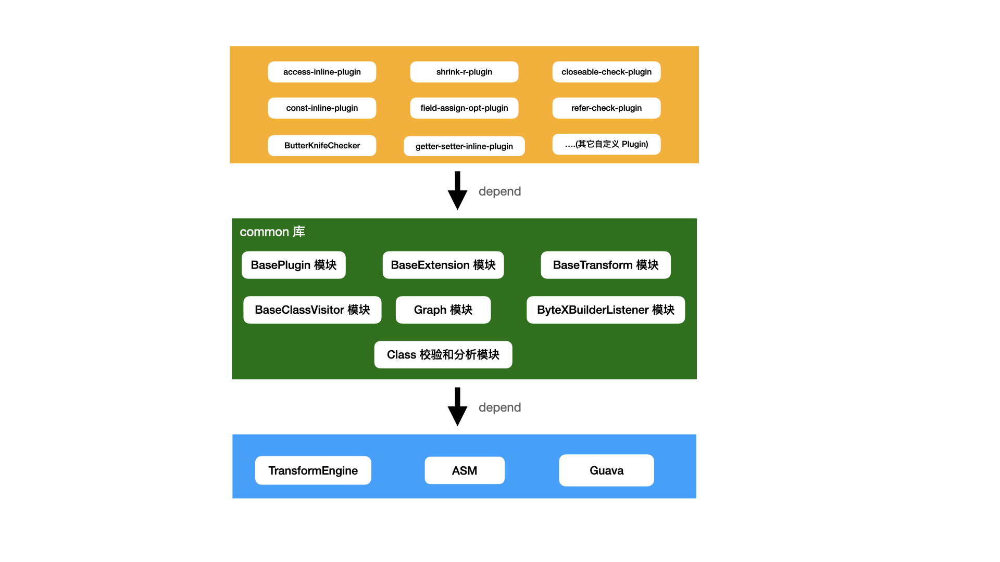
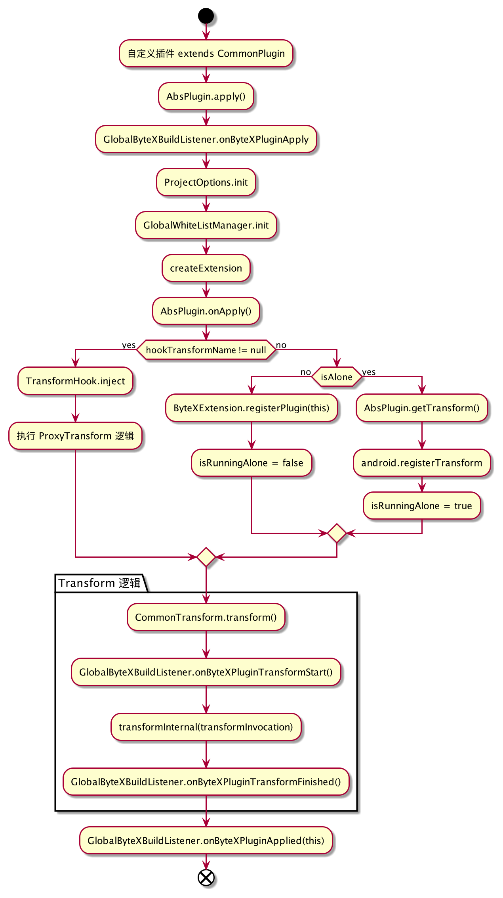
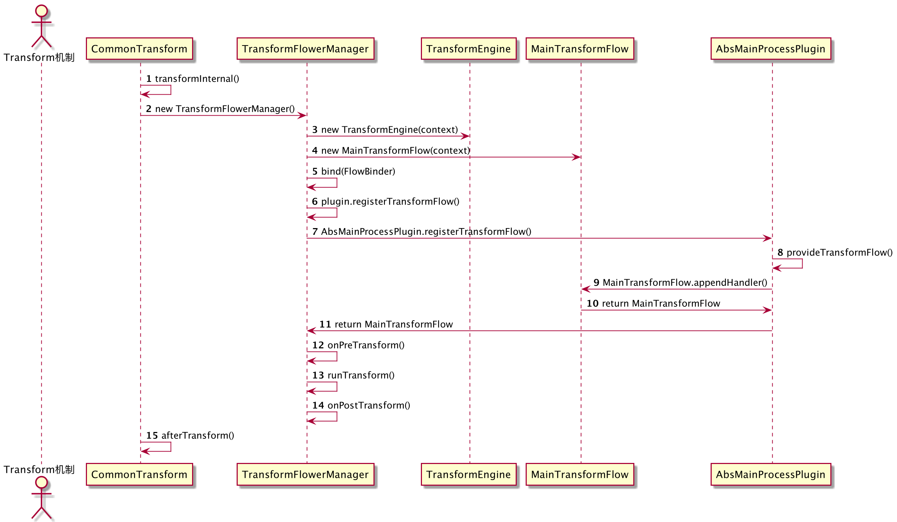

### 字节码插件 ByteX 源码解析

写这篇文章的目的有三个原因，首先在 `ByteX` 的交流群里有同学反馈源码不易阅读，看起来比较费力，所以希望通过自己的理解和梳理能够帮助大家学习 `ByteX` 的源码。其次，有同学在阅读我的博客 [AOP 利器 ASM 基础入门](https://juejin.cn/post/6877925000045658119) 之后反馈，不知道如何在工作中发现 `ASM` 的使用场景，所以希望借助 `ByteX` 的插件能给大家一些应用场景的启发。最后是作为个人学习 `ASM` 的一个总结。

### 1. ByteX 介绍

`ByteX` 是一个基于 `Gradle Transform API` 和 `ASM` 的字节码插件平台。通过平台化的设计可以避免针对每个 `Feature` 业务单独开发一个插件造成的编译构建耗时线性增加和代码耦合臃肿。目前 `ByteX` 集成了若干个字节码插件，每个插件完全独立，既可以脱离 `ByteX` 这个宿主而独立存在，又可以自动集成到宿主和其它插件一起整合为一个单独的 `Transform`。插件和插件之间，宿主和插件之间的代码是完全解耦的，这使得 `ByteX` 在代码上拥有很好的可拓展性，新插件的开发将会变得更加简单高效。

[ByteX 仓库地址：https://github.com/bytedance/ByteX](https://github.com/bytedance/ByteX)

### 2. 项目结构



通过对 `Plugin` 和 `Transform` 的抽象，将公共的代码剥离到 `common` 库中，提供给所有的插件复用，这样每个插件就只需要关注字节码插桩的业务逻辑处理即可。同时插件间自动无缝地整合成一个 `Transform`，提高构建的效率。`Transform` 过程中，对 `class` 文件的 `IO` 是比较耗时的，把所有的 `plugin` 整合成一个单独 `Transform` 可以避免打包的额外时间开销呈线性增长。让耗时从 `1+1=2`，变成`1+1<2` 或者约等于 `1`。平台化每个插件之间的代码相互隔离，避免代码的耦合，方便扩展。

#### 2.1 Plugins 应用层

在 `ByteX` 项目中，提供了诸多插件。

- [access-inline-plugin](https://github.com/bytedance/ByteX/blob/master/access-inline-plugin/README-zh.md)：`access` 方法内联优化，减少 `apk` 方法数和包大小
- [shrink-r-plugin](https://github.com/bytedance/ByteX/blob/master/shrink-r-plugin/README-zh.md)：`R` 文件瘦身和无用资源检查
- [closeable-check-plugin](https://github.com/bytedance/ByteX/blob/master/closeable-check-plugin/README-zh.md)：文件流的 `close` 检查
- [const-inline-plugin](https://github.com/bytedance/ByteX/blob/master/const-inline-plugin/README-zh.md)：常量内联
- [field-assign-opt-plugin](https://github.com/bytedance/ByteX/blob/master/field-assign-opt-plugin/README-zh.md)：优化多余赋值指令
- [getter-setter-inline-plugin](https://github.com/bytedance/ByteX/blob/master/getter-setter-inline-plugin/README-zh.md) ：`getter` 和 `setter` 方法内联
- [method-call-opt-plugin](https://github.com/bytedance/ByteX/blob/master/method-call-opt-plugin/README-zh.md)：干净地删除某些方法调用，如 `Log.d`
- [coverage-plugin](https://github.com/bytedance/ByteX/blob/master/coverage/README-zh.md)：线上代码覆盖率
- [refer-check-plugin](https://github.com/bytedance/ByteX/blob/master/refer-check-plugin/README-zh.md)：检查是否有调用不存在的方法和引用不存在的字段
- [serialization-check-plugin](https://github.com/bytedance/ByteX/blob/master/serialization-check-plugin/README-zh.md)：序列化检查
- [SourceFileKiller](https://github.com/bytedance/ByteX/blob/master/SourceFileKiller/README-zh.md)：删除 `SourceFile` 和行号属性
- [ButterKnifeChecker](https://github.com/bytedance/ByteX/blob/master/butterknife-check-plugin/README-zh.md)：检测跨 `module` 使用 `ButterKnife` 可能导致的问题
- [RFileKnife](https://github.com/bytedance/ByteX/blob/master/shrink-r-plugin/RFileKnife-README-zh.md)：修复 `R.java` 太大编译报 `code too large` 的问题

当然我们也可以基于 `common` 库开发自定义插件。这里可以参照研发 `WIKI`：[Developer API。](https://github.com/bytedance/ByteX/blob/master/wiki/ByteX-Developer-API-zh.md)

#### 2.2 Common 层

`common` 模块是整个框架的核心模块，它封装了公共代码部分，供所有插件使用。结构大体可分为如下：

- 通用插件 `BasePlugin` 的抽象，涉及到的类有：`AbsMainProcessPlugin`、`AbsPlugin`、`MainProcessHandler` 和 `IPlugin`
- 插件配置项的抽象，涉及到的类有：`BaseExtension`
- 通用 `Transform` 的抽象，涉及到的类有：`CommonTransform`、`SimpleTransform`、`ProxyTransform`
- 通用的 `ClassVisitor`，涉及到的类有：`BaseClassVisitor`、`ClassVisitorChain`
- 编译生命周期监听：`ByteXBuilderListener`、`TransformFlowListener`、`PluginStatus`
- 类图的生成：涉及到 `flow` 和 `graph` 两个包
- 类分析器和校验：`ClassFileAnalyzer` 和 `ClassFileTransformer`、`AsmVerifier`、`AsmVerifyClassVisitor`

很多同学反馈 `common` 库比较复杂，通过上面的模块拆分，能更好辅助阅读 `common` 层的源码。

#### 2.3 底层依赖

在 `common` 层中，依赖 `ASM` 仓库、`TransformEngine` 包和 `GradleToolKit` 来实现。

### 3. Common 模块核心逻辑

`common` 模块是整个框架的核心，包含了公共代码，是我们重点研读的对象。

#### 3.1 核心流程

无论如何变化，基于 `Transform` 机制开发的插件，大体核心的流程都是从 `Plugin.apply()` 方法开始。 `ByteX` 核心流程参见下图。



#### 3.2 AbsPlugin.apply 方法

`AbsPlugin.apply()` 是自定义插件的关键步骤，通常包含插件配置项的定义、回调监听以及注册 `Transform` 处理。

```java
public final void apply(@NotNull Project project) {
    // 回调 onByteXPluginApply 监听
    GlobalByteXBuildListener.INSTANCE.onByteXPluginApply(project, this);
    this.project = project;
    this.android = project.getExtensions().getByType(AppExtension.class);
    // 读取 Project 配置项
    ProjectOptions.INSTANCE.init(project);
    // 黑白名单配置读取
    GlobalWhiteListManager.INSTANCE.init(project);
    Class<E> extensionClass = getExtensionClass();
    if (extensionClass != null) {
        Instantiator instantiator = ((DefaultGradle) project.getGradle()).getServices().get(Instantiator.class);
        extension = createExtension(instantiator, extensionClass);
        // 添加 ByteX 配置
        project.getExtensions().add(extension.getName(), extension);
    }
    // 回调 onApply 方法
    onApply(project);
    // 读取代理 Proxy 名称
    String hookTransformName = hookTransformName();
    if (hookTransformName != null) {
        // 代码 ProxyTransform 处理
        TransformHook.inject(project, android, this);
    } else {
        // 是否独立插件
        if (!alone()) {//不是独立插件
            try {
                ByteXExtension byteX = project.getExtensions().getByType(ByteXExtension.class);
                byteX.registerPlugin(this);
                isRunningAlone = false;
            } catch (UnknownDomainObjectException e) {
                android.registerTransform(getTransform());
                isRunningAlone = true;
            }
        } else {
            // 独立插件
            android.registerTransform(getTransform());
            isRunningAlone = true;
        }
    }
    // 回调 onByteXPluginApplied
    GlobalByteXBuildListener.INSTANCE.onByteXPluginApplied(this);
} 
```

通过继承 `CommonPlugin` 实现自定义插件，插件注册后，执行到 `AbsPlugin.apply()` 方法，在该方法中完成插件回调监听、配置定义以及 `Transform` 注册等操作。

#### 3.3 Transform 机制的实现

`Transform` 的处理是实现一个 `Plugin` 比较关键的部分。在 `ByteX` 中将 `Transform` 的处理逻辑封装到 `CommonTransform` 类中。

```java
@Override
public final synchronized void transform(TransformInvocation transformInvocation) throws TransformException, InterruptedException, IOException {
    try {
        // 插件编译 Transform 开始回调 onByteXPluginTransformStart
        GlobalByteXBuildListener.INSTANCE.onByteXPluginTransformStart(this, transformInvocation);
        // Transform 核心逻辑封装
        transformInternal(transformInvocation);
        // 插件编译 Transform 结束回调 onByteXPluginTransformFinished
        GlobalByteXBuildListener.INSTANCE.onByteXPluginTransformFinished(this, null);
    } catch (Exception e) {
        GlobalByteXBuildListener.INSTANCE.onByteXPluginTransformFinished(this, e);
        throw e;
    }
}

private void transformInternal(TransformInvocation transformInvocation) throws TransformException, InterruptedException, IOException {
    super.transform(transformInvocation);
    // 1. 如果不是增量编译，并且 OutputProvider 不为空，则清空输出文件夹路径
    if (!transformInvocation.isIncremental() && transformInvocation.getOutputProvider() != null) {
        transformInvocation.getOutputProvider().deleteAll();
    }
    // 2. 读取 TransformContext 实例
    TransformContext transformContext = getTransformContext(transformInvocation);
    // 3. 初始化 Log 和 HtmlReporter 日志输出
    init(transformContext);
    // 4. 过滤 enable 状态为 false 的 Plugin，并排序
    List<IPlugin> plugins = getPlugins().stream().filter(p -> p.enable(transformContext)).collect(Collectors.toList());
    // 5. 对于未开启增量编译的插件，关闭增量变量
    if (plugins.stream().anyMatch(iPlugin -> !iPlugin.transformConfiguration().isIncremental())) {
        transformContext.requestNotIncremental();
    }

    Timer timer = new Timer();
    // 6. 创建 TransformFlowerManager 对象
    final ITransformPipeline manager = new TransformFlowerManager(transformContext);
    try {
        if (!plugins.isEmpty()) {
            // 7. 遍历执行 Plugin 的 startExecute
            plugins.forEach(iPlugin -> iPlugin.startExecute(transformContext));
            // 8. 遍历每个 Plugin，并给 Plugin 注册 Transform 回调，同时绑定到 TransformFlowerManager 上
            plugins.forEach(plugin -> manager.bind(manager1 -> plugin.registerTransformFlow(manager1.getCommonFlow(), transformContext)));
            // 9. 触发 onPreTransform 回调
            manager.onPreTransform();
            // 10. 触发 runTransform 回调
            manager.runTransform();
            // 11. 触发 onPostTransform 回调
            manager.onPostTransform();
        } else {//如果插件集合为空，则直接触发跳过回调
            manager.skipTransform();
        }
        // 12. 触发 afterTransform 回调
        afterTransform(transformInvocation);
    } catch (Throwable throwable) {
        LevelLog.sDefaultLogger.e(throwable.getClass().getName(), throwable);
        throw throwable;
    } finally {
        // 13. 遍历执行 Plugin 的 afterExecute
        for (IPlugin plugin : plugins) {
            try {
                plugin.afterExecute();
            } catch (Throwable throwable) {
                LevelLog.sDefaultLogger.e("do afterExecute", throwable);
            }
        }
        // 14. 释放 TransformContext
        transformContext.release();
        this.configurations = null;
        timer.record("Total cost time = [%s ms]");
        // 15. 日志输出
        if (BooleanProperty.ENABLE_HTML_LOG.value()) {
            HtmlReporter.getInstance().createHtmlReporter(getName());
            HtmlReporter.getInstance().reset();
        }
        LevelLog.sDefaultLogger = new LevelLog();
    }
}
```

在 `ByteX` 中 `transform()` 的核心实现被剥离到 `transformInternal()` 方法中进行实现，大体上可以分为以上的 `15` 个步骤，详细的步骤可以参见代码中的注释进行了解。这里我们重点介绍步骤 `6-10`，给 `Plugin` 注册 `Transform` 回调，同时绑定到 `TransformFlowerManager` 。



在这个流程中涉及到相关的关键类：

- `CommonTransform`：自定义插件中 `Transform` 的实现父类
- `TransformFlowerManager`：用于管理 `Transform` 过程管理，包含 `TransformFlow` 关系和 `Transform` 过程
- `TransformEngine`：`Transform` 过程的处理工具类，封装了 `Transform` 中的任务，比如 `traverseAndroidJar`
- `MainTransformFlow`：`Transform` 处理产物承载体
- `AbsMainProcessPlugin`：自定义插件的抽象类

##### 步骤 6：创建 ITransformPipeline 对象

在该步骤中创建一个 `TransformFlowerManager` 实例对象 `manager`，`TransformFlowerManager`  类中包含 `MainTransformFlow`、`TransformEngine` 和 `TransformFlow` 三个实例构成。

```java
private final MainTransformFlow commonFlow;
private final TransformEngine engine;
private TransformFlow first;
public TransformFlowerManager(TransformContext context) {
    this.engine = new TransformEngine(context);
    this.commonFlow = new MainTransformFlow(engine);
}
```

##### 步骤 7：回调 Plugin.startExecute

在该步骤中回到每个 `Plugin` 的 `startExecute` 方法，查看 `AbsPlugin` 中的实现触发的是 `onByteXPluginStart`。

```java
// 源码对应 AbsPlugin 类
public void startExecute(TransformContext transformContext) {
    GlobalByteXBuildListener.INSTANCE.onByteXPluginStart(this);
}
```

##### 步骤 8： Plugin.registerTransformFlow

我们将步骤 `8` 的 `Lambda` 写法调整一下，方便我们理解。

```java
plugins.forEach(plugin -> {
            manager.bind(new FlowBinder() {
                @Override
                public TransformFlow bind(TransformFlowerManager manager) {
                    return plugin.registerTransformFlow(manager.getCommonFlow(), transformContext);
                }
            });
        }
);
```

在这个步骤中，遍历每个 `Plugin`，通过调用 `TransformFlowerManager` 的 `bind` 方法将每个 `Plugin` 对应的 `TransformFlow` 串联起来。而每个 `Plugin` 通过调用 `registerTransformFlow` 方法来生成对应的 `TransformFlow` 对象。

```java
// 源码对应 AbsMainProcessPlugin 类
public final TransformFlow registerTransformFlow(@Nonnull MainTransformFlow mainFlow, @Nonnull TransformContext transformContext) {
    if (transformFlow == null) {
        transformFlow = provideTransformFlow(mainFlow, transformContext);// 处理最后返回的是 mainFlow
        if (transformFlow == null) {
            throw new RuntimeException("TransformFlow can not be null.");
        }
        if (!transformFlow.isLifecycleAware()) {
            transformFlow = new LifecycleAwareTransformFlow(transformFlow);
        }
    }
    return transformFlow;
}
```

通过源码可以看到返回的 `TransformFlow` 对象是 `MainTransformFlow` 或 `LifecycleAwareTransformFlow`。这里 `provideTransformFlow` 方法内部的实现是调用 `MainTransformFlow.appendHandler()` 方法，注意这里加入的是当前 `Plugin` 对象，因为 `AbsMainProcessPlugin` 实现了  `MainProcessHandler` 接口。

##### 步骤 9：onPreTransform()

`TransformFlowerManager.onPreTransform()` 的实现是遍历回调每个 `TransformFlow` 的 `prepare` 方法。

```java
// 源码对应 TransformFlowerManager 类
public void onPreTransform() throws IOException, InterruptedException {
    for (TransformFlow flow : first) {
        flow.prepare();
    }
}
```

从步骤 `8` 中可以知道， `TransformFlow` 对象是 `MainTransformFlow` 或 `LifecycleAwareTransformFlow`，这里我们以 `MainTransformFlow` 源码为例。

```java
// 源码对应 MainTransformFlow.java
@Override
public void prepare() throws IOException, InterruptedException {
    try {
        // 回调 startPrepare
        listenerManager.startPrepare(this);
        prepareInternal();
        // 回调 finishPrepare
        listenerManager.finishPrepare(this, null);
    } catch (Exception e) {
        listenerManager.finishPrepare(this, e);
        throw e;
    }
}

private void prepareInternal() throws IOException, InterruptedException {
    super.prepare();
    markRunningState(TransformContext.State.INITIALIZING);
    timer.startRecord("INIT");
    // 执行每个 Handler 的 init 任务,注意这里的 handler 集合是 registerTransformFlow 时添加的 Plugin 对象本身
    Schedulers.COMPUTATION().submitAndAwait(handlers, handler -> handler.init(transformEngine));
    timer.stopRecord("INIT", "Process init cost time = [%s ms]");
    markRunningState(TransformContext.State.INITIALIZED);
    if (!isOnePassEnough()) {// 是否只遍历一次
        markRunningState(TransformContext.State.INCREMENTALTRAVERSING);
        if (context.isIncremental()) {// 是否增量编译
            try {
                GlobalMainProcessHandlerListener.INSTANCE.startTraverseIncremental(handlers);
                timer.startRecord("TRAVERSE_INCREMENTAL");
                // 只遍历增量产物
                traverseArtifactOnly(getProcessors(Process.TRAVERSE_INCREMENTAL, new ClassFileAnalyzer(context, Process.TRAVERSE_INCREMENTAL, null, new ArrayList<>(handlers))));
                timer.stopRecord("TRAVERSE_INCREMENTAL", "Process project all .class files cost time = [%s ms]");
                GlobalMainProcessHandlerListener.INSTANCE.finishTraverseIncremental(handlers, null);
            } catch (Exception e) {
                GlobalMainProcessHandlerListener.INSTANCE.finishTraverseIncremental(handlers, e);
                throw e;
            }
        }
        markRunningState(TransformContext.State.BEFORETRAVERSE);
        // 执行每个 Handler 的 beforeTraverse 任务
        Schedulers.COMPUTATION().submitAndAwait(handlers, plugin -> plugin.beforeTraverse(transformEngine));
    }
}
```

`onPreTransform` 最终执行的是 `MainTransformFlow` 类的 `prepareInternal()` 方法。在针对每个 `TransformFlow` 遍历的过程中，业务处理是在 `traverseArtifactOnly()` 方法完成。

```java
traverseArtifactOnly(getProcessors(Process.TRAVERSE_INCREMENTAL, new ClassFileAnalyzer(context, Process.TRAVERSE_INCREMENTAL, null, new ArrayList<>(handlers))));
```

这里涉及到两个重要参数：

- `ClassFileAnalyzer` 类：用于完成类文件的解析，很关键的一个步骤，解析文件然后形成类图；
- `getProcessors() ` 方法：根据 `Process` 状态构建解析流程。

```java
private FileProcessor[] getProcessors(Process process, FileHandler fileHandler) {
  	// 在 traverse 和 transform 的过程中，加入自定义的 FileProcessor，提供更大的灵活性
    List<FileProcessor> processors = handlers.stream()
            .flatMap((Function<MainProcessHandler, Stream<FileProcessor>>) handler -> handler.process(process).stream())
            .collect(Collectors.toList());
    switch (process) {
        case TRAVERSE_INCREMENTAL:
            processors.add(0, new FilterFileProcessor(fileData -> fileData.getStatus() != Status.NOTCHANGED));
            processors.add(new IncrementalFileProcessor(new ArrayList<>(handlers), ClassFileProcessor.newInstance(fileHandler)));
            break;
        case TRAVERSE:
        case TRAVERSE_ANDROID:
        case TRANSFORM:
            processors.add(ClassFileProcessor.newInstance(fileHandler));
            processors.add(0, new FilterFileProcessor(fileData -> fileData.getStatus() != Status.NOTCHANGED && fileData.getStatus() != Status.REMOVED));
            break;
        default:
            throw new RuntimeException("Unknow Process:" + process);
    }
    return processors.toArray(new FileProcessor[0]);
}
```

首先添加自定义的 `FileProcessor` 处理器，然后根据 `Process` 状态添加对应处理器。

- `TRAVERSE_INCREMENTAL`：增量遍历状态
  - `FilterFileProcessor`：按照指定的条件过滤掉不需要的 `FileData`，此时的过滤条件是文件的状态不是 `Status.NOTCHANGED`；
  - `IncrementalFileProcessor`：增量文件处理器，**其中包含一个 `ClassFileProcessor(FileHandler)` 参数，用于对文件解析使用。**
- `TRAVERSE`、`TRAVERSE_ANDROID`、`TRANSFORM` 状态：
  - `ClassFileProcessor`：类文件处理器，**其中包含一个 `ClassFileProcessor(FileHandler)` 参数，用于对文件解析使用。**
  - `FilterFileProcessor`：按照指定的条件过滤掉不需要的 `FileData`，此时的过滤条件是文件的状态不是 `Status.NOTCHANGED` 和 `Status.REMOVED`。

关于 `ClassFileProcessor`、`IncrementalFileProcessor` 和 `FilterFileProcessor` 的具体实现由于篇幅的原因就不过多展开了，这里会重点介绍 `FileHandler` 的处理过程。

```java
// 源码对应 FileHandler.java
public void handle(FileData fileData) {
    try {
        List<MainProcessHandler> pluginList = handlers;
        if (fileData.getStatus() == Status.REMOVED) {// 移除状态的文件处理
            if (process != Process.TRAVERSE_INCREMENTAL) {
                throw new IllegalStateException("REMOVED State is only valid in TRAVERSE_INCREMENTAL process");
            }
            for (MainProcessHandler handler : pluginList) {
                handler.traverseIncremental(fileData, (ClassVisitorChain) null);
            }
            return;
        }
        byte[] raw = fileData.getBytes();
        String relativePath = fileData.getRelativePath();
        ClassReader cr = new ClassReader(raw);   // 构建 ClassReader 对象，解析文件
        int flag = getFlag(handlers);
        ClassVisitorChain chain = getClassVisitorChain(relativePath);  // 创建 ClassVisitorChain 对象，本质是 ClassWriter
        if (this.mGraphBuilder != null) {// 如果类图构建器为空，则创建 GenerateGraphClassVisitor 类读取类文件，并构建类图
            //do generate class diagram
            chain.connect(new GenerateGraphClassVisitor(process == TRAVERSE_ANDROID, mGraphBuilder));
        }
        pluginList.forEach(plugin -> {// 根据不同的状态，回调 Plugin 对应的处理过程
            switch (process) {
                case TRAVERSE_INCREMENTAL:
                    plugin.traverseIncremental(fileData, chain);
                    break;
                case TRAVERSE:
                    plugin.traverse(relativePath, chain);
                    break;
                case TRAVERSE_ANDROID:
                    plugin.traverseAndroidJar(relativePath, chain);  // 遍历 Android.jar
                    break;
                default:
                    throw new RuntimeException("Unsupported Process");
            }
        });
        ClassNode cn = new SafeClassNode();
        chain.append(cn);
        chain.accept(cr, flag);
        pluginList.forEach(plugin -> { // 做指令检查
            switch (process) {
                case TRAVERSE_INCREMENTAL:
                    plugin.traverseIncremental(fileData, cn);
                    break;
                case TRAVERSE:
                    plugin.traverse(relativePath, cn);
                    break;
                case TRAVERSE_ANDROID:
                    plugin.traverseAndroidJar(relativePath, cn);
                    break;
                default:
                    throw new RuntimeException("Unsupported Process");
            }
        });
    } catch (ByteXException e) {
        throw new RuntimeException(String.format("Failed to resolve class %s[%s]", fileData.getRelativePath(), Utils.getAllFileCachePath(context, fileData.getRelativePath())), e);
    } catch (Exception e) {
        e.printStackTrace();
        LevelLog.sDefaultLogger.e(String.format("Failed to read class %s", fileData.getRelativePath()), e);
        if (!GlobalWhiteListManager.INSTANCE.shouldIgnore(fileData.getRelativePath())) {
            throw new RuntimeException(String.format("Failed to resolve class %s[%s]", fileData.getRelativePath(), Utils.getAllFileCachePath(context, fileData.getRelativePath())), e);
        }
    }
}
```

`handle` 方法的核心还是通过 `ASM` 进行类文件的读取，然后形成 `GraphBuilder`。

##### 步骤  10：runTransform()

在步骤 `9` 的 `onPreTransform()` 中，已经完成了一次遍历。在 `runTransform()` 会在进行一次遍历。

```java
// 源码对应 TransformFlowerManager.java
@Override
public void runTransform() throws IOException, InterruptedException {
    for (TransformFlow flow : first) {
        flow.run(); // 1. 执行 TransformFlow.run 方法
        Graph graph = flow.getClassGraph();  // 读取 Graph 对象
        if (graph instanceof EditableGraph) {
            //clear the class diagram.we won’t use it anymore
            ((EditableGraph) graph).clear();
        }
    }
}
```

从步骤 `8` 中可以知道， `TransformFlow` 对象是 `MainTransformFlow` 或 `LifecycleAwareTransformFlow`，这里我们以 `MainTransformFlow` 源码为例。

```java
// 源码对应 MainTransformFlow.java
@Override
public void run() throws IOException, InterruptedException {
    try {
        listenerManager.startRunning(this, context.isIncremental());
        runTransform(); // 调用 runTransform 方法
        listenerManager.finishRunning(this, null);
    } catch (Exception e) {
        listenerManager.finishRunning(this, e);
        throw e;
    } finally {
        markRunningState(TransformContext.State.STATELESS);
    }
}

private void runTransform() throws IOException, InterruptedException {
    markRunningState(TransformContext.State.RUNNING);
    if (handlers.isEmpty()) return;
    timer.startRecord("PRE_PROCESS");
    Schedulers.COMPUTATION().submitAndAwait(handlers, plugin -> plugin.startRunning(transformEngine));
    if (!isOnePassEnough()) {
        timer.startRecord("LOADCACHE");
        GraphBuilder graphBuilder = new CachedGraphBuilder(getGraphCache(), context.isIncremental(), context.shouldSaveCache());
        if (context.isIncremental() && !graphBuilder.isCacheValid()) {
            throw new IllegalStateException("Transform is running as incrementally, but failed to load cache for the transform!");
        }
        timer.stopRecord("LOADCACHE", "Process loading cache cost time = [%s ms]");
        markRunningState(TransformContext.State.TRANSFORMING);
        try {
            GlobalMainProcessHandlerListener.INSTANCE.startTraverse(handlers);
            timer.startRecord("PROJECT_CLASS");
            // 对类文件进行遍历处理
            traverseArtifactOnly(getProcessors(Process.TRAVERSE, new ClassFileAnalyzer(context, Process.TRAVERSE, graphBuilder, new ArrayList<>(handlers))));
            timer.stopRecord("PROJECT_CLASS", "Process project all .class files cost time = [%s ms]");
            GlobalMainProcessHandlerListener.INSTANCE.finishTraverse(handlers, null);
        } catch (Exception e) {
            GlobalMainProcessHandlerListener.INSTANCE.finishTraverse(handlers, e);
            throw e;
        }

        try {
            GlobalMainProcessHandlerListener.INSTANCE.startTraverseAndroidJar(handlers);
            timer.startRecord("ANDROID");
            markRunningState(TransformContext.State.TRAVERSINGANDROID);
            // 遍历 Android.jar
            traverseAndroidJarOnly(getProcessors(Process.TRAVERSE_ANDROID, new ClassFileAnalyzer(context, Process.TRAVERSE_ANDROID, graphBuilder, new ArrayList<>(handlers))));
            GlobalMainProcessHandlerListener.INSTANCE.finishTraverseAndroidJar(handlers, null);
        } catch (Exception e) {
            GlobalMainProcessHandlerListener.INSTANCE.finishTraverseAndroidJar(handlers, e);
            throw e;
        }
        timer.stopRecord("ANDROID", "Process android jar cost time = [%s ms]");
        timer.startRecord("SAVECACHE");
        mClassGraph = graphBuilder.build(); // 类图构建
        timer.stopRecord("SAVECACHE", "Process saving cache cost time = [%s ms]");
    }

    GlobalMainProcessHandlerListener.INSTANCE.startTransform(handlers);
    timer.stopRecord("PRE_PROCESS", "Collect info cost time = [%s ms]");
    timer.startRecord("PROCESS");
    // 执行 Transform 任务
    transform(getProcessors(Process.TRANSFORM, new ClassFileTransformer(new ArrayList<>(handlers), needPreVerify(), needVerify())));
    timer.stopRecord("PROCESS", "Transform cost time = [%s ms]");
}
```

相比较 `onPreTransform()`，在 `runTransform()` 中同样通过 `traverseArtifactOnly()` 进行遍历，同时新增了对 `Android.jar` 的处理。最后调用 `transform(getProcessors(Process.TRANSFORM, new ClassFileTransformer()` 执行 `Transform` 任务。

至此，关于 `ByteX` 的 `Common` 层比较核心部分的逻辑已经介绍完毕。这部分代码对于监听和状态的设计较为复杂，需要理解各个流程细节以及类之间的继承关系，理清楚了，基本逻辑就出来了。

### 4. 总结

`ByteX` 字节码插件中使用了很多技术，比如 `Lambda 表达式`、`泛型`、`Stream API`以及 `ForkJoin 框架`，这些技术的灵活使用提高了代码的简洁性，但同时也加大了阅读难度。继续奥利给！


**参考**

- [ByteX ：https://github.com/bytedance/ByteX](https://github.com/bytedance/ByteX)

