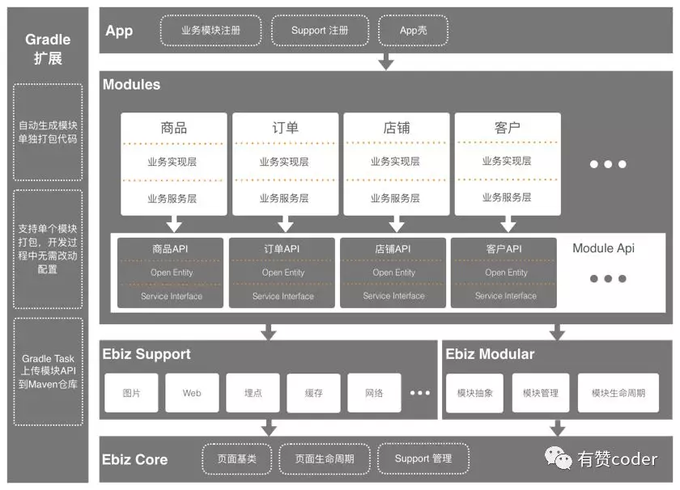

### 再说 Android 组件化

一个项目从最初的快速开发上线，到中期业务快速发展，再到后期稳定维护。这中间势必随着项目开发人员的不断增多，带来业务代码的臃肿，功能间的代码耦合也会逐渐增大，这时候为了提升代码质量和提高可维护性，势必需要进行架构重构。由于目前所在的业务线有规划做组件化相关的内容，本文通过分析业内优秀的组件化落地方案，以便找到适合自己业务的落地方案。

### 1. 组件化与模块化

**组件化**

组件是指单一的功能组件。比如视频组件、支付组件。在实际组件化的过程中，每个组件都是一个单独的 `Module`，每个 `Module` 可作为独立的 `Application` 运行，也可作为单独的 `Library` 运行。

**模块化**

模块是指独立的业务模块，比如支付模块、登录模块。在 AndroidStudio 中，一个模块同样对应着一个 `Module`，模块化就是将业务拆分成不同的 `Module` 模块，模块之间通过相互依赖的方式进行调用与通信。

从架构层面来说，二者的核心思想都是分而治之，都是为了提升代码的质量和可维护性，但是差别是在划分的粒度上，模块的粒度比组件的粒度高，通常情况一个模块中可能包含多个组件。

**组件化是纵向分层，模块化是横向分块。**

**组件化的优点**

1. **提高开发效率**：通过组件化的解耦，降低各个组件之间的相互依赖，使每个组件都是高内聚低耦合的状态。单独某个组件的修改不会对其它组件有重大影响，对于开发和测试来说，都提高了工作效率。同时可维护性也极大提升。
2. **功能复用**：每个单独的组件就是一个单一功能，对于业务线的开发团队来说，通过直接使用组件快速完成功能开发，同时减少了重复的开发工作量。

### 2. 组件化案例

在这部分，主要是结合网上一些优秀团队分享的组件化方案进行剖析。

#### 2.1 有赞微商城 Android 组件化

[有赞微商城分享的组件化方案](https://www.infoq.cn/article/fs4wggbaqymoq-as6eq3)详细介绍了实施组件化方案的背景，在基于日益复杂的业务模块中，代码出现大量冗余、打包时间逐渐增长以及各个业务模块之间相互耦合等。面临的问题有：

- 模块只是项目结构的概念（一个模块一个 `Module`），在逻辑层并没有模块这个概念
- 模块本身没有生命周期控制
- 公用服务中心化，公用逻辑部分全部都在 `Common` 模块中
- 模块对外暴露的服务不可知，都是直接依赖模块内部的代码逻辑
- 模块无法单独打包，针对模块的代码改动，只能全量打包之后才能看到效果

这些问题也是很多项目发展到一定阶段要面对的问题，为了解决这种问题，就需要对架构进行调整重构，严格按照组件化的强要求来进行业务模块的拆分。下面我们看下有赞团队是如何去落地组件化方案。

##### 1. 模块的拆分与抽象

将模块的功能抽象出基础类，形成模块化支持组件，这个基础 `Module` 提供的功能有：

- 抽象出模块本身作为某一类业务的容器，即所有业务模块需要实现自己的模块类，继承自我们的 `BaseModule`，并在 `App` 壳工程中进行注册；
- 模块对象跟 `Activity` 一样，拥有生命周期的概念，需要在生命周期的不同阶段处理自己相应的逻辑（注册服务、初始化数据等）；
- 模块可以注册的对外暴露的服务的实现，在注册模块的时候，模块携带的服务也会被注册到 App 的服务中心。

##### 2. 公共业务去中心化

这里的公共业务是指在 `App` 中抽取的 `Common` 模块，这个模块随着项目复杂度的提升，像一个大储物柜，每个人都往里面塞了很多业务代码，造成了该模块代码冗余增多以及维护难度增大。解决思路是：

- 将公用的业务模块向上抽离到业务模块中（所谓业务模块的服务化）；
- 将基础组件抽象到一个独立的组件中；
- 将一些基础类下沉到不包含业务逻辑的底层核心库中。

##### 3. 业务模块服务化

简单来说，就是根据业务划分为多个模块，模块之间的交互以互相提供服务的方式来完成。常见的基本方式有：

- `A` 模块直接依赖 `B` 模块，直接调用 `B` 模块的代码逻辑；
- 将 `A` 和 `B` 模块中的公用部分放到 `Common` 模块中，通过调用 `Common` 模块的代码实现依赖；

在有赞的组件化中，提出了通过 `API` 的方式实现，每个模块通过 `API` 暴露内部的数据和服务，以此来完成通信。常见的 API 实现方式有：

- 协议，类似于 `app://order/detail/get?id=100`，通过 `JSON` 传递数据，但是面临的问题维护成本高，服务修改导致引用方无感知；
- 接口，通过暴露的接口完成数据的交互，引用方需要依赖该模块，依赖和发布成本高；

这里有赞团队选择通过接口的方式实现，这种方式的稳定性和版本控制做的更好，对于改动来说，编译过程自动会帮你校验改动的影响面，而引入依赖和发布成本高的问题，完全可以交给构建工具（`Gradle Plugin`）来解决。

业务实现层需要做的，就是实现自己模块本身的业务逻辑，并实现自己提供的 `API` 接口，暴露对外的服务。

##### 4. 基础组件抽象

很多的基础组件都是统一在 `Common` 里面进行封装的，例如：账号库、网络库、图片加载等等，导致该模块臃肿。针对这种情况，需要针对该模块进行重构：

- 将常用的基础组件整理，抽象成单独的一个抽象层，里面定义了一系列基础组件接口（图片加载、`Web` 容器、`JsBridge` 调用、账号等等）；
- 把统一实现的组件放到另一个依赖里面，可以在 `App` 中进行具体实现的注册，而业务模块本身，可以只依赖抽象。

##### 5. 单/多模块打包

这部分是通过自定义 `Gradle Plugin` 实现 `Module` 的类型，在开发阶段是 `Application` 类型，可以单独运行调试，在发布阶段是 `Library` 形式。

新的架构图：

#### 2.2 知乎 Android 客户端组件化实践

在[知乎 Android 客户端组件化实践一文](https://zhuanlan.zhihu.com/p/45374964)中，介绍到随着项目团队的不断扩大，同样是面临代码耦合的问题以及现有架构在开发过程中研发人员协作方面也显得越来越力不从心。下面我们看下知乎团队如何落地实践组件化。

##### 1. 解耦业务模块

组件化第一步就是要解耦冗余的业务逻辑，这里主要包含：

**公有代码处理**

基础的业务逻辑拆分出独立的业务组件，将 `Common` 模块进行降级处理，严格限制大小增长。

**初始化**

有些组件有在应用启动时初始化服务的需求时，通过自定义生命周期框架进行实现初始化任务依赖和先后顺序的管理。

**路由**

界面间使用 `Url` 进行跳转，内部实现了一套灵活小巧的路由框架 `ZRouter` 完成路由跳转功能。

**接口**

不同业务之间不可避免的会有一些调用，为了避免组件的直接通信，通常都是使用接口依赖的方式。实现了一个 `Interface Provider` 来支持接口通信，它可以通过运行时在动态注册一个接口，同时也实现了对于 `ServiceLoader` 的支持。

**组件 API 模块**

为每个有对外暴露需求的组件添加一个 `API` 模块，`API` 模块中只包含对外暴露的 `Model` 和组件通信用的 `Interface` 与 `Event`。有需要引用这些类的组件只要依赖 `API` 即可。比如：

- `template` ：组件代码，它包含了这个组件所有业务代码；

- `template-api`：组件的接口模块，专门用于与其他组件通信，只包含 `Model`、`Interface` 和 `Event`，不存在任何业务和逻辑代码。

##### 2. 组件工程半自动拆分

解耦拆组件是一个很头疼的问题，如果依赖关系比较复杂，很容易出现到处编译错误，只能靠人肉一点点挪了。为了解决这个问题，知乎开发了一个辅助工具 `RefactorMan`： 它可以递归的解析出工程中所有源码的引用和被引用情况，同时会根据预设规则自动分析出所有不合理的依赖，在开发人员根据提示解决了不合理依赖之后，即可将组件一键移出，大大减少了拆组件的工作量。

##### 3. 联合编译完整包

通过 `sourceSet` 整合资源的目录，编译时使用 `sourceSet` 依赖，其他时候使用 `module` 依赖，保证各个子业务可以独立运行，对外发布只有一个组件。

新的架构图:

它包含 4 个层次：

- 主工程：除了一些全局配置和主 Activity 之外，不包含任何业务代码。

- 业务组件：最上层的业务，每个组件表示一条完整的业务线，彼此之间互相独立。

- 基础组件：支撑上层业务组件运行的基础业务服务。

- 基础 SDK：完全业务无关的基础代码。

#### 2.3 爱奇艺知识移动端组件化探索和实践

组件化对于任何一个业务场景复杂的 `App` 来说都是一个必经的过程，随着公司的业务线拆分发展，必然会出现同样的业务模块出现多端多套代码的情况，造成很大的维护成本。**在实施组件化之前，先明确组件化需要解决的业务问题，而不是为了组件化而组件化。**

在爱奇艺知识移动端实施组件化时，组件化的目标定义为以下几个：

- **解决多端代码维护问题**

根据业务特点，横向和纵向划分组件，以组件为单位承接迭代需求，各端进行组件复用。

- **解决跨组件调用和组件间路由的问题**

业务划分更加清晰、组件间解耦更加彻底、组件间通信更高效，对原有业务模块进行抽离和整合，明确组件间的业务边界。

- **提升开发效率，方便开发调试**

组件可以单独编译和调试，使模块开发者更聚焦本模块业务。

- **提升集成和提测效率**

各端项目需要哪个组件，可以直接通过工具快速集成和提测。

基于以上四个目标，结合自己的业务需求，新的架构分为**基础组件、功能组件和业务组件**。

其次是关于组件化实践中比较核心的两个技术点实践：组件间交互和组件间路由。

**组件间交互**

组件间交互的难点是降低组件耦合度，最好能达到完全无侵入式的调用。在 `Android` 端，组件间交互使用的是 `ZRouter` 组件，每个组件对外提供一个服务接口 `service`，接口的实现交给对应组件内。在组件初始化注册时候，会同时注册该 `service` 接口和对应 `service` 实现。业务方使用时，只需要通过 `service` 接口调用组件功能。这样组件间就没有了直接依赖关系，实现了组件间解耦隔离。

**组件间路由**

组件间路由跳转方面，用了注册 `URL` 的方式，注册的时机分为静态、动态和懒加载三种，懒加载方式即为在调用跳转方法时检查 `URL` 与`ClassName` 是否已经注册绑定，如果未绑定则从模块静态信息表中获取并完成注册绑定。这里爱奇艺团队借鉴业内优秀的组件化思想，专门开发了一个用于组件间UI跳转的 `UIRouter`。

### 3. 实现组件化

#### 3.1 四大步骤实现组件化

通过上面一些优秀案例的分析，当一个组织进行架构重构和调整时，基本上是积重难返、严重影响开发效率。所以需要对架构进行重构，提升开发效率。结合以上案例，总结出四大步骤来辅助我们实现一个组件化架构的设计。

##### 1. 明确组件化的目的

任何架构的重构或调整，都是为了解决特定的问题，在实施组件化之前，一定要明确此次架构重构需要解决的问题，以便能够有的放矢，而不是为了组件化而组件化。

##### 2. 业务拆分

组件化有一个重要的目的是为了降低代码之间的耦合，所以需要根据自己的业务进行拆分。**在业务拆分的过程中一般涉及到公共代码的处理、业务模块的拆分。**

##### 3. 组件划分

在完成业务拆分后，需要对各个业务形成单一组件，并进行分类。**组件的分类大致可以分为：业务组件、功能组件和基础组件三大类。**

**业务组件**

业务组件对应着具体的业务模块，比如首页、搜索、问答。

**功能组件**

功能组件通常是具有一个完整基础功能的组件，比如分享、视频、播放器等。它通常为业务组件直接引用，用于快速实现特定功能。一般比较稳定。

**基础组件**

基础组件就是覆盖众多基础功能的组件，这些基础功能和具体的业务无关。比如网络请求、日志框架、图片加载。基础组件是底层最稳定的组件。

##### 4. 技术选型

组件化的过程中，要保证每个 `Module` 组件能够单独运行并且参与编译，同时组件之间涉及到数据的交互和页面跳转。比如页面跳转实现的方案有：[ARouter](https://github.com/alibaba/ARouter)、[CC](https://github.com/luckybilly/CC)、[Componet](https://github.com/xiaojinzi123/Component) 等，需要根据自己的业务选择具体的方案。

#### 3.2 组件化面临的问题

组件化实现了解耦，将 `App` 运行工程与组件工程进行隔离，那必然会带来一些问题需要解决。

- 组件单独调试与编译
- 页面跳转和路由
- 组件模块间通信
- `Application` 的管理
- 资源冲突

关于这些问题都有比较成熟的方案，推荐阅读：[Android组件化开发思想与实践](https://juejin.cn/post/6844904147641171981#heading-7)、[“终于懂了” 系列：Android组件化，全面掌握！](https://juejin.cn/post/6881116198889586701#heading-19)

### 4. 最后

在这次调研中，阅读了很多优秀的实践文章，也算是对整个组件化的实践有了一定的了解。其中一篇文章中关于架构的总结很是受用。

> **无论任何架构，核心就是分层与通信的问题。分层是为了实现代码的解耦，无非就是数据处理（Model）、 UI显示(View)和业务处理（X）。通信就是分层的模块之间数据交互的方式。**

参考文章：

- [有赞微商城 Android 组件化方案](app.mokahr.com/interviews/overview?period=past)
- [知乎 Android 客户端组件化实践](https://zhuanlan.zhihu.com/p/45374964)
- [爱奇艺知识移动端组件化探索和实践](https://mp.weixin.qq.com/s?__biz=MzI0MjczMjM2NA==&mid=2247488427&idx=1&sn=df0e019de37eafa5b29baadc79541616&chksm=e9768f88de01069e8a539210798eeaa154f8ee03962a6bfac02edeabfc3ba1f1ec9886a6cd10&scene=27#wechat_redirect)

