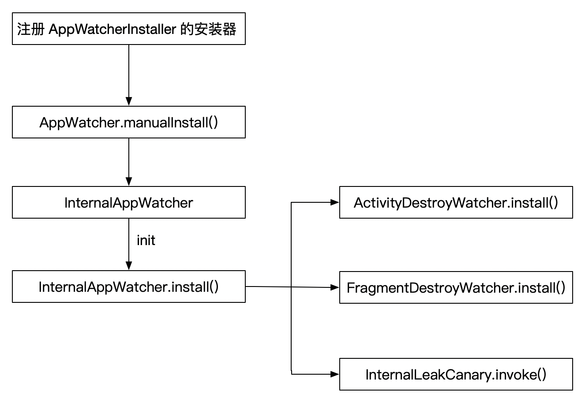

### 开源库—LeakCanary 源码解析

> 分析经典开源库是成长进阶的必备过程，通过学习顶尖工程师优秀的开源库，能提高我们的源码阅读和分析的能力，学习他们的设计思路构想，提升我们的代码设计能力。

**注意：本次分析基于 [leakcanary v2.4 版本](https://github.com/square/leakcanary/releases/tag/v2.4)**

`LeakCananry` 是 `Square` 公司开源的一个针对 `Android` 的内存泄漏检测工具，`LeakCanary` 对 `Android` 框架内部结构的了解使其具有独特的能力来缩小每次泄漏的原因，帮助开发人员显著减少 `OutOfMemoryError` 崩溃。

*A small leak will sink a great ship。（千里之堤溃于蚁穴）*

**什么是内存泄漏？**

在 `Java` 中，当一个已经不需要在使用的对象，会被垃圾回收器回收。但如果另外一个正在使用的对象持有该对象的引用，则导致不能被垃圾回收器回收，最终导致该对象一直存在内存中，这种现象称之为内存泄漏。持续发生内存泄漏，最终就会造成 `OOM` 的问题。

在 `Android` 中典型的内存泄漏，是当一个 `Activity` 已经执行 `onDestroy` 后，仍然被一些静态变量持有，最终导致内存泄漏。

### 1. 基本使用

`2.0` 之后的版本使用方式简化了很多，只需要在 `dependencies` 中添加 `LeakCanary` 的依赖即可。同时官网建议使用 `debugImplementation` 的方式进行依赖，该方式只在 `debug` 包下有效，所以不用担心用户误操作导致在 `release` 包下造成的性能影响。

**添加依赖**

```groovy
dependencies {
  // debugImplementation because LeakCanary should only run in debug builds.
  debugImplementation 'com.squareup.leakcanary:leakcanary-android:2.4'
}
```

不需要写任何代码就完成了 `LeakCanary` 的集成使用。`LeakCanary` 会自动完成对以下对象的内存泄漏检测：

- 销毁的 `Activity` 实例
- 销毁的 `Fragment` 实例
- 销毁的 `Fragment` 的 `View` 实例
- 清空的 `ViewModel` 实例

### 2. 流程概述

关于 `LeakCananry` 的工作流程可以参照官方的指导文档 [How LeakCanary works](https://square.github.io/leakcanary/fundamentals-how-leakcanary-works/)。

#### 2.1 原理概述

参照 [How LeakCanary works](https://square.github.io/leakcanary/fundamentals-how-leakcanary-works/) 文档，`LeakCanary` 通过 `ActivityLifecycleCallbacks` 和 `FragmentLifecycleCallbacks` 完成对于 `Activity` 和 `Fragment` 的生命周期监听，当监听到 `Activity` 或 `Fragment` 被销毁时(`onDestroy()`) ，会把他们放到一个弱引用中（`WeakReference`），然后将该弱引用关联到一个引用队列（`ReferenceQueue`）。如果该引用队列中扔持有 `Activity` 或 `Fragment` 的引用，则执行 `GC`  操作，如果 `5s` 之后，该对象还存在引用队列中，则证明该对象出现内存泄漏，然后执行 `dump` 指令分析内存。

#### 2.2 基本流程

关于 `LeakCanary` 的注册流程如下：



可以概述为以下步骤：

1. 注册 `AppWatcherInstaller` 的 `ContentProvider`
2. 调用 `AppWatcher` 的 `manualInstall` 方法
3. `InternalAppWatcher` 进行初始化，调用 `init` 方法，然后调用 `InternalAppWatcher.install()` 完成对 `Activity` 和 `Fragment`的生命周期监听。同时注册处理回调 `InternalLeakCanary`。

### 3 LeakCanary 内存泄漏对象检测

#### 3.1. LeakCanary 安装初始化

在 `2.0` 之后的版本，`LeakCanary` 无需用户写一行代码就可以完成初始化，这里主要是利用 `ContentProvider` 在 `Application` 之前进行初始化的特点，通过注册 `ContentProvider` 然后在 `onCreate` 方法中完成初始化操作。

```xml
<provider
    android:name="leakcanary.internal.AppWatcherInstaller$MainProcess"
    android:authorities="${applicationId}.leakcanary-installer"
    android:enabled="@bool/leak_canary_watcher_auto_install"
    android:exported="false"/>
```

这里注册了 `leakcanary.internal.AppWatcherInstaller$MainProcess`。

```kotlin
internal sealed class AppWatcherInstaller : ContentProvider() {

  /**
   * [MainProcess] automatically sets up the LeakCanary code that runs in the main app process.
   */
  internal class MainProcess : AppWatcherInstaller()

  /**
   * When using the `leakcanary-android-process` artifact instead of `leakcanary-android`,
   * [LeakCanaryProcess] automatically sets up the LeakCanary code
   */
  internal class LeakCanaryProcess : AppWatcherInstaller()

  override fun onCreate(): Boolean {
    val application = context!!.applicationContext as Application
    AppWatcher.manualInstall(application)
    return true
  }
  ...
}
```

在 `onCreate` 方法内部，调用 `AppWatcher.manualInstall(application)` 进行初始化，这样就做到无需写代码即可集成使用。这里有同学会问了，那怎么不开启自动初始化呢？这就得利用 `ContentProvider` 组件的 `android:enable` 属性去控制，从上面的 `Provider` 声明可以看到，`android:enable` 属性的取值通过 `leak_canary_watcher_auto_install` 控制，该值默认为 `true`。

```xml
<resources>
  <bool name="leak_canary_watcher_auto_install">true</bool>
</resources>
```

所以如果我们要自定义，就得将 `android:enable` 取值为 `false`，并且手动调用 `AppWatcher.munualInstall(application)` 进行初始化。

```xml
// 在 res 目录中重写为 false
<resources>
  <bool name="leak_canary_watcher_auto_install">false</bool>
</resources>

// 在 Application 中初始化
AppWatcher.munualInstall(application)
```

##### 2.1 AppWatcher.manualInstall(Application)

`AppWatcher` 类是 `Android` 开发中使用 `ObjectWatcher` 监听的 `API` 入口。它的内部主要包含了 `LeakCanary` 使用的配置项。

```kotlin
object AppWatcher {

  /**
   * AppWatcher configuration data class. Properties can be updated via [copy].
   *
   * @see [config]
   */
  data class Config(
  	// 是否自动检测 Activity
    val watchActivities: Boolean = true,

    // 是否自动检测 Fragment
    val watchFragments: Boolean = true,

    // 是否自动检测 Fragment View
    val watchFragmentViews: Boolean = true,

    // 是否自动检测 androidx.lifecycle.ViewModel
    val watchViewModels: Boolean = true,

    // 检测遗留的对象时长，默认 5s
    val watchDurationMillis: Long = TimeUnit.SECONDS.toMillis(5),
  ) {}

  /**
   * The [ObjectWatcher] used by AppWatcher to detect retained objects.
   */
  val objectWatcher
    get() = InternalAppWatcher.objectWatcher

  /**
   * [AppWatcher] is automatically installed in the main process on startup. You can
   * disable this behavior by overriding the `leak_canary_watcher_auto_install` boolean resource:
   *
   * ```
   * <?xml version="1.0" encoding="utf-8"?>
   * <resources>
   *   <bool name="leak_canary_watcher_auto_install">false</bool>
   * </resources>
   * ```
   *
   * If you disabled automatic install then you can call this method to install [AppWatcher].
   */
  fun manualInstall(application: Application) {
    InternalAppWatcher.install(application)
  }
}
```

`AppWatcher` 作为对 `LeakCanary` 的对外 `API`，内部包含一个 `Config` 配置项类，用于配置 `LeakCanary` 检测哪些类型的对象。

- `watchActivities`：是否自动检测 `Activity`
- `watchFragments`：是否自动检测 `Fragment`
- `watchFragmentViews`：是否自动检测 `Fragment View`
- `watchViewModels`：是否自动检测 `androidx.lifecycle.ViewModel`

如果我们手动进行初始化，可以参照如下方式进行设置。

```kotlin
val watcherConfig = AppWatcher.config.copy(watchViewModels = false)
AppWatcher.config = watcherConfig
AppWatcher.manualInstall(application)
```

在 `manualInstall` 方法的内部调用 `InternalAppWatcher.install()` 进行初始化安装。

##### 2.2 InternalAppWatcher.install()

这是初始化安装的最终执行方法。

```kotlin
internal object InternalAppWatcher {

  val isInstalled
    get() = ::application.isInitialized

  private val onAppWatcherInstalled: (Application) -> Unit

  lateinit var application: Application

  private val clock = object : Clock {
    override fun uptimeMillis(): Long {
      return SystemClock.uptimeMillis()
    }
  }

  private val mainHandler by lazy {
    Handler(Looper.getMainLooper())
  }

  init {
    val internalLeakCanary = try {
      val leakCanaryListener = Class.forName("leakcanary.internal.InternalLeakCanary")
      leakCanaryListener.getDeclaredField("INSTANCE")
          .get(null)
    } catch (ignored: Throwable) {
      NoLeakCanary
    }
    @kotlin.Suppress("UNCHECKED_CAST")
    onAppWatcherInstalled = internalLeakCanary as (Application) -> Unit
  }

  private val checkRetainedExecutor = Executor {
    mainHandler.postDelayed(it, AppWatcher.config.watchDurationMillis)
  }
  val objectWatcher = ObjectWatcher(
      clock = clock,
      checkRetainedExecutor = checkRetainedExecutor,
      isEnabled = { true }
  )

  fun install(application: Application) {
    checkMainThread()
    if (this::application.isInitialized) {
      return
    }
    SharkLog.logger = DefaultCanaryLog()
    InternalAppWatcher.application = application

    val configProvider = { AppWatcher.config }
    ActivityDestroyWatcher.install(application, objectWatcher, configProvider)
    FragmentDestroyWatcher.install(application, objectWatcher, configProvider)
    onAppWatcherInstalled(application)
  }

  inline fun <reified T : Any> noOpDelegate(): T {
    val javaClass = T::class.java
    val noOpHandler = InvocationHandler { _, _, _ ->
      // no op
    }
    return Proxy.newProxyInstance(
        javaClass.classLoader, arrayOf(javaClass), noOpHandler
    ) as T
  }

  private fun checkMainThread() {
    if (Looper.getMainLooper().thread !== Thread.currentThread()) {
      throw UnsupportedOperationException(
          "Should be called from the main thread, not ${Thread.currentThread()}"
      )
    }
  }

  object NoLeakCanary : (Application) -> Unit, OnObjectRetainedListener {
    override fun invoke(application: Application) {
    }

    override fun onObjectRetained() {
    }
  }
}
```

`InternalAppWatcher` 是一个 `Object` 类，它完成 `LeakCanary` 初始化安装核心代码调用。

**init 方法**

首先执行初始化方法，在 `init` 方法中通过反射创建 `InternalLeakCanary` 对象，并赋值给 `onAppWatcherInstalled` 对象。

**install 方法**

1. 首先检测当前线程是否在主线程，`LeakCanary` 要求在主线程进行初始化
2. 进行 `SharkLog` 、`Config` 的初始化
3. 注册 `ActivityDestroyWatcher` 和 `FragmentDestroyWatcher` 监听
4. 调用 `InternalLeakCanary` 类的 `invoke` 方法

#### 3.2 ActivityDestroyWatcher

`ActivityDestroyWatcher` 用于对 `Activity` 的生命周期进行监听。

```kotlin
internal class ActivityDestroyWatcher private constructor(
  private val objectWatcher: ObjectWatcher,
  private val configProvider: () -> Config
) {

  private val lifecycleCallbacks =
    object : Application.ActivityLifecycleCallbacks by noOpDelegate() {
      override fun onActivityDestroyed(activity: Activity) {
        if (configProvider().watchActivities) {
          objectWatcher.watch(
              activity, "${activity::class.java.name} received Activity#onDestroy() callback"
          )
        }
      }
    }

  companion object {
    fun install(
      application: Application,
      objectWatcher: ObjectWatcher,
      configProvider: () -> Config
    ) {
      val activityDestroyWatcher =
        ActivityDestroyWatcher(objectWatcher, configProvider)
      application.registerActivityLifecycleCallbacks(activityDestroyWatcher.lifecycleCallbacks)
    }
  }
}
```

通过注册 `registerActivityLifecycleCallbacks`  实现对 `Activity` 生命周期的监听，当 `Activity` 触发 `onActivityDestroyed`

 时，则将 `Activity` 添加到 `ObjectWatcher` 中进行检测。关于 `ObjectWatcher` 的讲解放在后面的章节进行介绍。

#### 3.3 FragmentDestroyWatcher

``FragmentDestroyWatcher`` 用于对于 `Fragment` 的生命周期监听。在 `Android` 中关于 `Fragment` 存在三种类型：

- `androidx.fragment.app.Fragment`：在 `Androidx` 库中提供支持
- `android.support.v4.app.Fragment`：在 `support` 库中提供支持
- `android.app.Fragment`：`Android` 库中提供支持

由于 `Androidx` 库和 `support` 库不能共存，所以在处理上需要做兼容。

```kotlin
internal object FragmentDestroyWatcher {

  private const val ANDROIDX_FRAGMENT_CLASS_NAME = "androidx.fragment.app.Fragment"
  private const val ANDROIDX_FRAGMENT_DESTROY_WATCHER_CLASS_NAME =
    "leakcanary.internal.AndroidXFragmentDestroyWatcher"

  // Using a string builder to prevent Jetifier from changing this string to Android X Fragment
  @Suppress("VariableNaming", "PropertyName")
  private val ANDROID_SUPPORT_FRAGMENT_CLASS_NAME =
    StringBuilder("android.").append("support.v4.app.Fragment")
        .toString()
  private const val ANDROID_SUPPORT_FRAGMENT_DESTROY_WATCHER_CLASS_NAME =
    "leakcanary.internal.AndroidSupportFragmentDestroyWatcher"

  fun install(
    application: Application,
    objectWatcher: ObjectWatcher,
    configProvider: () -> AppWatcher.Config
  ) {
    // 创建 Fragment 检测列表
    val fragmentDestroyWatchers = mutableListOf<(Activity) -> Unit>()

    if (SDK_INT >= O) {
      fragmentDestroyWatchers.add(
          AndroidOFragmentDestroyWatcher(objectWatcher, configProvider)
      )
    }

    getWatcherIfAvailable(
        ANDROIDX_FRAGMENT_CLASS_NAME,
        ANDROIDX_FRAGMENT_DESTROY_WATCHER_CLASS_NAME,
        objectWatcher,
        configProvider
    )?.let {
      fragmentDestroyWatchers.add(it)
    }

    getWatcherIfAvailable(
        ANDROID_SUPPORT_FRAGMENT_CLASS_NAME,
        ANDROID_SUPPORT_FRAGMENT_DESTROY_WATCHER_CLASS_NAME,
        objectWatcher,
        configProvider
    )?.let {
      fragmentDestroyWatchers.add(it)
    }

    if (fragmentDestroyWatchers.size == 0) {
      return
    }

    application.registerActivityLifecycleCallbacks(object : Application.ActivityLifecycleCallbacks by noOpDelegate() {
      override fun onActivityCreated(
        activity: Activity,
        savedInstanceState: Bundle?
      ) {
        for (watcher in fragmentDestroyWatchers) {
          watcher(activity)
        }
      }
    })
  }
}
```

核心方法 `install` 的流程可以概述三个流程：

1. 注册 `android.app.Fragment`  的监听 `AndroidOFragmentDestroyWatcher`
2. 注册 `androidx.fragment.app.Fragment` 的监听 `AndroidXFragmentDestroyWatcher`
3. 注册 `android.support.v4.app.Fragment` 的监听 `AndroidSupportFragmentDestroyWatcher`

在对 `support` 库和 `androidx` 库进行支持的时候，在 `getWatcherIfAvailable` 方法中通过反射判断当前 `App` 是否引入对应的库，如果引入则添加对应的监听。

##### 1. AndroidOFragmentDestroyWatcher

通过 ` FragmentManager.FragmentLifecycleCallbacks` 回调进行 `Fragment` 的生命周期监听，这里的 `FragmentManager` 是 `android.app.FragmentManager`。当在 `onFragmentDestroyed` 和 `onFragmentViewDestroyed` 时，将 `Fragment` 添加到 `ObjectWatcher` 中检测。

```kotlin
private val fragmentLifecycleCallbacks = object : FragmentManager.FragmentLifecycleCallbacks() {

  override fun onFragmentViewDestroyed(
    fm: FragmentManager,
    fragment: Fragment
  ) {
    val view = fragment.view
    if (view != null && configProvider().watchFragmentViews) {
      objectWatcher.watch(
        view, "${fragment::class.java.name} received Fragment#onDestroyView() callback " +
        "(references to its views should be cleared to prevent leaks)"
      )
    }
  }

  override fun onFragmentDestroyed(
    fm: FragmentManager,
    fragment: Fragment
  ) {
    if (configProvider().watchFragments) {
      objectWatcher.watch(
        fragment, "${fragment::class.java.name} received Fragment#onDestroy() callback"
      )
    }
  }
}
```

##### 2. AndroidXFragmentDestroyWatcher

通过 ` FragmentManager.FragmentLifecycleCallbacks` 回调进行 `Fragment` 的生命周期监听，这里的 `FragmentManager` 是 `androidx.fragment.app.FragmentManager`。当在 `onFragmentDestroyed` 和 `onFragmentViewDestroyed` 时，将 `Fragment` 添加到 `ObjectWatcher` 中检测。在 `onFragmentCreated` 中会添加对于 `ViewModel` 的检测。

```kotlin
private val fragmentLifecycleCallbacks = object : FragmentManager.FragmentLifecycleCallbacks() {

	override fun onFragmentCreated(
	  fm: FragmentManager,
	  fragment: Fragment,
	  savedInstanceState: Bundle?
	) {
	  ViewModelClearedWatcher.install(fragment, objectWatcher, configProvider)
	}

	override fun onFragmentViewDestroyed(
	  fm: FragmentManager,
	  fragment: Fragment
	) {
	  val view = fragment.view
	  if (view != null && configProvider().watchFragmentViews) {
	    objectWatcher.watch(
	        view, "${fragment::class.java.name} received Fragment#onDestroyView() callback " +
	        "(references to its views should be cleared to prevent leaks)"
	    )
	  }
	}

	override fun onFragmentDestroyed(
	  fm: FragmentManager,
	  fragment: Fragment
	) {
	  if (configProvider().watchFragments) {
	    objectWatcher.watch(
	        fragment, "${fragment::class.java.name} received Fragment#onDestroy() callback"
	    )
	  }
	}
}
```

##### 3. AndroidSupportFragmentDestroyWatcher

通过 ` FragmentManager.FragmentLifecycleCallbacks` 回调进行 `Fragment` 的生命周期监听，这里的 `FragmentManager` 是 `android.support.v4.app.FragmentManager`。当在 `onFragmentDestroyed` 和 `onFragmentViewDestroyed` 时，将 `Fragment` 添加到 `ObjectWatcher` 中检测。

```kotlin
private val fragmentLifecycleCallbacks = object : FragmentManager.FragmentLifecycleCallbacks() {

    override fun onFragmentViewDestroyed(
      fm: FragmentManager,
      fragment: Fragment
    ) {
      val view = fragment.view
      if (view != null && configProvider().watchFragmentViews) {
        objectWatcher.watch(
            view, "${fragment::class.java.name} received Fragment#onDestroyView() callback " +
            "(references to its views should be cleared to prevent leaks)"
        )
      }
    }

    override fun onFragmentDestroyed(
      fm: FragmentManager,
      fragment: Fragment
    ) {
      if (configProvider().watchFragments) {
        objectWatcher.watch(
            fragment, "${fragment::class.java.name} received Fragment#onDestroy() callback"
        )
      }
    }
}
```

至此完成对 `Fragment` 的监听。

#### 3.4 ObjectWatcher

在前面的章节中，可以看到调用 `ObjectWatcher` 的 `watch()` 方法将 `Activity` 和 `Fragment` 添加到监测集合中。`ObjectWatcher` 是 `LeakCanary` 的内存泄漏监测对象管理类。它采用弱引用的方式存储对象，然后当 `checkRetainedExecutor` 执行后去检查对象引用是否被清除，如果未被清除，则可能发生内存泄漏。

通过源码看下基本构成。

```kotlin
class ObjectWatcher constructor(
  private val clock: Clock,
  private val checkRetainedExecutor: Executor,
  private val isEnabled: () -> Boolean = { true }
) {

  private val onObjectRetainedListeners = mutableSetOf<OnObjectRetainedListener>()

  // 监测对象集合
  private val watchedObjects = mutableMapOf<String, KeyedWeakReference>()

  private val queue = ReferenceQueue<Any>()

  // 是否有未清除的对象，发生内
  val hasRetainedObjects: Boolean

  // 内存泄漏对象个数
  val retainedObjectCount: Int

  /**
   * Returns true if there are watched objects that aren't weakly reachable, even
   * if they haven't been watched for long enough to be considered retained.
   */
  val hasWatchedObjects: Boolean

  // 内存泄漏对象集合
  val retainedObjects: List<Any>
}
```

`ObjectWatch` 的组成也比较简单，我们主要关注 `watchedObjects` 和 `checkRetainedExecutor` 的用途，二者分别用于存储监测对象和执行监测。调用 `watch`  方法添加监测对象。

```kotlin
@Synchronized fun watch(
watchedObject: Any,
description: String
) {
	if (!isEnabled()) {
	  return
	}
	removeWeaklyReachableObjects()
	val key = UUID.randomUUID()
	    .toString()
	val watchUptimeMillis = clock.uptimeMillis()
	val reference =
	  KeyedWeakReference(watchedObject, key, description, watchUptimeMillis, queue)
	SharkLog.d {
	  "Watching " +
	      (if (watchedObject is Class<*>) watchedObject.toString() else "instance of ${watchedObject.javaClass.name}") +
	      (if (description.isNotEmpty()) " ($description)" else "") +
	      " with key $key"
	}

	watchedObjects[key] = reference
	checkRetainedExecutor.execute {
	  moveToRetained(key)
	}
}
```

`watch` 方法的流程简要概括如下：

1. 是否开启 `LeakCanary`，未开启则 `return`
2. 移除 `watchedObjects` 中被 `GC` 回收的引用
3. 生成 `key`，并构建 `KeyedWeakReference` 弱引用，同时添加到 `watchedObjects` 集合中
4. 执行 `moveToRetained` 方法检测当前对象

在这里需要补充一个关于引用队列的知识点。

##### 引用队列（ReferenceQueue）

`Reference` 把内存分为 4 种状态，`Active` 、 `Pending` 、 `Enqueued` 、 `Inactive`。

- `Active` ：一般说来 `Reference` 被创建出来分配的状态都是 `Active`
- `Pending` ：马上要放入队列（`ReferenceQueue`）的状态，也就是马上要回收的对象
- `Enqueued` ：`Reference` 对象已经进入队列，即 `Reference` 对象已经被回收
- `Inactive` ：`Reference` 从队列中取出后的最终状态，无法变成其他的状态。

在 `Java` 中软引用(`SoftReference`)和弱引用(`WeakReference`)在创建的时候都可以关联一个引用队列。当 `GC`（垃圾回收线程）准备回收一个对象时，如果发现它还仅有软引用(或弱引用，或虚引用)指向它，就会在回收该对象之前，把这个软引用（或弱引用，或虚引用）加入到与之关联的引用队列（`ReferenceQueue`）中。如果一个软引用（或弱引用，或虚引用）对象本身在引用队列中，则说明该引用对象所指向的对象被回收了。

**LeakCanary** 的实现就是将所有的 **Activity** 或 **Fragment** 实例放入到弱引用中，并关联一个引用队列。如果实例进行了回收，那么弱引用就会放入到 **ReferenceQueue** 中，并调用 `removeWeaklyReachableObjects` 方法将已经回收的对象从 `watchedObjects` 集合中删除，然后剩下的就是没有被回收，发生内存泄漏的。如果一段时间后，所监控的实例还未在 **ReferenceQueue** 中出现，那么可以证明出现了内存泄漏导致了实例没有被回收。

#### 3.5 InternalLeakCanary

在前面介绍 `InternalAppWatcher.install()` 中，最后一个执行操作就是 `InternalLeakCanary` 类的使用，下面围绕这个类的用法，进行一些介绍。

同样还是先看基本组成。

```kotlin
internal object InternalLeakCanary : (Application) -> Unit, OnObjectRetainedListener {

  private const val DYNAMIC_SHORTCUT_ID = "com.squareup.leakcanary.dynamic_shortcut"

  private lateinit var heapDumpTrigger: HeapDumpTrigger
  
  private var _application: Application? = null
  ....

 }
```

`InternalLeakCanary` 实现 `OnObjectRetainedListener` 接口，里面持有一个 `HeapDumpTrigger` 对象用于内存计算。

`InternalAppWatcher` 类在 `init` 方法中通过反射创建 `InternalLeakCanary` 对象，并在 `install` 方法内调用触发 `invoke` 方法，下面详细介绍下 `invoke` 逻辑。

```kotlin
override fun invoke(application: Application) {
	_application = application
	// 检测是否是 Debug build
	checkRunningInDebuggableBuild()
	// 添加 AppWatcher 监听
	AppWatcher.objectWatcher.addOnObjectRetainedListener(this)
	// 创建 AndroidHeapDumper 分析工具类
	val heapDumper = AndroidHeapDumper(application, createLeakDirectoryProvider(application))
	// GC 触发器
	val gcTrigger = GcTrigger.Default

	val configProvider = { LeakCanary.config }

	val handlerThread = HandlerThread(LEAK_CANARY_THREAD_NAME)
	handlerThread.start()
	val backgroundHandler = Handler(handlerThread.looper)
	// 初始化执行 HeapDumpTrigger
	heapDumpTrigger = HeapDumpTrigger(
	    application, backgroundHandler, AppWatcher.objectWatcher, gcTrigger, heapDumper,
	    configProvider
	)
	// 注册监听器
	application.registerVisibilityListener { applicationVisible ->
	  this.applicationVisible = applicationVisible
	  heapDumpTrigger.onApplicationVisibilityChanged(applicationVisible)
	}
	registerResumedActivityListener(application)
	// 添加桌面快捷方式
	addDynamicShortcut(application)
	// 关闭 Dump 分析
	disableDumpHeapInTests()
}
```

在 `invoke` 方法中，主要是执行相关类的初始化工作。比如添加 `OnObjectRetainedListener` 监听、`AndroidHeapDumper` 分析、`GcTrigger` 触发器、添加桌面快捷方式等操作。至此，整个 `LeakCanary` 的主体流程就完成了。后面就是通过 `HeapDumpTrigger` 进行内存检测的过程了。

### 4. LeakCanary 内存分析与检测

通过上面的流程分析可知，最后 `InternalLeakCananry` 类作为内存分析的引爆点，通过 `invoke` 方法完成相关成员对象的初始化，然后实现 `OnObjectRetainedListener` 监听回调，当 `ObjectWatcher` 中检测到有未被清除的对象时，则触发  `OnObjectRetainedListener`  回调，之后针对该对象完成内存泄漏分析与检测。

关键调用流程：

```xml
ObjectWatcher.onObjectRetained()
	-> InternalLeakCanary.onObjectRetained()
		-> HeapDumpTrigger.scheduleRetainedObjectCheck()
			-> HeapDumpTrigger.checkRetainedObjects()
			-> GcTrigger.runGc()
			-> HeapDumpTrigger.dumpHeap()
				-> HeapAnalyzerService.runAnalysis()
```

#### 1) InternalLeakCanary.onObjectRetained()

```kotlin
// InternalLeakCanary
override fun onObjectRetained() {
  if (this::heapDumpTrigger.isInitialized) {
    heapDumpTrigger.onObjectRetained()
  }
}
// HeapDumpTrigger
fun onObjectRetained() {
  scheduleRetainedObjectCheck(
    reason = "found new object retained",
    rescheduling = false
  )
}
```

如果 `HeapDumpTrigger` 完成初始化，则调用 `onObjectRetained()` 回调处理。在 `HeapDumpTrigger` 内部调用 `scheduleRetainedObjectCheck` 进行未回收的 `Object` 检查。

#### 2) HeapDumpTrigger.scheduleRetainedObjectCheck()

```kotlin
private fun scheduleRetainedObjectCheck(
reason: String,
rescheduling: Boolean,
delayMillis: Long = 0L
) {
	// 检查的时间戳，默认是 0
	val checkCurrentlyScheduledAt = checkScheduledAt
	// 如果大于 0，则说明已经在检查
	if (checkCurrentlyScheduledAt > 0) {
	  val scheduledIn = checkCurrentlyScheduledAt - SystemClock.uptimeMillis()
	  SharkLog.d { "Ignoring request to check for retained objects ($reason), already scheduled in ${scheduledIn}ms" }
	  return
	} else {
	  val verb = if (rescheduling) "Rescheduling" else "Scheduling"
	  val delay = if (delayMillis > 0) " in ${delayMillis}ms" else ""
	  SharkLog.d { "$verb check for retained objects${delay} because $reason" }
	}
	// 设置检查时间戳
	checkScheduledAt = SystemClock.uptimeMillis() + delayMillis
	backgroundHandler.postDelayed({
	  checkScheduledAt = 0
	  // 检查未回收的对象
	  checkRetainedObjects(reason)
	}, delayMillis)
}
```

在 `scheduleRetainedObjectCheck()` 方法中，主要是检查一次分析是否执行完毕，如果是已经开启的执行，则 `return`。最后在 `backgroundHandler` 中触发异步检查任务 `checkRetainedObjects()` 。

#### 3) HeapDumpTrigger.checkRetainedObjects()

```kotlin
private fun checkRetainedObjects(reason: String) {
  val config = configProvider()
  // A tick will be rescheduled when this is turned back on.
  // 如果忽略 dumpHeap
  if (!config.dumpHeap) {
    SharkLog.d { "Ignoring check for retained objects scheduled because $reason: LeakCanary.Config.dumpHeap is false" }
    return
  }
  // 未回收对象的个数
  var retainedReferenceCount = objectWatcher.retainedObjectCount
	// 未回收对象个数大于 0，则主动再次触发 GC
  if (retainedReferenceCount > 0) {// 如果有未回收的对象，则触发 GC
    gcTrigger.runGc()
    retainedReferenceCount = objectWatcher.retainedObjectCount
  }
  // 检查触发 GC 后，未回收的对象的个数是否超过触发 dump heap 的阈值，默认是 5
  if (checkRetainedCount(retainedReferenceCount, config.retainedVisibleThreshold)) return
  // 是否只有在 Debug 环境下进行 dump heap，并且在 Debug 环境下
  if (!config.dumpHeapWhenDebugging && DebuggerControl.isDebuggerAttached) {
    onRetainInstanceListener.onEvent(DebuggerIsAttached)
    showRetainedCountNotification(
      objectCount = retainedReferenceCount,
      contentText = application.getString(
        R.string.leak_canary_notification_retained_debugger_attached
      )
    )
    scheduleRetainedObjectCheck(
      reason = "debugger is attached",
      rescheduling = true,
      delayMillis = WAIT_FOR_DEBUG_MILLIS
    )
    return
  }

  val now = SystemClock.uptimeMillis()
  val elapsedSinceLastDumpMillis = now - lastHeapDumpUptimeMillis
  // 检查最近的两次 dump 间隔，默认是 60s
  if (elapsedSinceLastDumpMillis < WAIT_BETWEEN_HEAP_DUMPS_MILLIS) {
    onRetainInstanceListener.onEvent(DumpHappenedRecently)
    // Notification 提示
    showRetainedCountNotification(
      objectCount = retainedReferenceCount,
      contentText = application.getString(R.string.leak_canary_notification_retained_dump_wait)
    )
    scheduleRetainedObjectCheck(
      reason = "previous heap dump was ${elapsedSinceLastDumpMillis}ms ago (< ${WAIT_BETWEEN_HEAP_DUMPS_MILLIS}ms)",
      rescheduling = true,
      delayMillis = WAIT_BETWEEN_HEAP_DUMPS_MILLIS - elapsedSinceLastDumpMillis
    )
    return
  }

  SharkLog.d { "Check for retained objects found $retainedReferenceCount objects, dumping the heap" }
  dismissRetainedCountNotification()
  dumpHeap(retainedReferenceCount, retry = true)
}
```

在 `checkRetainedObjects()` 中主要针对触发 `dump heap` 操作的合法性校验。主要包含以下条件：

1. 是否开启 `dumpHeap` 操作
2. 未回收对象的个数是否达到 `dumpHeap` 的阈值，默认是 5 个。如果未达到，则继续执行 `scheduleRetainedObjectCheck` 检查操作
3. 检查是否在 `Debug` 时才 `dumpHeap`，如果当前在 `Debug` 则继续执行 `scheduleRetainedObjectCheck` 检查操作
4. 检查两次执行 `dumpHeap` 操作的间隔是否超过 `60s`，如果没有则返回
5. 最后执行 `dumpHeap` 操作 

#### 4）GcTrigger.runGc()

在对象的检测中，当未回收的对象个数大于 `0` 时，则主动再次触发 `GC` 操作。

```kotlin
interface GcTrigger {

  /**
   * Attempts to run garbage collection.
   */
  fun runGc()

  /**
   * Default implementation of [GcTrigger].
   */
  object Default : GcTrigger {
    override fun runGc() {
      // Code taken from AOSP FinalizationTest:
      // https://android.googlesource.com/platform/libcore/+/master/support/src/test/java/libcore/
      // java/lang/ref/FinalizationTester.java
      // System.gc() does not garbage collect every time. Runtime.gc() is
      // more likely to perform a gc.
      Runtime.getRuntime()
          .gc()
      enqueueReferences()
      System.runFinalization()
    }

    private fun enqueueReferences() {
      // Hack. We don't have a programmatic way to wait for the reference queue daemon to move
      // references to the appropriate queues.
      try {
        Thread.sleep(100)
      } catch (e: InterruptedException) {
        throw AssertionError()
      }
    }
  }
}
```

在 `GcTrigger` 接口的默认实现 `Default` 中，`runGc()` 操作通过调用 `Runtime.getRuntime().gc()` 执行 `GC` 操作。

#### 5）HeapDumpTrigger.dumpHeap()

调用 `dumpHeap()` 方法计算堆栈信息。

```kotlin
private fun dumpHeap(
    retainedReferenceCount: Int,
    retry: Boolean
  ) {
    saveResourceIdNamesToMemory()
    val heapDumpUptimeMillis = SystemClock.uptimeMillis()
    KeyedWeakReference.heapDumpUptimeMillis = heapDumpUptimeMillis
    // 计算堆栈信息
    val heapDumpFile = heapDumper.dumpHeap()
    if (heapDumpFile == null) {
      if (retry) {
        SharkLog.d { "Failed to dump heap, will retry in $WAIT_AFTER_DUMP_FAILED_MILLIS ms" }
        scheduleRetainedObjectCheck(
            reason = "failed to dump heap",
            rescheduling = true,
            delayMillis = WAIT_AFTER_DUMP_FAILED_MILLIS
        )
      } else {
        SharkLog.d { "Failed to dump heap, will not automatically retry" }
      }
      showRetainedCountNotification(
          objectCount = retainedReferenceCount,
          contentText = application.getString(
              R.string.leak_canary_notification_retained_dump_failed
          )
      )
      return
    }
    lastDisplayedRetainedObjectCount = 0
    lastHeapDumpUptimeMillis = SystemClock.uptimeMillis()
    objectWatcher.clearObjectsWatchedBefore(heapDumpUptimeMillis)
    HeapAnalyzerService.runAnalysis(application, heapDumpFile)
}
```

在 `dumpHeap()` 方法中的关键是 `heapDumper.dumpHeap()`。`heapDumper` 是一个 `HeapDumper` 的实例，它的默认实现是 `AndroidHeapDumper` 类。

```kotlin
// AndroidHeapDumper
override fun dumpHeap(): File? {
  // 创建 heap 保存的文件
  val heapDumpFile = leakDirectoryProvider.newHeapDumpFile() ?: return null

  val waitingForToast = FutureResult<Toast?>()
  showToast(waitingForToast)

  if (!waitingForToast.wait(5, SECONDS)) {
    SharkLog.d { "Did not dump heap, too much time waiting for Toast." }
    return null
  }

  val notificationManager =
  context.getSystemService(Context.NOTIFICATION_SERVICE) as NotificationManager
  if (Notifications.canShowNotification) {
    val dumpingHeap = context.getString(R.string.leak_canary_notification_dumping)
    val builder = Notification.Builder(context)
    .setContentTitle(dumpingHeap)
    val notification = Notifications.buildNotification(context, builder, LEAKCANARY_LOW)
    notificationManager.notify(R.id.leak_canary_notification_dumping_heap, notification)
  }

  val toast = waitingForToast.get()

  return try {
    // 调用 Debug.dumpHprofData 方法生成 heap 文件信息，并返回
    Debug.dumpHprofData(heapDumpFile.absolutePath)
    if (heapDumpFile.length() == 0L) {
      SharkLog.d { "Dumped heap file is 0 byte length" }
      null
    } else {
      heapDumpFile
    }
  } catch (e: Exception) {
    SharkLog.d(e) { "Could not dump heap" }
    // Abort heap dump
    null
  } finally {
    cancelToast(toast)
    notificationManager.cancel(R.id.leak_canary_notification_dumping_heap)
  }
}
```

获取 `heap` 信息的关键方法是使用 `Debug.dumpHprofData()`。

#### 6）HeapAnalyzerService.runAnalysis()

经过上面的处理，最终可以获取到堆栈信息，后面的流程就是分析这个堆栈信息。

```kotlin
// HeapAnalyzerService
companion object {
    private const val HEAPDUMP_FILE_EXTRA = "HEAPDUMP_FILE_EXTRA"
    private const val PROGUARD_MAPPING_FILE_NAME = "leakCanaryObfuscationMapping.txt"

    fun runAnalysis(
      context: Context,
      heapDumpFile: File
    ) {
      val intent = Intent(context, HeapAnalyzerService::class.java)
      intent.putExtra(HEAPDUMP_FILE_EXTRA, heapDumpFile)
      startForegroundService(context, intent)
    }

    private fun startForegroundService(
      context: Context,
      intent: Intent
    ) {
      if (SDK_INT >= 26) {
        context.startForegroundService(intent)
      } else {
        // Pre-O behavior.
        context.startService(intent)
      }
    }
}
```

`runAnalytsis()` 方法的实现就是启动一个 `HeapAnalyzerService` 用于分析 堆栈信息。查看源码中可得知，`HeapAnalyzerService` 是一个继承 `ForegroundService`  的服务，该服务最终是基于 `IntentService` 实现，所以关键的信息在 `onHandleIntent` 中的实现。

```kotlin
 // ForegroundService
 override fun onHandleIntent(intent: Intent?) {
    onHandleIntentInForeground(intent)
  }

  protected abstract fun onHandleIntentInForeground(intent: Intent?)

// HeapAnalyzerService
override fun onHandleIntentInForeground(intent: Intent?) {
  if (intent == null || !intent.hasExtra(HEAPDUMP_FILE_EXTRA)) {
    SharkLog.d { "HeapAnalyzerService received a null or empty intent, ignoring." }
    return
  }

  // Since we're running in the main process we should be careful not to impact it.
  Process.setThreadPriority(Process.THREAD_PRIORITY_BACKGROUND)
  val heapDumpFile = intent.getSerializableExtra(HEAPDUMP_FILE_EXTRA) as File

  val config = LeakCanary.config
  val heapAnalysis = if (heapDumpFile.exists()) {
    analyzeHeap(heapDumpFile, config)
  } else {
    missingFileFailure(heapDumpFile)
  }
  onAnalysisProgress(REPORTING_HEAP_ANALYSIS)
  config.onHeapAnalyzedListener.onHeapAnalyzed(heapAnalysis)
}

private fun analyzeHeap(
    heapDumpFile: File,
    config: Config
  ): HeapAnalysis {
    val heapAnalyzer = HeapAnalyzer(this)

    val proguardMappingReader = try {
      ProguardMappingReader(assets.open(PROGUARD_MAPPING_FILE_NAME))
    } catch (e: IOException) {
      null
    }
    return heapAnalyzer.analyze(
        heapDumpFile = heapDumpFile,
        leakingObjectFinder = config.leakingObjectFinder,
        referenceMatchers = config.referenceMatchers,
        computeRetainedHeapSize = config.computeRetainedHeapSize,
        objectInspectors = config.objectInspectors,
        metadataExtractor = config.metadataExtractor,
        proguardMapping = proguardMappingReader?.readProguardMapping()
    )
}
```

最终的分析是使用 `HeapAnalyzer` 类的 `analyze()` 方法完成。由于后面的流程比较复杂，我也没研究太明白，就不展开了。😂

至此，关于 `LeakCanary` 的主体流程有了一个粗略的认识。

### 5. 总结

`LeakCanary` 作为 `Android` 内存泄漏检测届的扛把子，对于了解 `Java` 的内存和对象管理有很大的帮助作用，比如对于 `Reference` 的使用是非常经典的案例，以及充分利用 `Android` 系统的 `API` 接口进行开发，具有极高的参照价值。看完之后，有一种感觉，“原理我都懂，没啥我设计不出来的尴尬。”