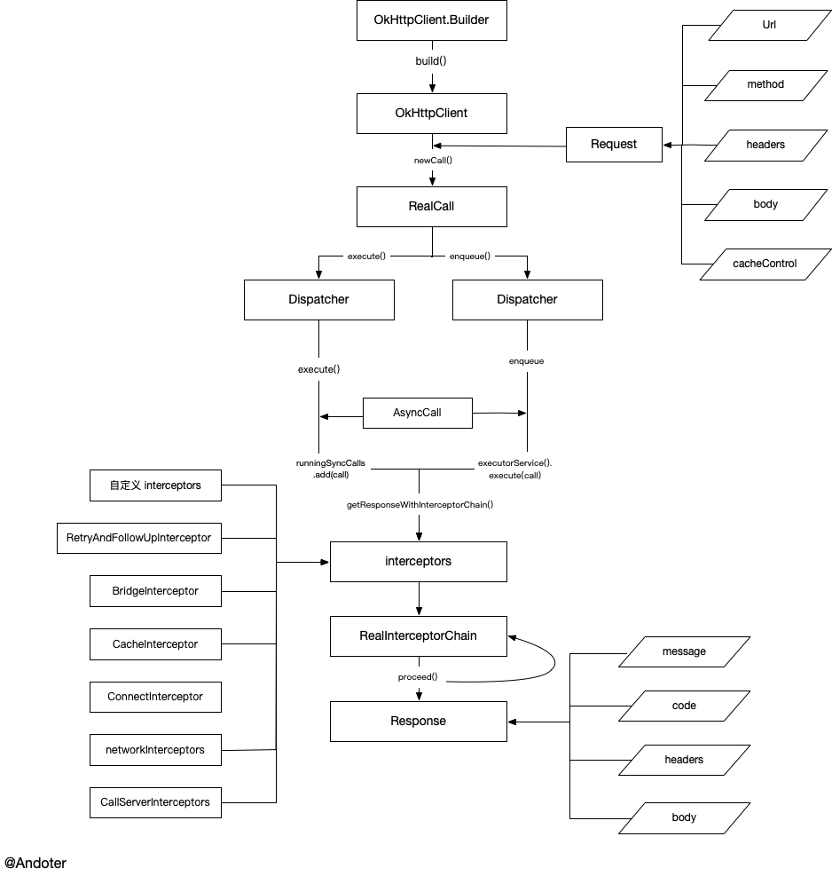
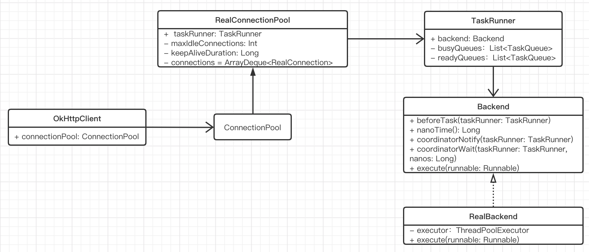
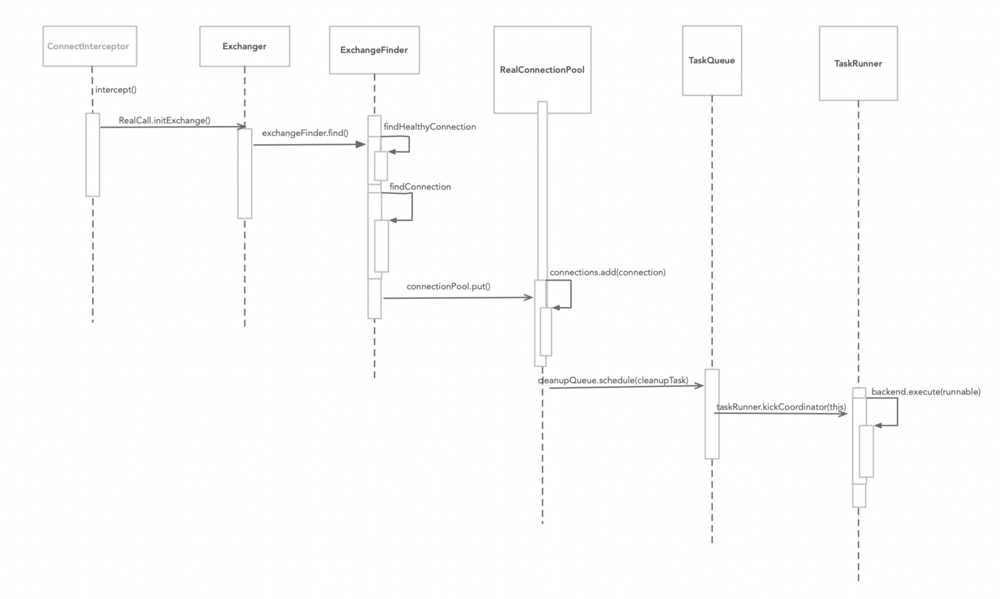

## Android 流行开源库—okhttp 源码解析

> 分析经典开源库是成长进阶的必备过程，通过学习顶尖工程师优秀的开源库，能提高我们的源码阅读和分析的能力，学习他们的设计思路构想，提升我们的代码设计能力。

**注意：本次分析基于 [okhttp parent-4.6.0 版本](https://github.com/square/okhttp/releases/tag/parent-4.6.0)**

`okhttp` 作为最热门的网络开源库，几乎成为每个 `App` 的标配。它出色的缓存管理、连接复用、拦截器链等设计都是 `okhttp` 的出色亮点。在本篇文章中，我们将对 `okhttp` 库做一个较详细的研究，学到一招半式的设计技巧。

`okhttp` 库作为一个网络请求操作库，里面涉及到很多关于 `HTTP` 的细节，关于 `HTTP` 的基础知识可以参照文章[你应该知道的 HTTP 基础知识](https://juejin.im/post/5e68f375e51d4526e32c4357)进行了解。

### 1. 基本用法

`okhttp` 上手简单是它能够普及的一个重要原因，简单的接口设计，上手成本很低。如下一个 `okhttp` 的简单示例：

```java
// 创建一个 OkHttpClient 
OkHttpClient okHttpClient = new OkHttpClient.Builder()
        .build();
// 创建一个请求体 Request
Request request = new Request.Builder()
        .url("http://wwww.baidu.com")
        .get()
        .build();
// 网络请求 Call
Call call = okHttpClient.newCall(request);
call.enqueue(new Callback() {
    @Override
    public void onFailure(@NotNull Call call, @NotNull IOException e) {
        // 请求失败回调
    }

    @Override
    public void onResponse(@NotNull Call call, @NotNull Response response) throws IOException {
        // 请求成功回调
    }
});

// call.execute()
```

首先创建一个 `OkHttpClient` 对象，然后对请求体对象 `Request` 进行 `newCall()` 操作，最终构建网络请求的执行体 `Call` 对象，使用 `enqueue()` 或 `execute()` 方法发起网络请求。

### 2. 基本流程解析

**分析庞大的开源库，从最基本的用法入手分析，把握住它的核心脉络，最终串联一体。**这里基于基础用法的流程进行 `okhttp` 的源码分析。

#### 2.1 核心流程

先看一张 `okhttp` 的核心处理流程图，目的是让大家思路上跟住源码分析，防止跑偏。



#### 2.2 流程分析

##### 1. OkHttpClient 的创建

`OkHttpClient` 是网络请求的客户端工厂，它包含了很多网络请求的配置，比如 `ConnectionPool`、`Interceptor`、`Cache` 和 `Dispatcher `等。官方建议我们使用单例创建 `OkHttpClient` 用于统一网络请求。目的是可以对 `OkHttpClient` 中的连接池和线程池进行复用，避免创建过多，造成资源和内存的浪费。

我们来看下 `OkHttpClient` 的源码，这里我只保留基本骨架。

```kotlin
open class OkHttpClient internal constructor(
  builder: Builder
) : Cloneable, Call.Factory, WebSocket.Factory {
	// Dispatcher 分发器
  @get:JvmName("dispatcher") val dispatcher: Dispatcher = builder.dispatcher
	// 网络请求连接池
  @get:JvmName("connectionPool") val connectionPool: ConnectionPool = builder.connectionPool

	// 拦截器
  @get:JvmName("interceptors") val interceptors: List<Interceptor> =
      builder.interceptors.toImmutableList()
	// 缓存
  @get:JvmName("cache") val cache: Cache? = builder.cache
	// DNS
  @get:JvmName("dns") val dns: Dns = builder.dns
	// 代理
  @get:JvmName("proxy") val proxy: Proxy? = builder.proxy

  /** Default connect timeout (in milliseconds). The default is 10 seconds. */
  @get:JvmName("connectTimeoutMillis") val connectTimeoutMillis: Int = builder.connectTimeout

  /** Default read timeout (in milliseconds). The default is 10 seconds. */
  @get:JvmName("readTimeoutMillis") val readTimeoutMillis: Int = builder.readTimeout

  /** Default write timeout (in milliseconds). The default is 10 seconds. */
  @get:JvmName("writeTimeoutMillis") val writeTimeoutMillis: Int = builder.writeTimeout
	// 无参构造方法
  constructor() : this(Builder())
  ......
	// Builder 建造者
  class Builder constructor() {
    internal var dispatcher: Dispatcher = Dispatcher()
    internal var connectionPool: ConnectionPool = ConnectionPool()
    internal val interceptors: MutableList<Interceptor> = mutableListOf()
    internal val networkInterceptors: MutableList<Interceptor> = mutableListOf()
    internal var eventListenerFactory: EventListener.Factory = EventListener.NONE.asFactory()
    internal var retryOnConnectionFailure = true
    internal var authenticator: Authenticator = Authenticator.NONE
    internal var followRedirects = true
    internal var followSslRedirects = true
    internal var cookieJar: CookieJar = CookieJar.NO_COOKIES
    internal var cache: Cache? = null
    internal var dns: Dns = Dns.SYSTEM
    internal var proxy: Proxy? = null
    internal var proxySelector: ProxySelector? = null
    internal var proxyAuthenticator: Authenticator = Authenticator.NONE
    internal var socketFactory: SocketFactory = SocketFactory.getDefault()
    internal var sslSocketFactoryOrNull: SSLSocketFactory? = null
    internal var x509TrustManagerOrNull: X509TrustManager? = null
    internal var connectionSpecs: List<ConnectionSpec> = DEFAULT_CONNECTION_SPECS
    internal var protocols: List<Protocol> = DEFAULT_PROTOCOLS
    internal var hostnameVerifier: HostnameVerifier = OkHostnameVerifier
    internal var certificatePinner: CertificatePinner = CertificatePinner.DEFAULT
    internal var certificateChainCleaner: CertificateChainCleaner? = null
    internal var callTimeout = 0
    internal var connectTimeout = 10_000
    internal var readTimeout = 10_000
    internal var writeTimeout = 10_000
    internal var pingInterval = 0
    internal var minWebSocketMessageToCompress = RealWebSocket.DEFAULT_MINIMUM_DEFLATE_SIZE
    internal var routeDatabase: RouteDatabase? = null

    internal constructor(okHttpClient: OkHttpClient) : this() {
      this.dispatcher = okHttpClient.dispatcher
      this.connectionPool = okHttpClient.connectionPool
      this.interceptors += okHttpClient.interceptors
      this.networkInterceptors += okHttpClient.networkInterceptors
      this.eventListenerFactory = okHttpClient.eventListenerFactory
      this.retryOnConnectionFailure = okHttpClient.retryOnConnectionFailure
      this.authenticator = okHttpClient.authenticator
      this.followRedirects = okHttpClient.followRedirects
      this.followSslRedirects = okHttpClient.followSslRedirects
      this.cookieJar = okHttpClient.cookieJar
      this.cache = okHttpClient.cache
      this.dns = okHttpClient.dns
      this.proxy = okHttpClient.proxy
      this.proxySelector = okHttpClient.proxySelector
      this.proxyAuthenticator = okHttpClient.proxyAuthenticator
      this.socketFactory = okHttpClient.socketFactory
      this.sslSocketFactoryOrNull = okHttpClient.sslSocketFactoryOrNull
      this.x509TrustManagerOrNull = okHttpClient.x509TrustManager
      this.connectionSpecs = okHttpClient.connectionSpecs
      this.protocols = okHttpClient.protocols
      this.hostnameVerifier = okHttpClient.hostnameVerifier
      this.certificatePinner = okHttpClient.certificatePinner
      this.certificateChainCleaner = okHttpClient.certificateChainCleaner
      this.callTimeout = okHttpClient.callTimeoutMillis
      this.connectTimeout = okHttpClient.connectTimeoutMillis
      this.readTimeout = okHttpClient.readTimeoutMillis
      this.writeTimeout = okHttpClient.writeTimeoutMillis
      this.pingInterval = okHttpClient.pingIntervalMillis
      this.minWebSocketMessageToCompress = okHttpClient.minWebSocketMessageToCompress
      this.routeDatabase = okHttpClient.routeDatabase
    }
    
    .....
}
```

通过源码可以看到 `OkHttpClient` 使用建造者 `Builder` 的模式来方便支持大量的配置。所以，**当一个类包含多个配置时，可以通过 Builder 建造者的模式来创建类，极大方便对象创建使用。**在 `OkHttpClient` 中包含了 与网络请求相关的配置，比如 `Dispatcher`、`ConnectionPool`、`Interceptor` 和 `Cache` 等。

`OkHttpClient` 提供了以下方式用于创建一个对象。

**创建默认配置的 `OkHttpClient`**

方式一：`new OkHttpClient()`

```java
OkHttpClient client = new OkHttpClient();
```

方式二：`new OkHttpClient.Builder()`

```java
OkHttpClient client1 = new OkHttpClient.Builder().build();
```

**创建自定义配合的 `OkHttpClient`**

```java
public final OkHttpClient client = new OkHttpClient.Builder()
  .addInterceptor(new HttpLoggingInterceptor())
  .cache(new Cache(cacheDir, cacheSize))
  .build();
```

如果要修改一个 `OkHttpClient` 的配置，可以采用如下方式：

```java
OkHttpClient client = new OkHttpClient();
OkHttpClient okHttpClient = client.newBuilder()
  																.readTimeout(Duration.ofMillis(20000)).build();
```

##### 2. Request 对象创建

`Request` 对象中封装了网络请求的地址、方法、请求头等信息。`Request` 的基本结构。

```kotlin
class Request internal constructor(
  @get:JvmName("url") val url: HttpUrl,
  @get:JvmName("method") val method: String,
  @get:JvmName("headers") val headers: Headers,
  @get:JvmName("body") val body: RequestBody?,
  internal val tags: Map<Class<*>, Any>
) {
	private var lazyCacheControl: CacheControl? = null

	....

	  open class Builder {
	    internal var url: HttpUrl? = null
	    internal var method: String
	    internal var headers: Headers.Builder
	    internal var body: RequestBody? = null

	    open fun cacheControl(cacheControl: CacheControl): Builder {
	      val value = cacheControl.toString()
	      return when {
	        value.isEmpty() -> removeHeader("Cache-Control")
	        else -> header("Cache-Control", value)
	      }
	    }

     open fun build(): Request {
	      return Request(
	          checkNotNull(url) { "url == null" },
	          method,
	          headers.build(),
	          body,
	          tags.toImmutableMap()
	      )
	    }
     open fun url(url: String): Builder {
        // Silently replace web socket URLs with HTTP URLs.
        val finalUrl: String = when {
          url.startsWith("ws:", ignoreCase = true) -> {
            "http:${url.substring(3)}"
          }
          url.startsWith("wss:", ignoreCase = true) -> {
            "https:${url.substring(4)}"
          }
          else -> url
        }

        return url(finalUrl.toHttpUrl())
    	}
      
      open fun get() = method("GET", null)
      open fun post(body: RequestBody) = method("POST", body)
	    ....
	}
```

`Request` 同样采用 `Builder` 的方式进行设计，主要包含了 `url`、`method`、`headers`、`body` 和 `CacheControl` 组成。

- `HttpUrl`：封装 `URL` 地址，一个 `HttpUrl` 对象，由 `scheme`、`url`、`host`、`port`、`username`、`password` 等组成。
- `method`：请求方法类型，有 `GET`、`POST`、`PUT`、`PATCH` 等类型。
- `headers`：封装网络请求头
- `body`：请求体，一个 `RequestBody` 对象。
- `cacheControl`：请求头缓存设置。

 `Request` 类的借鉴之处：

- 尽量保持一个 `Model` 的精简，比如一个网络请求地址，`url` 种类很多，这个时候可以单独把这部分封装成一个 `HttpUrl` ，而不是全部组成 `Request` 实体 。
- `method` 的取值，除了可以采用枚举类型外，也可以采用转化为方法直接赋值，比如 `get()`、`post()` 方法

##### 3. 创建 Call 

通过 `OkHttpClient` 对象中提供的 `newCall` 方法创建网络请求 `Call` 对象。

```kotlin
/** Prepares the [request] to be executed at some point in the future. */
override fun newCall(request: Request): Call = RealCall(this, request, forWebSocket = false)
```

可以看到，`newCall` 方法本质上创建的是一个 `RealCall` 对象。`RealCall` 对象是基于 App 应用层和网络层之间的一个中间层，它包含了网络的连接、请求、响应和流处理整个流程，也是 `okhttp` 中最关键核心的类。

##### 4. RealCall 核心流程

在基本流程图中，可以看到 `RealCall` 中提供了 `execute()` 和 `enqueue()` 两个方法。

**execute() 方法**

```kotlin
override fun execute(): Response {
	synchronized(this) {
	  // 判断当前 RealCall 是否已经执行
	  check(!executed) { "Already Executed" }
	  executed = true  // 标记为执行
	}
	// 超时计时
	timeout.enter()
	// 触发 start 回调
	callStart()
	try {
	  // Dispatcher 执行
	  client.dispatcher.executed(this)
	  return getResponseWithInterceptorChain()
	} finally {
	  // 结束
	  client.dispatcher.finished(this)
	}
}
```

首先判断当前请求是否已执行，如果已经执行则打印日志，并抛出 `IllegalStateException` 异常。所以 `Call` 对象只能执行一次。如果未执行则开始进行 `timeout` 计时，并调用 `OkHttpClient` 的 `Dispatchr` 分发器进行执行请求，然后通过 `getResponseWithInterceptorChain()` 读取请求结果，最后关闭请求。

**enqueue() 方法**

```kotlin
override fun enqueue(responseCallback: Callback) {
	synchronized(this) {
	  check(!executed) { "Already Executed" }
	  executed = true
	}
	callStart()
	client.dispatcher.enqueue(AsyncCall(responseCallback))
}
```

首先判断当前请求是否已执行，如果已经执行则打印日志，并抛出 `IllegalStateException` 异常。所以 `Call` 对象只能执行一次。如果未执行则触发 `callStart` 回调监听，并调用 `OkHttpClient` 的 `Dispatchr` 分发器将请求放到队列中。这里封装为 `AsyncCall` 请求进行执行。`AsyncCall` 是一个实现 `Runnable` 接口的类。

```kotlin
// Dispatcher.enqueue
internal fun enqueue(call: AsyncCall) {
	synchronized(this) {
	  readyAsyncCalls.add(call)

	  // Mutate the AsyncCall so that it shares the AtomicInteger of an existing running call to
	  // the same host.
	  if (!call.call.forWebSocket) {
	    val existingCall = findExistingCallWithHost(call.host)
	    if (existingCall != null) call.reuseCallsPerHostFrom(existingCall)
	  }
	}
	promoteAndExecute()
}
```

在 `Dispatcher` 的 `enqueue` 方法中：

1. 首先将请求 `AsyncCall` 添加到待执行队列
2. 判断当前请求是否已存在可复用的 `host`
3. 调用 `promoteAndExecute()` 方法执行请求 

```kotlin
// Dispathcer.promoteAndExecute()
private fun promoteAndExecute(): Boolean {
	this.assertThreadDoesntHoldLock()

	val executableCalls = mutableListOf<AsyncCall>()
	val isRunning: Boolean
	synchronized(this) {
	  val i = readyAsyncCalls.iterator()
	  while (i.hasNext()) {
	    val asyncCall = i.next()

	    if (runningAsyncCalls.size >= this.maxRequests) break // Max capacity.
	    if (asyncCall.callsPerHost.get() >= this.maxRequestsPerHost) continue // Host max capacity.

	    i.remove()
	    asyncCall.callsPerHost.incrementAndGet()
	    executableCalls.add(asyncCall)
	    runningAsyncCalls.add(asyncCall)
	  }
	  isRunning = runningCallsCount() > 0
	}

	for (i in 0 until executableCalls.size) {
	  val asyncCall = executableCalls[i]
	  asyncCall.executeOn(executorService)
	}

	return isRunning
}
```

在 `Dispatcher` 类中维护了两个队列：`readyAsyncCalls` 和 `runningAsyncCalls`。在 `promoteAndExecute` 方法中所做的工作就是将待执行队列中的请求放到正在执行的队列中。

1. 遍历待执行队列 `readyAsyncCalls`
2. 判断正在执行的请求队列大小是否已满（最大 64），如果已满，则结束
3. 判断异步请求是否共享 `Host`，每个 `Host` 默认最多共享 5 个请求，如果不符合，则处理下一个请求
4. 共享 `Host` 个数加 1，并将请求添加到 `runningAsyncCalls` 队列和 `executableCalls` 集合
5. 遍历  `executableCalls` 集合，并执行 `executeOn` 处理请求

```kotlin
// AsyncCall.executeOn()
fun executeOn(executorService: ExecutorService) {
  client.dispatcher.assertThreadDoesntHoldLock()

  var success = false
  try {
    executorService.execute(this)
    success = true
  } catch (e: RejectedExecutionException) {
    val ioException = InterruptedIOException("executor rejected")
    ioException.initCause(e)
    noMoreExchanges(ioException)
    responseCallback.onFailure(this@RealCall, ioException)
  } finally {
    if (!success) {
      client.dispatcher.finished(this) // This call is no longer running!
    }
  }
}
```

`executeOn` 的核心就是调用 `executorService.execute(this)` 执行请求，`AsyncCall` 是一个实现 `Runnable` 接口的类，所以最终执行就是 `run()` 方法。

```kotlin
// AsyncCall.run()
override fun run() {
  threadName("OkHttp ${redactedUrl()}") {
    var signalledCallback = false
    timeout.enter()
    try {
      val response = getResponseWithInterceptorChain()
      signalledCallback = true
      responseCallback.onResponse(this@RealCall, response)
    } catch (e: IOException) {
      if (signalledCallback) {
        // Do not signal the callback twice!
        Platform.get().log("Callback failure for ${toLoggableString()}", Platform.INFO, e)
      } else {
        responseCallback.onFailure(this@RealCall, e)
      }
    } catch (t: Throwable) {
      cancel()
      if (!signalledCallback) {
        val canceledException = IOException("canceled due to $t")
        canceledException.addSuppressed(t)
        responseCallback.onFailure(this@RealCall, canceledException)
      }
      throw t
    } finally {
      client.dispatcher.finished(this)
    }
  }
}
```

大致的流程处理如下：

1. 给当前的 `AsyncCall` 异步线程设置名称
2. 通过 `getResponseWithInterceptorChain()` 方法获取请求结果
3. 触发请求回调 `responseCallback`
4. 关闭请求 `client.dispatcher.finished(this)`

在 `execute()` 方法和 `enqueue()` 方法中，最终核心的处理逻辑都是由 `getResponseWithInterceptorChain()` 方法进行处理。

##### 5. 网络请求结果 getResponseWithInterceptorChain() 方法

通过上面对  `execute()` 和 `enqueue()` 方法的分析，最终都是调用 `getResponseWithInterceptorChain()` 方法获取返回值。

```kotlin
//RealCall.getResponseWithInterceptorChain()
@Throws(IOException::class)
internal fun getResponseWithInterceptorChain(): Response {
	// Build a full stack of interceptors.
	val interceptors = mutableListOf<Interceptor>()
  // 添加自定义拦截器
	interceptors += client.interceptors
  // 添加重试和重定向拦截器
	interceptors += RetryAndFollowUpInterceptor(client)
  // 添加转换拦截器
	interceptors += BridgeInterceptor(client.cookieJar)
  // 添加缓存拦截器
	interceptors += CacheInterceptor(client.cache)
  // 添加连接拦截器
	interceptors += ConnectInterceptor
  // 添加网络拦截器
	if (!forWebSocket) {
	  interceptors += client.networkInterceptors
	}
	interceptors += CallServerInterceptor(forWebSocket)

	val chain = RealInterceptorChain(
	    call = this,
	    interceptors = interceptors,
	    index = 0,
	    exchange = null,
	    request = originalRequest,
	    connectTimeoutMillis = client.connectTimeoutMillis,
	    readTimeoutMillis = client.readTimeoutMillis,
	    writeTimeoutMillis = client.writeTimeoutMillis
	)

	var calledNoMoreExchanges = false
	try {
	  val response = chain.proceed(originalRequest)
	  if (isCanceled()) {
	    response.closeQuietly()
	    throw IOException("Canceled")
	  }
	  return response
	} catch (e: IOException) {
	  calledNoMoreExchanges = true
	  throw noMoreExchanges(e) as Throwable
	} finally {
	  if (!calledNoMoreExchanges) {
	    noMoreExchanges(null)
	  }
	}
}
```

基本的流程：

1. 添加拦截器，首先是客户自定义的拦截器，接着分别是：`RetryAndFollowUpInterceptor`、`BridgeInterceptor`、`CacheInterceptor`、`ConnectInterceptor`、`CallServerInterceptor`
2. 将拦截器封装成 `RealInterceptorChain`
3. 调用 `RealInterceptorChain` 的 `proceed()` 方法获取请求结果 

```kotlin
// RealInterceptorChain.proceed()
@Throws(IOException::class)
override fun proceed(request: Request): Response {
  check(index < interceptors.size)

  calls++

  if (exchange != null) {
    check(exchange.finder.sameHostAndPort(request.url)) {
      "network interceptor ${interceptors[index - 1]} must retain the same host and port"
    }
    check(calls == 1) {
      "network interceptor ${interceptors[index - 1]} must call proceed() exactly once"
    }
  }

  // Call the next interceptor in the chain.
  val next = copy(index = index + 1, request = request)
  val interceptor = interceptors[index]

  @Suppress("USELESS_ELVIS")
  val response = interceptor.intercept(next) ?: throw NullPointerException(
      "interceptor $interceptor returned null")

  if (exchange != null) {
    check(index + 1 >= interceptors.size || next.calls == 1) {
      "network interceptor $interceptor must call proceed() exactly once"
    }
  }

  check(response.body != null) { "interceptor $interceptor returned a response with no body" }

  return response
}
```

上面的核心是对拦截器通过责任链模式的方式串联起来，在责任链模式中，通常每个接收者都包含对另一个接收者的引用。如果一个接收者不能处理该请求，则把请求传给下一个接收者进行处理，依此类推，最终到达最后一个接收者处理，返回结果。`okhttp` 这里对于 `interceptor` 的设计很巧妙，在实际的开发中有很大的借鉴意义。

#### 2.3 小结

通过对照流程图，我们对于 `okhttp` 的基本请求处理流程有了一个认识，总结一下：

1. 创建 `OkHttpClient` 网络请求客户端，可以设置常见的网络链接参数
2. 调用 `newCall(Request)` 方法获取网络请求 `Call` 对象
3. 异步请求调用 `enqueue()` 方法、同步请求调用 `execute()` 方法
4. 内部最终通过 `Dispatcher` 类处理，调用 `RealCall` 的 `getResponseWithInterceptorChain()` 方法
5. 最后是在 `getResponseWithInterceptorChain()` 内部，通过 `RealInterceptorChain.proceed()` 获取执行结果

### 3. okhttp 拦截器流程

`okhttp` 中的拦截器有：

-  `RetryAndFollowUpInterceptor`：重试和重定向拦截器
- `BridgeInterceptor`：桥接拦截器
- `CacheInterceptor`：缓存拦截器
- `ConnectInterceptor`：连接拦截器
- `CallServerInterceptor`：读写拦截器

`okhttp` 中的拦截器都是实现 `Interceptor` 接口。在 `getResponseWithInterceptorChain` 方法中完成拦截器添加到集合中，然后通过 `interceptor.intercept(next)` 进行逐个拦截器的处理，按照添加到集合中的顺序逐个分析每个拦截器的用处。

#### 3.1 RetryAndFollowUpInterceptor 重试和重定向拦截器

重试和重定向拦截器的目的是为了恢复失败和重定向的请求，如果请求被取消，可能会返回 `IOException`。

##### 1. intercept 方法的实现

```kotlin
// RetryAndFollowUpInterceptor.intercept()
@Throws(IOException::class)
override fun intercept(chain: Interceptor.Chain): Response {
  // 强转 next Intercept
  val realChain = chain as RealInterceptorChain
  var request = chain.request
  val call = realChain.call
  var followUpCount = 0
  var priorResponse: Response? = null
  var newExchangeFinder = true
  var recoveredFailures = listOf<IOException>()
  while (true) {
    // 新建连接管理 ExchangeFinder
    call.enterNetworkInterceptorExchange(request, newExchangeFinder)

    var response: Response
    var closeActiveExchange = true
    try {
      // 如果 call 被取消，则抛出 IOException
      if (call.isCanceled()) {
        throw IOException("Canceled")
      }

      try {
        // 调用下一个拦截器
        response = realChain.proceed(request)
        newExchangeFinder = true
      } catch (e: RouteException) {
        // 如果出现 RouteException 异常，请求可能没有发出去，则进行重试
        if (!recover(e.lastConnectException, call, request, requestSendStarted = false)) {
          // 重试失败，抛出并打印异常
          throw e.firstConnectException.withSuppressed(recoveredFailures)
        } else {
          // 重试成功，则记录下异常
          recoveredFailures += e.firstConnectException
        }
        newExchangeFinder = false
        continue
      } catch (e: IOException) {
        // 尝试与服务器通信失败，请求可能已发送。则重试
        if (!recover(e, call, request, requestSendStarted = e !is ConnectionShutdownException)) {
          // 重试失败，抛出并打印异常
          throw e.withSuppressed(recoveredFailures)
        } else {
          // 重试成功，则记录下异常
          recoveredFailures += e
        }
        newExchangeFinder = false
        continue
      }

      // Attach the prior response if it exists. Such responses never have a body.
      if (priorResponse != null) {
        response = response.newBuilder()
            .priorResponse(priorResponse.newBuilder()
                .body(null)
                .build())
            .build()
      }

      val exchange = call.interceptorScopedExchange
      // 根据返回 code 构建 Request 对对象，比如 401、407、307、308 等
      val followUp = followUpRequest(response, exchange) 
      // 如果为 null，则直接返回结果
      if (followUp == null) {
        if (exchange != null && exchange.isDuplex) {
          call.timeoutEarlyExit()
        }
        closeActiveExchange = false
        return response
      }
      // 如果 Request 为不null，但是只请求一次，则直接返回 response
      val followUpBody = followUp.body
      if (followUpBody != null && followUpBody.isOneShot()) {
        closeActiveExchange = false
        return response
      }
      // response.body 不为 null，则关闭 response
      response.body?.closeQuietly()
      // 判断重定向次数，最大 20 次
      if (++followUpCount > MAX_FOLLOW_UPS) {
        throw ProtocolException("Too many follow-up requests: $followUpCount")
      }

      request = followUp
      priorResponse = response
    } finally {
      // 关闭
      call.exitNetworkInterceptorExchange(closeActiveExchange)
    }
  }
}
```

核心的过程：

1. 如果连接过程出现 `RoutException` 和 `IOException` 则执行 `recover` 方法重试
2. 对请求结果 `response` 调用 `followUpRequest` 进行处理，并返回 `Request` 对象 `followUp`
3. 如果重连对象 `followUp` 不为空，则执行 `while(true)` 重连，最大重连20 次。

在这个过程中，关键的两个方法 `recover` 重试和 `followUpRequest` 重定向。

##### 2. recover 重试

```kotlin
private fun recover(
  e: IOException,
  call: RealCall,
  userRequest: Request,
  requestSendStarted: Boolean
): Boolean {
  // okhttpclient 中禁用重试，则直接返回 false
  if (!client.retryOnConnectionFailure) return false

  // 如果 request 已经发送，并且只能发送一次（1. Request 中配置），则直接返回 false
  if (requestSendStarted && requestIsOneShot(e, userRequest)) return false

  // 如果异常是致命异常，则不重试。ProtocolException、InterruptedIOException、SSLHandshakeException、SSLPeerUnverifiedException
  if (!isRecoverable(e, requestSendStarted)) return false

  // 重试失败
  if (!call.retryAfterFailure()) return false

  // For failure recovery, use the same route selector with a new connection.
  return true
}
```

重试的过程也是有限制条件的：

- `OkHttpClient` 中配置 `retryOnConnectionFailure` 属性为 `false`，限制重连
- `request` 本身已经发送成功，并且只能发送一次，则无法重连
- 连接出现的致命异常不进行重连

##### 3. followUpRequest 重定向

```kotlin
@Throws(IOException::class)
private fun followUpRequest(userResponse: Response, exchange: Exchange?): Request? {
  val route = exchange?.connection?.route()
  val responseCode = userResponse.code

  val method = userResponse.request.method
  when (responseCode) {
    HTTP_PROXY_AUTH -> {// 407
      val selectedProxy = route!!.proxy
      if (selectedProxy.type() != Proxy.Type.HTTP) {
        throw ProtocolException("Received HTTP_PROXY_AUTH (407) code while not using proxy")
      }
      return client.proxyAuthenticator.authenticate(route, userResponse)
    }
    // 401
    HTTP_UNAUTHORIZED -> return client.authenticator.authenticate(route, userResponse)
    // 307、308、300、301、302、303 重定向
    HTTP_PERM_REDIRECT, HTTP_TEMP_REDIRECT, HTTP_MULT_CHOICE, HTTP_MOVED_PERM, HTTP_MOVED_TEMP, HTTP_SEE_OTHER -> {
      return buildRedirectRequest(userResponse, method)
    }

    HTTP_CLIENT_TIMEOUT -> {// 408
      // 408's are rare in practice, but some servers like HAProxy use this response code. The
      // spec says that we may repeat the request without modifications. Modern browsers also
      // repeat the request (even non-idempotent ones.)
      if (!client.retryOnConnectionFailure) {
        // The application layer has directed us not to retry the request.
        return null
      }

      val requestBody = userResponse.request.body
      if (requestBody != null && requestBody.isOneShot()) {
        return null
      }
      val priorResponse = userResponse.priorResponse
      if (priorResponse != null && priorResponse.code == HTTP_CLIENT_TIMEOUT) {
        // We attempted to retry and got another timeout. Give up.
        return null
      }

      if (retryAfter(userResponse, 0) > 0) {
        return null
      }

      return userResponse.request
    }

    HTTP_UNAVAILABLE -> { // 503
      val priorResponse = userResponse.priorResponse
      if (priorResponse != null && priorResponse.code == HTTP_UNAVAILABLE) {
        // We attempted to retry and got another timeout. Give up.
        return null
      }

      if (retryAfter(userResponse, Integer.MAX_VALUE) == 0) {
        // specifically received an instruction to retry without delay
        return userResponse.request
      }

      return null
    }

    HTTP_MISDIRECTED_REQUEST -> { // 421
      // OkHttp can coalesce HTTP/2 connections even if the domain names are different. See
      // RealConnection.isEligible(). If we attempted this and the server returned HTTP 421, then
      // we can retry on a different connection.
      val requestBody = userResponse.request.body
      if (requestBody != null && requestBody.isOneShot()) {
        return null
      }

      if (exchange == null || !exchange.isCoalescedConnection) {
        return null
      }

      exchange.connection.noCoalescedConnections()
      return userResponse.request
    }

    else -> return null
  }
}
```

主体过程就是根据 `response code` 进行对应的处理。

- `HTTP_PROXY_AUTH(407)`：要求代理身份验证。如果代理不是 `HTTP`则直接抛出 `ProtocolException` 异常
- `HTTP_UNAUTHORIZED(401)`：未授权。重新进行授权
- 重定向(`301..`)：重定向的错误，调用 `buildRedirectRequest` 方法进行重定向
- `HTTP_CLIENT_TIMEOUT(408)`：请求超时。一般是直接返回 `request` 重试
- `HTTP_UNAVAILABLE(503)`：服务不可用，这里调用 `retryAfter` 方法，解析出响应首部 **`Retry-After`** 值，如果是 0，则返回 `request` 进行重试
- `HTTP_MISDIRECTED_REQUEST(421)`：短时间大量请求，重试另外的连接

至此，关于 `RetryAndFollowUpInterceptor` 的基本流程梳理完毕。

#### 3.2 BridgeInterceptor 桥接拦截器

桥接拦截器是介于网络和应用代码之间的桥梁，主要有两个工作：

- 给 `HTTP` 请求添加请求头 `header`
- 对网络请求的结果进行封装返回

上半部分是添加`Content-Type`、`Content-Length`、`Transfer-Encoding`、`Host`、`Connection`、`Accept-Encoding`、`Cookie`、`User-Agent` 请求头。

```kotlin
// BridgeInterceptor.intercept
@Throws(IOException::class)
override fun intercept(chain: Interceptor.Chain): Response {
  val userRequest = chain.request()
  val requestBuilder = userRequest.newBuilder()

  val body = userRequest.body
  if (body != null) {
    val contentType = body.contentType()
    if (contentType != null) {
      requestBuilder.header("Content-Type", contentType.toString())
    }

    val contentLength = body.contentLength()
    if (contentLength != -1L) {
      requestBuilder.header("Content-Length", contentLength.toString())
      requestBuilder.removeHeader("Transfer-Encoding")
    } else {
      requestBuilder.header("Transfer-Encoding", "chunked")
      requestBuilder.removeHeader("Content-Length")
    }
  }

  if (userRequest.header("Host") == null) {
    requestBuilder.header("Host", userRequest.url.toHostHeader())
  }

  if (userRequest.header("Connection") == null) {
    requestBuilder.header("Connection", "Keep-Alive")
  }

  // If we add an "Accept-Encoding: gzip" header field we're responsible for also decompressing
  // the transfer stream.
  var transparentGzip = false
  if (userRequest.header("Accept-Encoding") == null && userRequest.header("Range") == null) {
    transparentGzip = true
    requestBuilder.header("Accept-Encoding", "gzip")
  }

  val cookies = cookieJar.loadForRequest(userRequest.url)
  if (cookies.isNotEmpty()) {
    requestBuilder.header("Cookie", cookieHeader(cookies))
  }

  if (userRequest.header("User-Agent") == null) {
    requestBuilder.header("User-Agent", userAgent)
  }
  ...
  // 下半部分
}
```

下半部分是对请求结果进行处理并返回。

```kotlin
// BridgeInterceptor.intercept
@Throws(IOException::class)
override fun intercept(chain: Interceptor.Chain): Response { 
  // 下半部分
	val networkResponse = chain.proceed(requestBuilder.build())

  cookieJar.receiveHeaders(userRequest.url, networkResponse.headers)

  val responseBuilder = networkResponse.newBuilder()
      .request(userRequest)

  if (transparentGzip &&
      "gzip".equals(networkResponse.header("Content-Encoding"), ignoreCase = true) &&
      networkResponse.promisesBody()) {
    val responseBody = networkResponse.body
    if (responseBody != null) {
      val gzipSource = GzipSource(responseBody.source())
      val strippedHeaders = networkResponse.headers.newBuilder()
          .removeAll("Content-Encoding")
          .removeAll("Content-Length")
          .build()
      responseBuilder.headers(strippedHeaders)
      val contentType = networkResponse.header("Content-Type")
      responseBuilder.body(RealResponseBody(contentType, -1L, gzipSource.buffer()))
    }
  }

  return responseBuilder.build()
}
```

#### 3.3 CacheInterceptor 缓存拦截器

缓存拦截器用于对网络请求返回缓存的操作处理，不需要每次都发起网络请求，可以降低网络请求流量消耗，提高响应速度，同时对于无网络时也能通过缓存进行支持。`OkHttp` 中的缓存拦截器大致处理流程：

1. 根据 `Request` 请求标识读取对应的 `Response` 缓存
2. 根据当前时间戳、`Request`、`Response` 计算缓存出缓存策略 `CacheStrategy`
3. 读取出缓存 `cacheResponse` 和 `networkRequest`
4. 如果 `networkRequest` 为空，即当前网络请求不可用，`cacheResponse` 为空，则返回 `504` 的错误
5. 如果 `networkRequest` 为空，即当前网络请求不可用，`cacheResponse` 不为空，则返回缓存的错误
6. 如果  `networkRequest` 不为空，即当前网络请求可用，则进行下一个拦截器处理
7. 如果 `cacheResponse` 不为空且网络请求结果是 `304` 则更新缓存，并返回缓存结果
8. 判断网络请求的状态对缓存进行处理

```kotlin
// CacheInterceptor.intercept()
@Throws(IOException::class)
override fun intercept(chain: Interceptor.Chain): Response {
  // 获取 request 对应的 cache
  val cacheCandidate = cache?.get(chain.request())

  val now = System.currentTimeMillis()
  // 根据当前时间、request 和 cache 构建 CacheStrategy
  val strategy = CacheStrategy.Factory(now, chain.request(), cacheCandidate).compute()
  val networkRequest = strategy.networkRequest
  val cacheResponse = strategy.cacheResponse

  cache?.trackResponse(strategy)
  // 如果 cacheCandidate 不为空，但是计算的 cacheResponse 为空，则说明缓存不可用
  if (cacheCandidate != null && cacheResponse == null) {
    // The cache candidate wasn't applicable. Close it.
    cacheCandidate.body?.closeQuietly()
  }
  // 如果 networkRequest 为空，同时缓存为空
  // If we're forbidden from using the network and the cache is insufficient, fail.
  if (networkRequest == null && cacheResponse == null) {
    return Response.Builder()
        .request(chain.request())
        .protocol(Protocol.HTTP_1_1)
        .code(HTTP_GATEWAY_TIMEOUT)
        .message("Unsatisfiable Request (only-if-cached)")
        .body(EMPTY_RESPONSE)
        .sentRequestAtMillis(-1L)
        .receivedResponseAtMillis(System.currentTimeMillis())
        .build()
  }

  // If we don't need the network, we're done.
  if (networkRequest == null) {
    return cacheResponse!!.newBuilder()
        .cacheResponse(stripBody(cacheResponse))
        .build()
  }

  var networkResponse: Response? = null
  try {
    // 执行下一个拦截器
    networkResponse = chain.proceed(networkRequest)
  } finally {
    // If we're crashing on I/O or otherwise, don't leak the cache body.
    if (networkResponse == null && cacheCandidate != null) {
      cacheCandidate.body?.closeQuietly()
    }
  }

  // If we have a cache response too, then we're doing a conditional get.
  if (cacheResponse != null) {
    if (networkResponse?.code == HTTP_NOT_MODIFIED) {
      val response = cacheResponse.newBuilder()
          .headers(combine(cacheResponse.headers, networkResponse.headers))
          .sentRequestAtMillis(networkResponse.sentRequestAtMillis)
          .receivedResponseAtMillis(networkResponse.receivedResponseAtMillis)
          .cacheResponse(stripBody(cacheResponse))
          .networkResponse(stripBody(networkResponse))
          .build()

      networkResponse.body!!.close()

      // Update the cache after combining headers but before stripping the
      // Content-Encoding header (as performed by initContentStream()).
      cache!!.trackConditionalCacheHit()
      cache.update(cacheResponse, response) // 更新缓存
      return response
    } else {
      cacheResponse.body?.closeQuietly()
    }
  }

  val response = networkResponse!!.newBuilder()
      .cacheResponse(stripBody(cacheResponse))
      .networkResponse(stripBody(networkResponse))
      .build()
	// Cache 不为空
  if (cache != null) {
    // 不是 header 请求，且状态码大于 200 或小于 100时，缓存可用时，则将缓存存储
    if (response.promisesBody() && CacheStrategy.isCacheable(response, networkRequest)) {
      // Offer this request to the cache.
      val cacheRequest = cache.put(response)
      return cacheWritingResponse(cacheRequest, response)
    }
		// 如果请求方法是 Post、PATCH、PUT、DELETE、MOVE，则清除 request 对应的缓存
    if (HttpMethod.invalidatesCache(networkRequest.method)) {
      try {
        cache.remove(networkRequest)
      } catch (_: IOException) {
        // The cache cannot be written.
      }
    }
  }

  return response
}
```

#### 3.4 ConnectInterceptor 连接拦截器

连接拦截器的作用构建网络连接并且将网络连接交给下一个拦截器执行。

```kotlin
object ConnectInterceptor : Interceptor {
  @Throws(IOException::class)
  override fun intercept(chain: Interceptor.Chain): Response {
    val realChain = chain as RealInterceptorChain
    val exchange = realChain.call.initExchange(chain)
    val connectedChain = realChain.copy(exchange = exchange)
    return connectedChain.proceed(realChain.request)
  }
}
```

源码很简单，但是内部的实现却是非常复杂的。`ConnectInterceptor` 中关键的实现是 `initExchange()` 方法，

在该方法中通过 `ExchangeFinder` 类去找 `RealConnection` 连接对象，如果没有，则最终通过 `Socket` 请求构建连接。

#### 3.5 CallServerInterceptor

最后一个拦截器，发起网络请求和读取请求数据，并进行返回。

```kotlin
class CallServerInterceptor(private val forWebSocket: Boolean) : Interceptor {
  @Throws(IOException::class)
  override fun intercept(chain: Interceptor.Chain): Response {
    val realChain = chain as RealInterceptorChain
    val exchange = realChain.exchange!!
    val request = realChain.request
    val requestBody = request.body
    val sentRequestMillis = System.currentTimeMillis()
    // 写入请求头
    exchange.writeRequestHeaders(request)

    var invokeStartEvent = true
    var responseBuilder: Response.Builder? = null
    // 如果不是 GET 或 HEADER 请求，即允许有请求体，比如 POST
    if (HttpMethod.permitsRequestBody(request.method) && requestBody != null) {
      // If there's a "Expect: 100-continue" header on the request, wait for a "HTTP/1.1 100
      // Continue" response before transmitting the request body. If we don't get that, return
      // what we did get (such as a 4xx response) without ever transmitting the request body.
      if ("100-continue".equals(request.header("Expect"), ignoreCase = true)) {
        exchange.flushRequest() // 发起请求
        responseBuilder = exchange.readResponseHeaders(expectContinue = true) //读取返回
        exchange.responseHeadersStart()
        invokeStartEvent = false
      }

      if (responseBuilder == null) {
        if (requestBody.isDuplex()) {
          // Prepare a duplex body so that the application can send a request body later.
          exchange.flushRequest()
          val bufferedRequestBody = exchange.createRequestBody(request, true).buffer()
          requestBody.writeTo(bufferedRequestBody)
        } else {
          // Write the request body if the "Expect: 100-continue" expectation was met.
          val bufferedRequestBody = exchange.createRequestBody(request, false).buffer()
          requestBody.writeTo(bufferedRequestBody)
          bufferedRequestBody.close()
        }
      } else {
        exchange.noRequestBody()
        if (!exchange.connection.isMultiplexed) {
          // If the "Expect: 100-continue" expectation wasn't met, prevent the HTTP/1 connection
          // from being reused. Otherwise we're still obligated to transmit the request body to
          // leave the connection in a consistent state.
          exchange.noNewExchangesOnConnection()
        }
      }
    } else {
      exchange.noRequestBody()
    }

    if (requestBody == null || !requestBody.isDuplex()) {
      exchange.finishRequest() //结束请求
    }
    if (responseBuilder == null) {
      responseBuilder = exchange.readResponseHeaders(expectContinue = false)!!
      if (invokeStartEvent) {
        exchange.responseHeadersStart()
        invokeStartEvent = false
      }
    }
    var response = responseBuilder
        .request(request)
        .handshake(exchange.connection.handshake())
        .sentRequestAtMillis(sentRequestMillis)
        .receivedResponseAtMillis(System.currentTimeMillis())
        .build()
    var code = response.code
    if (code == 100) {
      // Server sent a 100-continue even though we did not request one. Try again to read the actual
      // response status.
      responseBuilder = exchange.readResponseHeaders(expectContinue = false)!!
      if (invokeStartEvent) {
        exchange.responseHeadersStart()
      }
      response = responseBuilder
          .request(request)
          .handshake(exchange.connection.handshake())
          .sentRequestAtMillis(sentRequestMillis)
          .receivedResponseAtMillis(System.currentTimeMillis())
          .build()
      code = response.code
    }

    exchange.responseHeadersEnd(response)

    response = if (forWebSocket && code == 101) {
      // Connection is upgrading, but we need to ensure interceptors see a non-null response body.
      response.newBuilder()
          .body(EMPTY_RESPONSE)
          .build()
    } else {
      response.newBuilder()
          .body(exchange.openResponseBody(response))
          .build()
    }
    if ("close".equals(response.request.header("Connection"), ignoreCase = true) ||
        "close".equals(response.header("Connection"), ignoreCase = true)) {
      exchange.noNewExchangesOnConnection()
    }
    if ((code == 204 || code == 205) && response.body?.contentLength() ?: -1L > 0L) {
      throw ProtocolException(
          "HTTP $code had non-zero Content-Length: ${response.body?.contentLength()}")
    }
    return response
  }
}
```

在 `CallServerInterceptor` 的实现中，有 `100-continue` 的判断操作。

> 在 `HTTP/1.1` 协议里，新增了 100(continue) 状态码，该状态码的目的是客户端在发送 `Request Body` 之前，允许客户端先判断服务端是否处理请求体数据。如果不处理，则不上传请求体数据，如果处理，则上传。协议对 HTTP客户端的要求是：“如果客户端期望等待 `100-continue` 应答，则发送的请求头中需包含 {“Expect”:”100-continue”} ”。
>
> 好处是避免服务端不处理请求数据，但是由于客户端发送造成的资源浪费。

 `CallServerInterceptor`  的大体流程：

1. 写入请求头信息到 `Exchange`
2. 判断客户端是否等待 `100-continue` 协议，如果服务器端允许发送请求 `Request Body`，则写入请求数据
3. 构建并处理 `Response` 数据

### 4. okhttp 缓存策略

在网络请求中，缓存策略是一个重要的应用。通过缓存的使用，可以降低客户端的网络请求频率，提高响应速度。对于服务端来说可以降低网络请求压力。在 `HTTP` 请求中，`Cache-Control` 指定请求和响应遵循的缓存机制。对应的缓存指令有以下几种：

- `public`：响应可被任何缓存区缓存，包括请求的发起方（浏览器）、代理缓存服务器
- `private`：请求仅被发起方缓存
- `no-cache`：可以在请求的发起方（浏览器）进行缓存，但是每次都需要去服务器进行资源验证，验证一致返回 `304` 使用缓存，不一致则请求服务器
- `no-store`：不能被缓存
- `max-age`：缓存最长时间，没超过缓存时间时，使用缓存，超出最大缓存时间则发起新的请求，请求失败时返回缓存数据
- `max-stale`：指定客户端可以接收超出 `max-age` 时间的响应消息，`max-stale` 在请求设置中有效，在响应设置中无效
- `min-fresh`：最短刷新时间间隔
- `only-if-cached `：请求内容来自缓存

在 `okhttp` 中使用设置缓存可以通过以下方式：

```java
File fileCache = new File(getCacheDir(), "cache");
Cache cache = new Cache(fileCache, 10 * 1024 * 1024);
OkHttpClient okHttpClient = new OkHttpClient.Builder()
        .cache(cache)
        .build();
```

`okhttp` 中缓存相关的类有：

- `Cache`：用于缓存 `HTTP` 或 `HTTPS` 请求的响应结果到本地，以便重复利用
- `CacheControl`：请求或响应的缓存指令控制头，用于控制哪些响应和请求可以缓存
- `CacheInterceptor`：`okhttp` 中的缓存拦截器
- `CacheStrategy`：缓存策略工具类

#### 4.1 Cache 类

`Cache` 类内部通过 `DiskLruCache` 对 `Response` 进行存储。提供了 `get(request: Request)` 、 `put(response: Response)` 、`remove(request: Request)` 和 `update(cached: Response, network: Response)` 等多个方法。

```kotlin
// 读取缓存数据
internal fun get(request: Request): Response? {
  // 生成 key
  val key = key(request.url)
  val snapshot: DiskLruCache.Snapshot = try {//根据 key 读取 Snapshot 对象
    cache[key] ?: return null
  } catch (_: IOException) {
    return null // Give up because the cache cannot be read.
  }

  // 构建对应的 Entry 对象，该对象封装了缓存 Snapshot 的操作
  val entry: Entry = try {
    Entry(snapshot.getSource(ENTRY_METADATA))
  } catch (_: IOException) {
    snapshot.closeQuietly()
    return null
  }
  // 读入真正的缓存数据
  val response = entry.response(snapshot)
  if (!entry.matches(request, response)) {
    response.body?.closeQuietly()
    return null
  }

  return response
}

// 存储缓存数据
internal fun put(response: Response): CacheRequest? {
  val requestMethod = response.request.method
  // 判断是否符合缓存的请求方法
  if (HttpMethod.invalidatesCache(response.request.method)) {
    try {
      remove(response.request)
    } catch (_: IOException) {
      // The cache cannot be written.
    }
    return null
  }
  // 如果缓存方法不是 `GET`，则返回 null
  if (requestMethod != "GET") {
    // Don't cache non-GET responses. We're technically allowed to cache HEAD requests and some
    // POST requests, but the complexity of doing so is high and the benefit is low.
    return null
  }

  if (response.hasVaryAll()) {
    return null
  }
  // 封装成 Entry 对象
  val entry = Entry(response)
  var editor: DiskLruCache.Editor? = null
  try {
    // 打开对应 Editor
    editor = cache.edit(key(response.request.url)) ?: return null
    entry.writeTo(editor)
    return RealCacheRequest(editor)
  } catch (_: IOException) {
    abortQuietly(editor)
    return null
  }
}

@Throws(IOException::class)
internal fun remove(request: Request) {
  cache.remove(key(request.url))
}
// 更新缓存数据
internal fun update(cached: Response, network: Response) {
  val entry = Entry(network)
  val snapshot = (cached.body as CacheResponseBody).snapshot
  var editor: DiskLruCache.Editor? = null
  try {
    editor = snapshot.edit() ?: return // edit() returns null if snapshot is not current.
    entry.writeTo(editor)
    editor.commit()
  } catch (_: IOException) {
    abortQuietly(editor)
  }
}
```

-  `get(request: Request)` ：读取缓存数据
- `put(response: Response)`：存储缓存数据
- `update(cached: Response, network: Response)`：更新缓存数据
- `remove(request: Request)` ：删除缓存数据

在 `Cache` 类中封装了一个内部类 `Entry` ，用于处理实际的缓存操作，而不是全部在 `Cache` 类中完成。`Cache` 类定义的交互对象都是 `Response`，而实际的操作要经过对 `Response` 数据转换，所以才把这些操作封装到 `Entry` 类中，实际的开发中，我们也可以在类似场景中这样处理。

#### 4.2 CacheControl 类

`CacheControl` 类中封装了常见的缓存请求头处理，比如 `noCache`、`noStore`、`maxAgeSeconds`、`onlyIfCached`、`noTransform` 等等。

```kotlin
class CacheControl private constructor(
	
  @get:JvmName("noCache") val noCache: Boolean,

  /** If true, this response should not be cached. */
  @get:JvmName("noStore") val noStore: Boolean,

  /** The duration past the response's served date that it can be served without validation. */
  @get:JvmName("maxAgeSeconds") val maxAgeSeconds: Int,

  @get:JvmName("sMaxAgeSeconds") val sMaxAgeSeconds: Int,

  val isPrivate: Boolean,
  val isPublic: Boolean,

  @get:JvmName("mustRevalidate") val mustRevalidate: Boolean,

  @get:JvmName("maxStaleSeconds") val maxStaleSeconds: Int,

  @get:JvmName("minFreshSeconds") val minFreshSeconds: Int,

  @get:JvmName("onlyIfCached") val onlyIfCached: Boolean,

  @get:JvmName("noTransform") val noTransform: Boolean,

  @get:JvmName("immutable") val immutable: Boolean,

  private var headerValue: String?
)  {
  /** Builds a `Cache-Control` request header. */
  class Builder {
    private var noCache: Boolean = false
    private var noStore: Boolean = false
    private var maxAgeSeconds = -1
    private var maxStaleSeconds = -1
    private var minFreshSeconds = -1
    private var onlyIfCached: Boolean = false
    private var noTransform: Boolean = false
    private var immutable: Boolean = false

    /** Don't accept an unvalidated cached response. */
    fun noCache() = apply {
      this.noCache = true
    }

    /** Don't store the server's response in any cache. */
    fun noStore() = apply {
      this.noStore = true
    }

    fun maxAge(maxAge: Int, timeUnit: TimeUnit) = apply {
      require(maxAge >= 0) { "maxAge < 0: $maxAge" }
      val maxAgeSecondsLong = timeUnit.toSeconds(maxAge.toLong())
      this.maxAgeSeconds = maxAgeSecondsLong.clampToInt()
    }

    fun maxStale(maxStale: Int, timeUnit: TimeUnit) = apply {
      require(maxStale >= 0) { "maxStale < 0: $maxStale" }
      val maxStaleSecondsLong = timeUnit.toSeconds(maxStale.toLong())
      this.maxStaleSeconds = maxStaleSecondsLong.clampToInt()
    }

    fun minFresh(minFresh: Int, timeUnit: TimeUnit) = apply {
      require(minFresh >= 0) { "minFresh < 0: $minFresh" }
      val minFreshSecondsLong = timeUnit.toSeconds(minFresh.toLong())
      this.minFreshSeconds = minFreshSecondsLong.clampToInt()
    }

    fun onlyIfCached() = apply {
      this.onlyIfCached = true
    }

    /** Don't accept a transformed response. */
    fun noTransform() = apply {
      this.noTransform = true
    }

    fun immutable() = apply {
      this.immutable = true
    }

    private fun Long.clampToInt(): Int {
      return when {
        this > Integer.MAX_VALUE -> Integer.MAX_VALUE
        else -> toInt()
      }
    }

    fun build(): CacheControl {
      return CacheControl(noCache, noStore, maxAgeSeconds, -1, false, false, false, maxStaleSeconds,
          minFreshSeconds, onlyIfCached, noTransform, immutable, null)
    }
  }
}
```

`CacheControl` 类采用 `Builder` 的设计模式，封装了常见的缓存请求头处理。对于一个 `Request` 请求，我们通过 `cacheControl()` 方法设置缓存。

##### 1. noCache 强制请求网络

强制刷新请求服务端数据，不使用缓存。

```kotlin
Request request = new Request.Builder()
  .url(ENDPOINT)
  .cacheControl(new CacheControl.Builder().noCache().build())
  .build();
```

##### 2. noStore 不缓存

对请求不进行缓存。

```kotlin
Request request = new Request.Builder()
      .url(ENDPOINT)
      .cacheControl(new CacheControl.Builder().noStore().build())
      .build();
```

##### 3. onlyIfCached 使用缓存

在一些及时交互的场景中，等待网络数据的返回造成延迟，所以需要尽量使用缓存数据。

```kotlin
Request request = new Request.Builder()
      .url(ENDPOINT)
      .cacheControl(new CacheControl.Builder().onlyIfCached().build())
      .build();
```

##### 4. 强制使用缓存

```kotlin
Request request = new Request.Builder()
      .url(ENDPOINT)
      .cacheControl(CacheControl.FORCE_CACHE)
      .build();
```

#### 4.3 CacheStrategy 类

在前面拦截器的介绍中，通过 `CacheStrategy.Factory` 方法构建出对应 `Request` 的缓存策略，`CacheStrategy` 对缓存处理的合法性进行预处理判断，然后在由 `CacheInterceptor` 进行处理决定是否返回。

```kotlin
/** Returns a strategy to satisfy [request] using [cacheResponse]. */
fun compute(): CacheStrategy {
  val candidate = computeCandidate()

  // We're forbidden from using the network and the cache is insufficient.
  if (candidate.networkRequest != null && request.cacheControl.onlyIfCached) {
    return CacheStrategy(null, null)
  }

  return candidate
}

/** Returns a strategy to use assuming the request can use the network. */
private fun computeCandidate(): CacheStrategy {
  // 如果没有缓存，则构建一个 response 缓存为空的的 strategy
  if (cacheResponse == null) {
    return CacheStrategy(request, null)
  }

  // 如果是 https 但是 handshake 为空，则清空缓存.
  if (request.isHttps && cacheResponse.handshake == null) {
    return CacheStrategy(request, null)
  }

  // 如果当前 request 本不应该被缓存，却被缓存了。则清空缓存
  if (!isCacheable(cacheResponse, request)) {
    return CacheStrategy(request, null)
  }

  // 如果当前 request 本不应该被缓存，却被缓存了。则清空缓存
  val requestCaching = request.cacheControl
  if (requestCaching.noCache || hasConditions(request)) {
    return CacheStrategy(request, null)
  }

  val responseCaching = cacheResponse.cacheControl

  val ageMillis = cacheResponseAge()
  var freshMillis = computeFreshnessLifetime()

  if (requestCaching.maxAgeSeconds != -1) {
    freshMillis = minOf(freshMillis, SECONDS.toMillis(requestCaching.maxAgeSeconds.toLong()))
  }

  var minFreshMillis: Long = 0
  if (requestCaching.minFreshSeconds != -1) {
    minFreshMillis = SECONDS.toMillis(requestCaching.minFreshSeconds.toLong())
  }

  var maxStaleMillis: Long = 0
  if (!responseCaching.mustRevalidate && requestCaching.maxStaleSeconds != -1) {
    maxStaleMillis = SECONDS.toMillis(requestCaching.maxStaleSeconds.toLong())
  }
  // 计算缓存是否在合理缓存时间内
  if (!responseCaching.noCache && ageMillis + minFreshMillis < freshMillis + maxStaleMillis) {
    val builder = cacheResponse.newBuilder()
    if (ageMillis + minFreshMillis >= freshMillis) {
      builder.addHeader("Warning", "110 HttpURLConnection \"Response is stale\"")
    }
    val oneDayMillis = 24 * 60 * 60 * 1000L
    if (ageMillis > oneDayMillis && isFreshnessLifetimeHeuristic()) {
      builder.addHeader("Warning", "113 HttpURLConnection \"Heuristic expiration\"")
    }
    return CacheStrategy(null, builder.build())
  }

  // Find a condition to add to the request. If the condition is satisfied, the response body
  // will not be transmitted.
  val conditionName: String
  val conditionValue: String?
  when {
    etag != null -> {
      conditionName = "If-None-Match"
      conditionValue = etag
    }

    lastModified != null -> {
      conditionName = "If-Modified-Since"
      conditionValue = lastModifiedString
    }

    servedDate != null -> {
      conditionName = "If-Modified-Since"
      conditionValue = servedDateString
    }

    else -> return CacheStrategy(request, null) // No condition! Make a regular request.
  }

  val conditionalRequestHeaders = request.headers.newBuilder()
  conditionalRequestHeaders.addLenient(conditionName, conditionValue!!)

  val conditionalRequest = request.newBuilder()
      .headers(conditionalRequestHeaders.build())
      .build()
  return CacheStrategy(conditionalRequest, cacheResponse)
}
```

### 5. okhttp 连接池管理

在 [ HTTP 基础知识](https://juejin.im/post/5e68f375e51d4526e32c4357) 一文中可知：通过声明`Connection: keep-alive`，让 `TCP` 连接不关闭，可以被多个请求复用。通过对 `TCP` 连接的复用，避免由连接过程中的三次握手造成的资源消耗，提高性能。

在 `okhttp` 中通过 `ConnectionPool` 类进行管理和复用 `HTTP` 连接，`ConnectionPool` 继承自 `RealConnectionPool`。



通过 UML 图可以看到，`okhttp` 连接池的管理最终是通过 `RealConnectionPool` 进行实现。

#### 5.1 RealConnectionPool

先来看看 `RealConnectionPool` 的组成。

```kotlin
class RealConnectionPool(
  taskRunner: TaskRunner,
  /** The maximum number of idle connections for each address. */
  private val maxIdleConnections: Int,
  keepAliveDuration: Long,
  timeUnit: TimeUnit
) {
  private val keepAliveDurationNs: Long = timeUnit.toNanos(keepAliveDuration)

  private val cleanupQueue: TaskQueue = taskRunner.newQueue()
  // 清理任务
  private val cleanupTask = object : Task("$okHttpName ConnectionPool") {
    override fun runOnce() = cleanup(System.nanoTime())
  }
  // 连接池集合
  private val connections = ArrayDeque<RealConnection>()

 }
```

组成的成员变量有：

- `taskRunner`：任务执行器，核心是一个 `ThreadPoolExecutor` 线程池
- `maxIdleConnections`：最大空闲连接数，默认最大 5 个
- `keepAliveDuration`：存活时长 5 min
- `cleanupQueue`：任务清理连接池
- `cleanupTask`：清理任务
- `connections`：一个双端队列结构的 `connection` 连接缓存池

对于一个缓存连接池，一般会提供存储和清理的操作接口，我们看看 `RealConnectionPool` 中的实现。

##### 1. put() 存储连接

```kotlin
fun put(connection: RealConnection) {
	this.assertThreadHoldsLock()

	connections.add(connection)
	cleanupQueue.schedule(cleanupTask)
}
```

在 `put` 方法中，主要完成两个功能。首先将 `RealConnection` 添加到缓存池队列中，等待执行。其次执行连接池清理任务，清理长时间处于 `IDLE` 状态的连接。

`put` 方法在 `ExchangerFinder` 类的 `findConnection` 方法中调用，当从缓存池中找不到可复用的连接时，进行创建并添加到缓存池中。

##### 2. cleanUp() 清理连接

```kotlin
fun cleanup(now: Long): Long {
  var inUseConnectionCount = 0
  var idleConnectionCount = 0
  var longestIdleConnection: RealConnection? = null
  var longestIdleDurationNs = Long.MIN_VALUE

  // 遍历连接池中连接，判断是否应该被清理
  synchronized(this) {
    for (connection in connections) {
      // 如果一个连接仍然被使用(一个连接可以承载多个请求)，则进行下一个判断
      if (pruneAndGetAllocationCount(connection, now) > 0) {
        inUseConnectionCount++
        continue
      }
      // idle 个数加 1
      idleConnectionCount++

      // 当前时间 - idle 状态的时间戳，判断是否长时间 idle 状态
      val idleDurationNs = now - connection.idleAtNs
      if (idleDurationNs > longestIdleDurationNs) {
        longestIdleDurationNs = idleDurationNs
        longestIdleConnection = connection
      }
    }

    when {
      // idle 最长时间 >= 存活最长时间（5 min），或者 idle 的连接个数 > 最大空闲连接个数（5 个），则清理该连接
      longestIdleDurationNs >= this.keepAliveDurationNs
      || idleConnectionCount > this.maxIdleConnections -> {
        // We've found a connection to evict. Remove it from the list, then close it below
        // (outside of the synchronized block).
        connections.remove(longestIdleConnection)
        if (connections.isEmpty()) cleanupQueue.cancelAll()
      }
      idleConnectionCount > 0 -> { // 已经有 idle 的连接，则返回时间差值
        // A connection will be ready to evict soon.
        return keepAliveDurationNs - longestIdleDurationNs
      }
      inUseConnectionCount > 0 -> {
        // All connections are in use. It'll be at least the keep alive duration 'til we run
        // again.
        return keepAliveDurationNs
      }
      else -> {
        // 没有 idle 连接返回 -1
        return -1
      }
    }
  }

  longestIdleConnection!!.socket().closeQuietly()

  // Cleanup again immediately.
  return 0L
}
```

可以看到，当一个 `RealConnection` 中处于 `IDLE` 状态后，就会根据处于静止的时间差来判断是否进行清理。

#### 5.2 TaskRunner 任务执行器

`TaskRunner` 任务执行器用于执行连接池的清理任务。实际执行是依靠 `RealBackend` 中的线程池来驱动。在 `RealConnectionPool`  的组成部分小节中，可以看到使用的一直是 `TaskRunner.INSTANCE` 对象。

```kotlin
companion object {
  @JvmField
  val INSTANCE = TaskRunner(RealBackend(threadFactory("$okHttpName TaskRunner", daemon = true)))

  val logger: Logger = Logger.getLogger(TaskRunner::class.java.name)
}
```

在 `RealBackend` 的核心是一个 `executor` 线程池。

```kotlin
class RealBackend(threadFactory: ThreadFactory) : Backend {
  private val executor = ThreadPoolExecutor(
    0, // corePoolSize.
    Int.MAX_VALUE, // maximumPoolSize.
    60L, TimeUnit.SECONDS, // keepAliveTime.
    SynchronousQueue(),
    threadFactory
  )
  ...
} 
    
```

`TaskRunner` 执行的时序图：



从时序图中可以看到，`TaskRunner` 中的清理任务时机是在有新的 `RealConnection` 添加到队列中时，就会触发执行一次清理任务。

### 6. okhttp 调度器 Dispatcher 设计

`Dispatcher` 调度器负责对 `okhttp` 的网络请求 `Call` 进行调度管理。对于 `okhttp` 中的同步请求 `RealCall`，`Dispatcher` 通过内置的 `ExecutorService` 线程池可直接执行，不需要客户端单独开启异步线程。

在前面的流程分析中，简单介绍了 `Dispatcher` 类中提供了异步请求(`enqueue(call: AsyncCall)`)和同步请求的方法(`executed(call: RealCall)`)，这块的逻辑可以参照基本流程分析中的介绍。下面只补充 `Dispatcher` 的基本结构。

```kotlin
class Dispatcher constructor() {
  /**
   * 并发请求最大个数 64 个
   */
  @get:Synchronized var maxRequests = 64
    set(maxRequests) {
      require(maxRequests >= 1) { "max < 1: $maxRequests" }
      synchronized(this) {
        field = maxRequests
      }
      promoteAndExecute()
    }

  /**
   * 每个 host 对应的最大的请求个数 5 个
   *
   * WebSocket connections to hosts **do not** count against this limit.
   */
  @get:Synchronized var maxRequestsPerHost = 5
    set(maxRequestsPerHost) {
      require(maxRequestsPerHost >= 1) { "max < 1: $maxRequestsPerHost" }
      synchronized(this) {
        field = maxRequestsPerHost
      }
      promoteAndExecute()
    }

  /**
   * A callback to be invoked each time the dispatcher becomes idle (when the number of running
   * calls returns to zero).
   */
  @set:Synchronized
  @get:Synchronized
  var idleCallback: Runnable? = null

  private var executorServiceOrNull: ExecutorService? = null

  @get:Synchronized
  @get:JvmName("executorService") val executorService: ExecutorService
    get() {
      if (executorServiceOrNull == null) {
        executorServiceOrNull = ThreadPoolExecutor(0, Int.MAX_VALUE, 60, TimeUnit.SECONDS,
            SynchronousQueue(), threadFactory("$okHttpName Dispatcher", false))
      }
      return executorServiceOrNull!!
    }

  /** Ready async calls in the order they'll be run. */
  private val readyAsyncCalls = ArrayDeque<AsyncCall>()

  /** Running asynchronous calls. Includes canceled calls that haven't finished yet. */
  private val runningAsyncCalls = ArrayDeque<AsyncCall>()

  /** Running synchronous calls. Includes canceled calls that haven't finished yet. */
  private val runningSyncCalls = ArrayDeque<RealCall>()

  ....
}
```

`Dispatcher` 的基本组成：

- 并发最大请求个数 64 个
- 每个 `host` 对应最大的请求个数 5 个
- `readyAsyncCalls` 异步请求队列
- `runningAsyncCalls` 正在执行的请求异步队列
- `runningSyncCalls` 同步请求队列

从以上成员变量可以看出，`Dispatcher` 的功能就是针对请求 `Call` 的任务队列管理器。

### 7. 总结

`okhttp` 的设计实践值得反复阅读和学习，时刻思考：“它到底有哪些设计可以复用到实际业务场景开发中”？这才是终极目标。

这篇文章中间断断续续停了很长时间，但是让我的收获很大，也算是完成了心中的执念（分析优秀开源项目）的一小步。在分析的过程中，也查看了很多资料，让我对开源项目分析有了一个新认识：学习优秀的开源项目并不是看分析博客，而是静下心来去 `Read The Fucking Source Code`。别人的分析文章，基本只能是对你做源码分析的一种辅助，真正能让你提高的途径，还是自己去反复阅读源码。

  