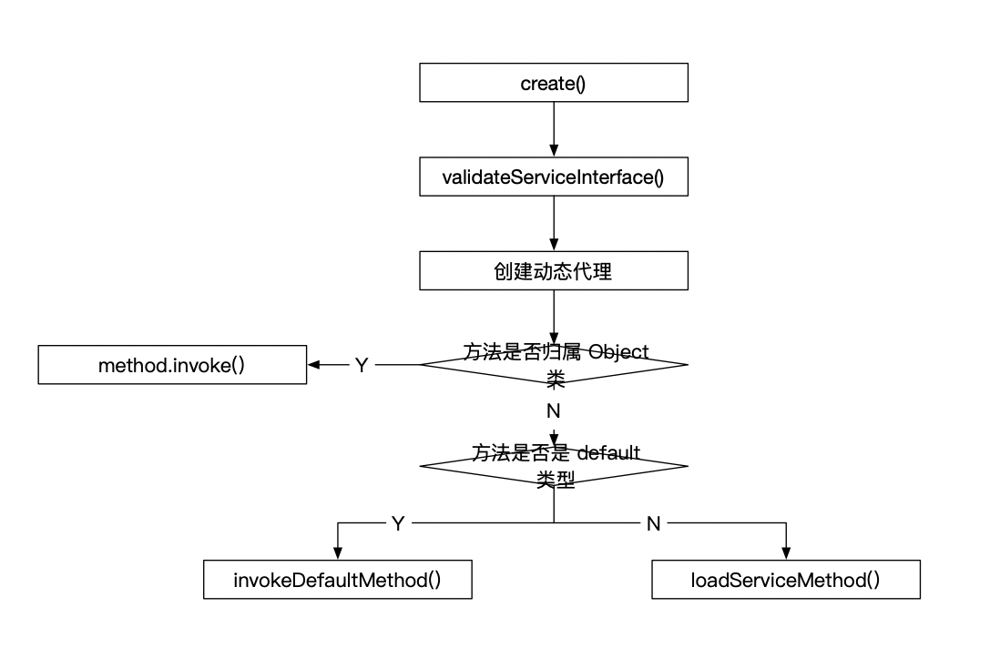
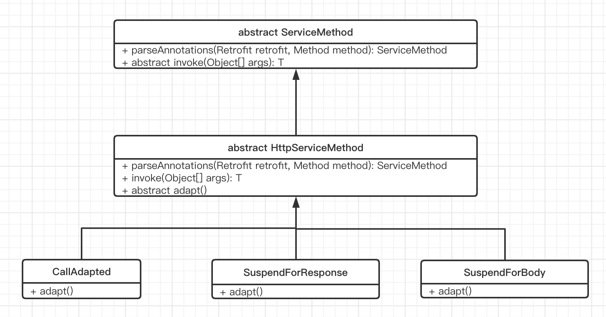
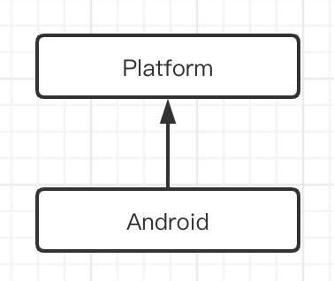
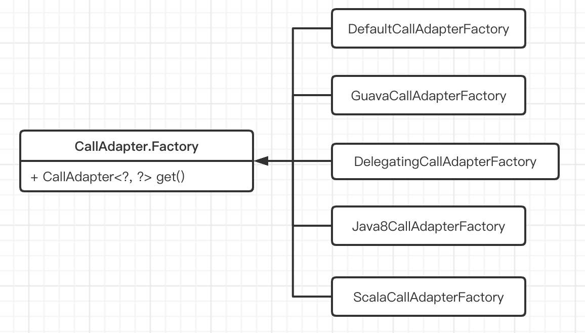

## 开源库—Retrofit 源码解析

>分析经典开源库是成长进阶的必备过程，通过学习顶尖工程师优秀的开源库，能提高我们的源码阅读和分析的能力，学习他们的设计思路构想，提升我们的代码设计能力。

**注意：本次分析基于 [retrofit parent-2.8.1 版本](https://github.com/square/retrofit/releases/tag/parent-2.8.1)**

`Retrofit` 是基于 `OkHttp` 封装的一个 `RESTful` 风格的 `HTTP` 网络请求框架。本质上 `Retrofit` 完成对请求接口的封装，真正的网络请求则由 `OkHttp` 完成。关于 `OkHttp` 的源码解析可以参见 [OkHttp 源码解析](https://juejin.im/post/5ee64dae6fb9a048036b0f7b)。`Retroft` 作为网络请求的三板斧之一，其对 `OkHttp` 的封装可谓之巧妙，这些巧妙的背后就是很多值得我们学习的设计技巧。

### 1. 基本用法

#### 1.1 添加依赖

在 `build.gradle` 文件中添加 `Retrofit` 相关依赖。

```groovy
implementation 'com.squareup.retrofit2:retrofit:2.9.0'   // retrofit 依赖
implementation 'com.squareup.retrofit2:converter-gson:2.0.2'	// 解析器依赖（可选）
```

上面的依赖中包含两部分：`retrfot` 仓库依赖和 `coverter-gson` 解析器依赖。

#### 1.2 创建网络请求接口描述

```java
import retrofit2.Call;
import retrofit2.http.GET;
import retrofit2.http.Path;
import retrofit2.http.Query;

interface GitHubService {
    @GET("users/{user}/followers")
    Call<List<Follower>> getFollowers(@Path("user") String user);
}
```

在上面创建了一个 `GitHubService` 的接口描述，里面包含一个 `getFollowers()` 的 `Get` 请求描述。

#### 1.3 发起网络请求

```java
// 创建 Retrofit
Retrofit retrofit = new Retrofit.Builder()
  .baseUrl("https://api.github.com/")
  .addConverterFactory(GsonConverterFactory.create())
  .build();
// 创建接口描述的实现
GitHubService followersService = retrofit.create(GitHubService.class);
// 获取对应的请求接口
Call<List<Follower>> followers1 = followersService.getFollowers("dengshiwei");
// 同步执行网络请求
Response<List<Follower>> followerResponse = followers1.execute();
```

通过 `Builder` 模式创建 `Retrfit` 的实例，然后调用 `create` 方法创建网络请求描述接口（`GitHubService`）的实现。然后调用 `getFollowers()` 接口获取对应的网络请求接口，最后调用 `execute()` 或 `enqueue()` 方法完成网络请求的同步或异步实现。

### 2. 流程解析

通过基础用法一节可以看到，`Retrofit` 的流程大致分为三个步骤：

1. 创建 `Retrofit` 对象，用于构建网络请求的基本信息
2. 调用 `create` 接口创建请求描述接口的代理对象
3. 获取网络请求 `Call`，并发起网络请求

下面将针对每个流程进行探究。

#### 2.1 Retrofit 的创建

`Retrofit` 作为对外暴露的核心 `API`，基本构成如下。

```java
public final class Retrofit {
  private final Map<Method, ServiceMethod<?>> serviceMethodCache = new ConcurrentHashMap<>();

  final okhttp3.Call.Factory callFactory;
  final HttpUrl baseUrl;
  final List<Converter.Factory> converterFactories;
  final List<CallAdapter.Factory> callAdapterFactories;
  final @Nullable Executor callbackExecutor;
  final boolean validateEagerly;

  Retrofit(okhttp3.Call.Factory callFactory, HttpUrl baseUrl,
      List<Converter.Factory> converterFactories, List<CallAdapter.Factory> callAdapterFactories,
      @Nullable Executor callbackExecutor, boolean validateEagerly) {
    this.callFactory = callFactory;
    this.baseUrl = baseUrl;
    this.converterFactories = converterFactories; // Copy+unmodifiable at call site.
    this.callAdapterFactories = callAdapterFactories; // Copy+unmodifiable at call site.
    this.callbackExecutor = callbackExecutor;
    this.validateEagerly = validateEagerly;
  }

  .... 省略很多方法，只看基本骨架

  public static final class Builder {
    private final Platform platform;
    private @Nullable okhttp3.Call.Factory callFactory;
    private @Nullable HttpUrl baseUrl;
    private final List<Converter.Factory> converterFactories = new ArrayList<>();
    private final List<CallAdapter.Factory> callAdapterFactories = new ArrayList<>();
    private @Nullable Executor callbackExecutor;
    private boolean validateEagerly;

    Builder(Platform platform) {
      this.platform = platform;
    }

    public Builder() {
      this(Platform.get());
    }
}
```

`Retrofit` 通过建造者模式进行构建对象。主要包含了以下成员变量：

- `callFactory`：
- `baseUrl`：
- `converterFactories`：
- `callAdapterFactories`：
- `callbackExecutor`：
- `serviceMethodCache`：

##### 1. 添加 baseUrl

在 `retrofit` 的 `Builder` 构建中，提供了三种方式用于添加 `baseUrl`。

```java
public Builder baseUrl(URL baseUrl) {
  Objects.requireNonNull(baseUrl, "baseUrl == null");
  return baseUrl(HttpUrl.get(baseUrl.toString()));
}

public Builder baseUrl(String baseUrl) {
  Objects.requireNonNull(baseUrl, "baseUrl == null");
  return baseUrl(HttpUrl.get(baseUrl));
}

public Builder baseUrl(HttpUrl baseUrl) {
  Objects.requireNonNull(baseUrl, "baseUrl == null");
  List<String> pathSegments = baseUrl.pathSegments();
  if (!"".equals(pathSegments.get(pathSegments.size() - 1))) {
    throw new IllegalArgumentException("baseUrl must end in /: " + baseUrl);
  }
  this.baseUrl = baseUrl;
  return this;
}
```

三种方式，最终都是封装成 `okhttp3.HttpUrl` 对象进行处理，在 `HttpUrl` 中封装了很多快捷方法。**如果在项目开发中，我们对同一个对象有很多判断转换操作，可以将其封装为一个类，内部完成对该类对象的判断。**

`retrofit` 中要求 `baseUrl` 最后必须以 `/` 结尾，如 `http://example.com/foo/bar/`。

##### 2. 添加 ConverterFactory

添加解析器用于序列化数据。

```java
/** Add converter factory for serialization and deserialization of objects. */
public Builder addConverterFactory(Converter.Factory factory) {
  converterFactories.add(Objects.requireNonNull(factory, "factory == null"));
  return this;
}
```

 `Converter` 接口提供的 `convert` 方法用于将 `HTTP` 请求的结果转换为对象。`converter` 是一个单独的库，所以需要我们单独引用。在 `retrofit` 源码中存在一个名为 `retrofit-converters` 的 `Module` 封装了常见的转换器。

- `GsonConverterFactory`：将网络请求数据转化为 `GSON` 格式
- `OptionalConverter`：将网络请求结果转换为 `Optional` 格式
- `JacksonConverterFactory`：将网络请求结果请求为 `Jackson` 格式

##### 3. 添加 callbackExecutor 执行器

添加自定义执行器。一般无特殊需求默认即可。

```java
public Builder callbackExecutor(Executor executor) {
  this.callbackExecutor = Objects.requireNonNull(executor, "executor == null");
  return this;
}
```

可以看到添加的是一个线程池管理类 `Executor`。

##### 4. 添加 CallAdapter 适配器

可选。

```java
public Builder addCallAdapterFactory(CallAdapter.Factory factory) {
  callAdapterFactories.add(Objects.requireNonNull(factory, "factory == null"));
  return this;
}
```

##### 5. build 构建

在 `Builder` 建造者模式中，最后基本都是通过 `build` 方法构建对象。

```java
public Retrofit build() {
  // 判断 baseUrl 是否为空
  if (baseUrl == null) {
    throw new IllegalStateException("Base URL required.");
  }

  // 判断是否自定义 Call.Factory 构造器，如果没有则内部实现
  okhttp3.Call.Factory callFactory = this.callFactory;
  if (callFactory == null) {
    callFactory = new OkHttpClient();
  }
  // 判断是否自定义执行器
  Executor callbackExecutor = this.callbackExecutor;
  if (callbackExecutor == null) {
    callbackExecutor = platform.defaultCallbackExecutor();
  }

  // 整合自定义适配器并添加默认适配器.
  List<CallAdapter.Factory> callAdapterFactories = new ArrayList<>(this.callAdapterFactories);
  callAdapterFactories.addAll(platform.defaultCallAdapterFactories(callbackExecutor));

  // 添加自定义转化器，并添加默认转化器.
  List<Converter.Factory> converterFactories = new ArrayList<>(
      1 + this.converterFactories.size() + platform.defaultConverterFactoriesSize());

  // Add the built-in converter factory first. This prevents overriding its behavior but also
  // ensures correct behavior when using converters that consume all types.
  converterFactories.add(new BuiltInConverters());
  converterFactories.addAll(this.converterFactories);
  converterFactories.addAll(platform.defaultConverterFactories());
  // 返回 Retrofit 对象
  return new Retrofit(callFactory, baseUrl, unmodifiableList(converterFactories),
      unmodifiableList(callAdapterFactories), callbackExecutor, validateEagerly);
}	
```

 `build` 的过程大致可以分为以下几步：

1.  检查 `baseUrl` 是否合法
2. 设置 `CallFatory`，如果用户自定义则使用自定义设置，反之则默认创建 `OkHttpClient`
3. 设置执行器，默认是 `platform.defaultCallbackExecutor()`
4. 添加适配器，默认是 `platform.defaultCallAdapterFactories(callbackExecutor)`
5. 添加转换器，默认添加了 `BuiltInConverters` 和 `platform.defaultConverterFactories`
6. 构建 `Retrofit` 对象

#### 2.2 创建网络请求接口

在基础用法中，通过 `retrofit.create()` 方法去实现网络请求接口的实现。

```java
/**
 * 创建网络接口的实现
 */
@SuppressWarnings("unchecked") // Single-interface proxy creation guarded by parameter safety.
public <T> T create(final Class<T> service) {
  validateServiceInterface(service);
  return (T) Proxy.newProxyInstance(service.getClassLoader(), new Class<?>[] { service },
      new InvocationHandler() {
        private final Platform platform = Platform.get();
        private final Object[] emptyArgs = new Object[0];

        @Override public @Nullable Object invoke(Object proxy, Method method,
            @Nullable Object[] args) throws Throwable {
          // If the method is a method from Object then defer to normal invocation.
          if (method.getDeclaringClass() == Object.class) {
            return method.invoke(this, args);
          }
          if (platform.isDefaultMethod(method)) {
            return platform.invokeDefaultMethod(method, service, proxy, args);
          }
          return loadServiceMethod(method).invoke(args != null ? args : emptyArgs);
        }
      });
}
```

在 `create()` 方法中通过动态代理来创建 `service` 的实现，通过代理模式达到对代理类接口的访问控制，实现对网络请求接口的控制。

`create()` 方法的流程：



##### 1. validateServiceInterface()

校验接口是否合法。

```java
private void validateServiceInterface(Class<?> service) {
  // 是否是 Interface 类型
  if (!service.isInterface()) {
    throw new IllegalArgumentException("API declarations must be interfaces.");
  }
  // 添加到队列中
  Deque<Class<?>> check = new ArrayDeque<>(1);
  check.add(service);
  while (!check.isEmpty()) {
    // 检查接口是否声明了泛型
    Class<?> candidate = check.removeFirst();
    if (candidate.getTypeParameters().length != 0) {
      StringBuilder message = new StringBuilder("Type parameters are unsupported on ")
          .append(candidate.getName());
      if (candidate != service) {
        message.append(" which is an interface of ")
            .append(service.getName());
      }
      throw new IllegalArgumentException(message.toString());
    }
    Collections.addAll(check, candidate.getInterfaces()); // 添加所有的父 Interface
  }

  if (validateEagerly) {// 是否开启提前操作
    Platform platform = Platform.get();
    for (Method method : service.getDeclaredMethods()) {
      if (!platform.isDefaultMethod(method) && !Modifier.isStatic(method.getModifiers())) {
        loadServiceMethod(method);
      }
    }
  }
} 
```

在 `validateServiceInterface(Class<?> service)` 方法中，主要是校验声明的网络描述接口是否符合要求：

- 接口是否是 `Interface` 类型，如果不是 `Interface` 则抛出 `IllegalArgumentException("API declarations must be interfaces.")` 异常
- 接口是否声明了泛型，如果声明了泛型，则抛出 `IllegalArgumentException(Type parameters are unsupported on ..)` 异常

检查完毕后，判断段接口是否开启提前校验，如果开启则提前处理。先获取 `Platform` 实例，然后对于非 `default` 类型且非 `static` 类型方法调用 `loadServiceMethod` 接口。

##### 2. 动态代理的创建

```java
  @SuppressWarnings("unchecked") // Single-interface proxy creation guarded by parameter safety.
  public <T> T create(final Class<T> service) {
    validateServiceInterface(service);
    return (T) Proxy.newProxyInstance(service.getClassLoader(), new Class<?>[] { service },
        new InvocationHandler() {
          ...
        });
  }
```

这里是经典的 `Proxy` 动态代理应用。第一个参数是对应的 `ClassLoader`、第二个参数是要实现的接口，第三个参数是 `InvocationHandler`。

##### 3. 方法执行

```java
if (method.getDeclaringClass() == Object.class) {
  return method.invoke(this, args);
}
if (platform.isDefaultMethod(method)) {
  return platform.invokeDefaultMethod(method, service, proxy, args);
}
return loadServiceMethod(method).invoke(args != null ? args : emptyArgs);
}
```

****

**Object 方法判断**

方法是否是 `Object` 类声明的方法，比如 `clone()`、`equals()` 或 `toString()` 之类，如果是则直接调用 `invoke` 处理。

**default 方法判断**

使用 `platform` 判断是否是 `default` 类型方法。这里 `platform` 的实现有两种：`Android` 平台和默认平台(`Java`)。

```java
private static Platform findPlatform() {
  try {
    Class.forName("android.os.Build");
    if (Build.VERSION.SDK_INT != 0) {
      return new Android();
    }
  } catch (ClassNotFoundException ignored) {
  }
  return new Platform(true);
}
```

`default` 类型的方法是在 `Java8` 中引入的 `Interface` 特性，即在 `Interface` 中可以实现一个 `default` 类型的方法。

```java
interface GitHubService {
    @GET("users/{user}/followers")
    Call<List<Follower>> getFollowers(@Path("user") String user);

    default void printUser() {
        System.out.println("打印出用户");
    }
}
```

所以我们也可以间接推断出 `isDefaultMethod` 方法的判断逻辑，是否支持 `Java8` 且是默认方法。

```java
// Platform.java
boolean isDefaultMethod(Method method) {
  return hasJava8Types && method.isDefault();
}
```

**invokeDefaultMethod**

看下方法的源码实现。

```java
class Platform {
  @Nullable Object invokeDefaultMethod(Method method, Class<?> declaringClass, Object object,
      @Nullable Object... args) throws Throwable {
    Lookup lookup = lookupConstructor != null
        ? lookupConstructor.newInstance(declaringClass, -1 /* trusted */)
        : MethodHandles.lookup();
    return lookup
        .unreflectSpecial(method, declaringClass)
        .bindTo(object)
        .invokeWithArguments(args);
  }


  static final class Android extends Platform {
    @Nullable @Override Object invokeDefaultMethod(Method method, Class<?> declaringClass,
        Object object, @Nullable Object... args) throws Throwable {
      if (Build.VERSION.SDK_INT < 26) {
        throw new UnsupportedOperationException(
            "Calling default methods on API 24 and 25 is not supported");
      }
      return super.invokeDefaultMethod(method, declaringClass, object, args);
    }
  }
}
```

在 `Android` 平台，如果当前手机系统版本小于 `26`，即 `Android 8` 以下，则抛出 `UnsupportedOperationException` 异常。如果在 `Android 8` 及以上，则调用 `Platform` 类的 `invokeDefaultMethod` 进行执行。

>这里涉及到 Java7 中引入的 MethodHandle 概念，不熟悉的同学可以去查找相关资料进行学习。
>
>Method Handles 的引入是为了与已经存在的 java.lang.reflect API 搭配使用。从性能角度上说，MethodHandles API 要比反射效率高，因为访问检查在创建的时候就已经完成了，而不是像反射一样等到运行时候才检查。

**loadServiceMethod**

经过一系列判断后，符合网络描述接口定义的最终调用 `loadServiceMethod` 方法。

```java
ServiceMethod<?> loadServiceMethod(Method method) {
  ServiceMethod<?> result = serviceMethodCache.get(method);
  if (result != null) return result;

  synchronized (serviceMethodCache) {
    result = serviceMethodCache.get(method);
    if (result == null) {
      result = ServiceMethod.parseAnnotations(this, method);
      serviceMethodCache.put(method, result);
    }
  }
  return result;
}
```

首先判断缓存中是否有对应的 `ServiceMethod` 对象，如果有则读取出来返回，如果没有则使用 `ServiceMethod.parseAnnotations` 进行创建。这部分是 `retrofit` 的核心部分，下一章节单独拿出来讲。

#### 2.3 ServiceMethod 的创建

`retrofit`的核心在 `loadServiceMethod()` 方法中。

```java
ServiceMethod<?> loadServiceMethod(Method method) {
  ServiceMethod<?> result = serviceMethodCache.get(method);
  if (result != null) return result;

  synchronized (serviceMethodCache) {
    result = serviceMethodCache.get(method);
    if (result == null) {
      result = ServiceMethod.parseAnnotations(this, method);
      serviceMethodCache.put(method, result);
    }
  }
  return result;
}
```

这里的核心是调用 `ServiceMethod` 的静态方法 `parseAnnotations` 进行对象的创建。

```java
abstract class ServiceMethod<T> {
  static <T> ServiceMethod<T> parseAnnotations(Retrofit retrofit, Method method) {
    RequestFactory requestFactory = RequestFactory.parseAnnotations(retrofit, method);

    Type returnType = method.getGenericReturnType();
    if (Utils.hasUnresolvableType(returnType)) {
      throw methodError(method,
          "Method return type must not include a type variable or wildcard: %s", returnType);
    }
    if (returnType == void.class) {
      throw methodError(method, "Service methods cannot return void.");
    }

    return HttpServiceMethod.parseAnnotations(retrofit, method, requestFactory);
  }

  abstract @Nullable T invoke(Object[] args);
}
```

主要分为三部分：

- 构建 `RequestFactory` 对象，将接口描述中的注解进行解析。
- 检查 `method` 返回类型
- 最终调用 `HttpServiceMethod` 类构建 `ServiceMethod` 对象

****

**1. RequestFactory.parseAnnotations()**

对方法的注解进行解析，将请求相关的参数解析到 `RequestFatory` 中。

```java
final class RequestFactory {
  static RequestFactory parseAnnotations(Retrofit retrofit, Method method) {
    return new Builder(retrofit, method).build();
  }
  private final Method method;
  private final HttpUrl baseUrl;
  final String httpMethod;
  private final @Nullable String relativeUrl;
  private final @Nullable Headers headers;
  private final @Nullable MediaType contentType;
  private final boolean hasBody;
  private final boolean isFormEncoded;
  private final boolean isMultipart;
  private final ParameterHandler<?>[] parameterHandlers;
  final boolean isKotlinSuspendFunction;

  static final class Builder {

  RequestFactory build() {
      for (Annotation annotation : methodAnnotations) {
        parseMethodAnnotation(annotation);
      }

      if (httpMethod == null) {
        throw methodError(method, "HTTP method annotation is required (e.g., @GET, @POST, etc.).");
      }

      if (!hasBody) {
        if (isMultipart) {
          throw methodError(method,
              "Multipart can only be specified on HTTP methods with request body (e.g., @POST).");
        }
        if (isFormEncoded) {
          throw methodError(method, "FormUrlEncoded can only be specified on HTTP methods with "
              + "request body (e.g., @POST).");
        }
      }

      int parameterCount = parameterAnnotationsArray.length;
      parameterHandlers = new ParameterHandler<?>[parameterCount];
      for (int p = 0, lastParameter = parameterCount - 1; p < parameterCount; p++) {
        parameterHandlers[p] =
            parseParameter(p, parameterTypes[p], parameterAnnotationsArray[p], p == lastParameter);
      }

      if (relativeUrl == null && !gotUrl) {
        throw methodError(method, "Missing either @%s URL or @Url parameter.", httpMethod);
      }
      if (!isFormEncoded && !isMultipart && !hasBody && gotBody) {
        throw methodError(method, "Non-body HTTP method cannot contain @Body.");
      }
      if (isFormEncoded && !gotField) {
        throw methodError(method, "Form-encoded method must contain at least one @Field.");
      }
      if (isMultipart && !gotPart) {
        throw methodError(method, "Multipart method must contain at least one @Part.");
      }

           return new RequestFactory(this);
    }
}
```

**2. HttpServiceMethod.parseAnnotations()**

获取 `CallAdapter` 请求适配对象。

```java
// HttpServiceMethod.java
static <ResponseT, ReturnT> HttpServiceMethod<ResponseT, ReturnT> parseAnnotations(
      Retrofit retrofit, Method method, RequestFactory requestFactory) {
    boolean isKotlinSuspendFunction = requestFactory.isKotlinSuspendFunction;
    boolean continuationWantsResponse = false;
    boolean continuationBodyNullable = false;

    Annotation[] annotations = method.getAnnotations();
    Type adapterType;
    if (isKotlinSuspendFunction) {
      Type[] parameterTypes = method.getGenericParameterTypes();
      Type responseType = Utils.getParameterLowerBound(0,
          (ParameterizedType) parameterTypes[parameterTypes.length - 1]);
      if (getRawType(responseType) == Response.class && responseType instanceof ParameterizedType) {
        // Unwrap the actual body type from Response<T>.
        responseType = Utils.getParameterUpperBound(0, (ParameterizedType) responseType);
        continuationWantsResponse = true;
      } else {
        // TODO figure out if type is nullable or not
        // Metadata metadata = method.getDeclaringClass().getAnnotation(Metadata.class)
        // Find the entry for method
        // Determine if return type is nullable or not
      }

      adapterType = new Utils.ParameterizedTypeImpl(null, Call.class, responseType);
      annotations = SkipCallbackExecutorImpl.ensurePresent(annotations);
    } else {
      adapterType = method.getGenericReturnType();
    }
		// 遍历 CallAdapter.Factory 集合并寻找合适的工厂，默认是 DefaultCallAdapterFactory
    CallAdapter<ResponseT, ReturnT> callAdapter =
        createCallAdapter(retrofit, method, adapterType, annotations);
    Type responseType = callAdapter.responseType();
    if (responseType == okhttp3.Response.class) {
      throw methodError(method, "'"
          + getRawType(responseType).getName()
          + "' is not a valid response body type. Did you mean ResponseBody?");
    }
    if (responseType == Response.class) {
      throw methodError(method, "Response must include generic type (e.g., Response<String>)");
    }
    // TODO support Unit for Kotlin?
    if (requestFactory.httpMethod.equals("HEAD") && !Void.class.equals(responseType)) {
      throw methodError(method, "HEAD method must use Void as response type.");
    }
		// 遍历 Converter.Factory 集合并寻找合适的工厂
    Converter<ResponseBody, ResponseT> responseConverter =
        createResponseConverter(retrofit, method, responseType);

    okhttp3.Call.Factory callFactory = retrofit.callFactory;
    if (!isKotlinSuspendFunction) {
      return new CallAdapted<>(requestFactory, callFactory, responseConverter, callAdapter);
    } else if (continuationWantsResponse) {
      //noinspection unchecked Kotlin compiler guarantees ReturnT to be Object.
      return (HttpServiceMethod<ResponseT, ReturnT>) new SuspendForResponse<>(requestFactory,
          callFactory, responseConverter, (CallAdapter<ResponseT, Call<ResponseT>>) callAdapter);
    } else {
      //noinspection unchecked Kotlin compiler guarantees ReturnT to be Object.
      return (HttpServiceMethod<ResponseT, ReturnT>) new SuspendForBody<>(requestFactory,
          callFactory, responseConverter, (CallAdapter<ResponseT, Call<ResponseT>>) callAdapter,
          continuationBodyNullable);
    }
}
```

在 `HttpServiceMethod` 中首先判断是否支持 `Kotlin` 协程相关的特性（`Continuation`），如果支持则直接封装为 `Call` 类型的返回值。反之则获取 `method.getGenericReturnType()` 返回值类型。

 **createCallAdapter()** 方法

调用 `createCallAdapter`  创建 `CallAdapter` 对象。最终调用 `retrofit.callAdapter()` 方法。如果用户没有自定义 `CallAdapter`，则使用默认的 `DefaultCallAdapterFactory` 来构建。

`HttpServiceMethod.parseAnnotations()` 方法的最后根据不同的条件，返回不同的工厂示例。一般情况下返回的是 `CallAdapter`。

在动态代理的最后，执行 `HttpServiceMethod` 的 `invoke` 方法返回一个 `Call` 对象，这个对象是一个 `OkHttpCall` 的对象，内部封装了 `okhttp` 的操作。在 `invoke` 方法的内部最终是调用 `adapt` 方法。

```java
@Override final @Nullable ReturnT invoke(Object[] args) {
  Call<ResponseT> call = new OkHttpCall<>(requestFactory, args, callFactory, responseConverter);
  return adapt(call, args);
}
```

由于 `adapt` 是 `ServiceMethod` 的抽象方法，不同的子类实现不同，所以对于 `CallApater` 来说，最终是调用 `DefaultCallAdapterFactory` 中构建的 `ExecutorCallbackCall` 对象。

#### 2.4 网络请求执行

在上面我们追踪到最终的流程是在 `ExecutorCallbackCall` 类，该类提供了 `enqueue()` 和 `execute()` 方法。

**异步请求流程 enqueue()**

```java
static final class ExecutorCallbackCall<T> implements Call<T> {
  @Override public void enqueue(final Callback<T> callback) {
    Objects.requireNonNull(callback, "callback == null");

    delegate.enqueue(new Callback<T>() {
      @Override public void onResponse(Call<T> call, final Response<T> response) {
        callbackExecutor.execute(() -> {
          if (delegate.isCanceled()) {
            // Emulate OkHttp's behavior of throwing/delivering an IOException on cancellation.
            callback.onFailure(ExecutorCallbackCall.this, new IOException("Canceled"));
          } else {
            callback.onResponse(ExecutorCallbackCall.this, response);
          }
        });
      }

      @Override public void onFailure(Call<T> call, final Throwable t) {
        callbackExecutor.execute(() -> callback.onFailure(ExecutorCallbackCall.this, t));
      }
    });
  }
}
```

**同步请求流程 execute()**

```java
@Override public Response<T> execute() throws IOException {
  return delegate.execute();
}
```

这里，我们跟踪 `enqueue` 方法进去查看。它的内部就是封装了 `okhttp` 的 `Call` 然后发起网络请求，最终触发对应的回调。

```java
@Override public void enqueue(final Callback<T> callback) {
  Objects.requireNonNull(callback, "callback == null");

  okhttp3.Call call;
  Throwable failure;

  synchronized (this) {
    if (executed) throw new IllegalStateException("Already executed.");
    executed = true;

    call = rawCall;
    failure = creationFailure;
    if (call == null && failure == null) {
      try {
        call = rawCall = createRawCall();
      } catch (Throwable t) {
        throwIfFatal(t);
        failure = creationFailure = t;
      }
    }
  }

  if (failure != null) {
    callback.onFailure(this, failure);
    return;
  }

  if (canceled) {
    call.cancel();
  }

  call.enqueue(new okhttp3.Callback() {
    @Override public void onResponse(okhttp3.Call call, okhttp3.Response rawResponse) {
      Response<T> response;
      try {
        response = parseResponse(rawResponse);
      } catch (Throwable e) {
        throwIfFatal(e);
        callFailure(e);
        return;
      }

      try {
        callback.onResponse(OkHttpCall.this, response);
      } catch (Throwable t) {
        throwIfFatal(t);
        t.printStackTrace(); // TODO this is not great
      }
    }

    @Override public void onFailure(okhttp3.Call call, IOException e) {
      callFailure(e);
    }

    private void callFailure(Throwable e) {
      try {
        callback.onFailure(OkHttpCall.this, e);
      } catch (Throwable t) {
        throwIfFatal(t);
        t.printStackTrace(); // TODO this is not great
      }
    }
  });
}
```

以上就是 `retrofit` 的基本流程，可以看出，`retrofit` 本质上并不是一个网络请求框架，它只是对网络请求框架的封装。把网络请求的实现交给了 `okhttp`，由 `okhttp` 发起网络请求。

### 3. 重点模块

#### 3.1 ServiceMethod

`ServiceMethod` 在 `retrofit` 中是很关键的类，它完成了从网络接口定义到网络请求 `Call` 的转换流程。



在 `HttpServiceMethod` 的 `parseAnnotations()` 方法的最后，根据不同的条件返回不同的 `ServiceMethod` 对象，如果从对象创建的角度来看，这里使用的就是**工厂模式**。如果从 `adapt()` 方法的角度来看，该方法是在 `invoke` 方法中被调用。

```java
@Override final @Nullable ReturnT invoke(Object[] args) {
  Call<ResponseT> call = new OkHttpCall<>(requestFactory, args, callFactory, responseConverter);
  return adapt(call, args);
}

protected abstract @Nullable ReturnT adapt(Call<ResponseT> call, Object[] args);
```

将方法进行抽象剥离，由不同的子类实现，这里使用的就是**模板方法模式**。

#### 3.2 Platform

在 `retrofit` 的 `create` 方法中，存在 `Platform` 类用于判断方法的类型。

```java
// Retrofit.java
Platform platform = Platform.get()
// Platform.java
class Platform {
  private static final Platform PLATFORM = findPlatform();

  static Platform get() {
    return PLATFORM;
  }
  static final class Android extends Platform
}
```



`findPlatform()` 方法根据不同的平台条件返回不同的类，如果是 `Android` 平台则返回 `Android`，反之则返回默认的 `Platform`。从对象创建的角度分析，是一个 `简单工厂模式` 的实现。

#### 3.3 CallAdapter

`CallAdapter` 是一个接口，内部包含一个静态内部 `Factory` 工厂类，用于创建 `CallAdapter` 对象。

**CallAdapter 类图**


`CallAdapter` 是一个接口，里面定义了 `responseType()` 和 `T adapt(Call<R> call)` 的方法，分别有对应的三个实现类。在不同的时机使用不同的类进行处理，使用的是 **策略模式** 的设计。

**CallAdapter.Factory 类图**



`Factory` 类是一个抽象类，其它工厂类都是它的子类，这里使用的是 `抽象工厂模式` 实现。类似的实现还有 `Convert.Factory`。 

#### 3.4 Retrofit

`Retrofit` 作为对外暴露的类，封装了核心方法模块的使用，这是 **门面模式** 的使用。同时采用 `Builder` 建造者的模式来完成 `Retrofit` 对象的创建。

### 4. 总结

`Retrofit` 绝对是一个非常值得反复学习的开源项目，里面对注解反射技术的应用以及通过设计模式的使用极大提高了框架的可扩展性，非常值得学习。